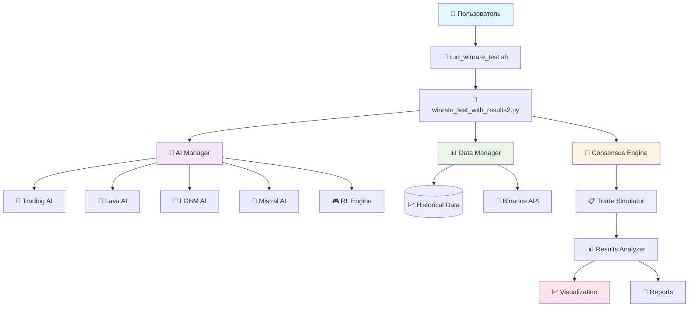
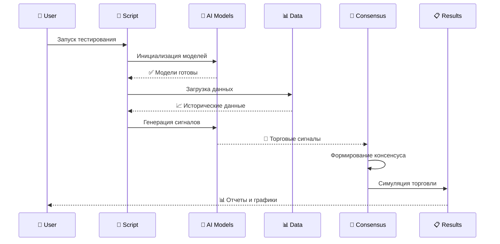
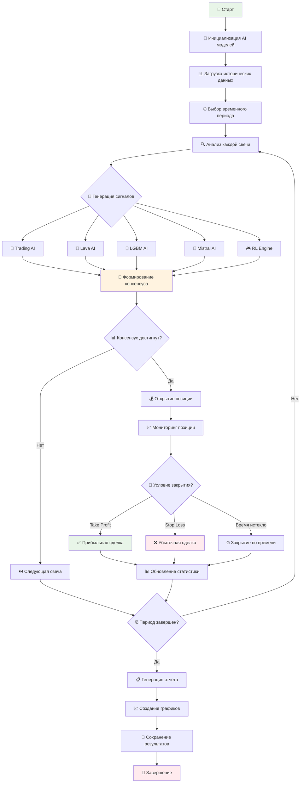

# 🚀 РУКОВОДСТВО ПО УСТАНОВКЕ И ЗАПУСКУ СИСТЕМЫ ТЕСТИРОВАНИЯ ВИНРЕЙТА AI МОДЕЛЕЙ

## 📋 Содержание
1. [Системные требования](#-системные-требования)
2. [Установка и настройка](#-установка-и-настройка)
3. [Первый запуск](#-первый-запуск)
4. [Решение проблем](#️-решение-типичных-проблем)
5. [Архитектура системы](#️-архитектура-системы)
6. [Интерпретация результатов](#-интерпретация-результатов)
7. [FAQ](#-часто-задаваемые-вопросы)

---

## 🖥️ СИСТЕМНЫЕ ТРЕБОВАНИЯ

### Минимальные требования:
- **Операционная система:** macOS 10.15+, Linux Ubuntu 18.04+, Windows 10+
- **Python:** версия 3.11 или выше
- **RAM:** минимум 8GB (рекомендуется 16GB)
- **Свободное место:** 5GB для данных и моделей
- **Интернет:** стабильное соединение для загрузки исторических данных

### Рекомендуемые требования:
- **CPU:** 4+ ядра
- **RAM:** 16GB+
- **SSD:** для быстрого доступа к данным
- **Интернет:** скорость 10+ Мбит/с

---

## 📦 УСТАНОВКА И НАСТРОЙКА

### Шаг 1: Клонирование репозитория
```bash
# Клонируйте проект в удобную папку
git clone <repository-url>
cd "Peper Binance v4"

# Или скачайте архив и распакуйте его
```

### Шаг 2: Проверка версии Python
```bash
# Проверьте версию Python (должна быть 3.11+)
python3 --version
# или
python3.11 --version
```

**Ожидаемый результат:**
```
Python 3.11.x
```

### Шаг 3: Создание виртуального окружения
```bash
# Создайте виртуальное окружение с именем venv311
python3.11 -m venv venv311

# Для Windows:
# python -m venv venv311
```

**Проверка создания:**
```bash
# Должна появиться папка venv311
ls -la | grep venv311
```

### Шаг 4: Активация виртуального окружения

**macOS/Linux:**
```bash
source venv311/bin/activate
```

**Windows:**
```cmd
venv311\Scripts\activate
```

**Проверка активации:**
После активации в начале строки терминала должно появиться `(venv311)`:
```
(venv311) user@computer:~/Peper Binance v4$
```

### Шаг 5: Установка зависимостей
```bash
# Обновите pip до последней версии
pip install --upgrade pip

# Установите основные зависимости
pip install pandas numpy matplotlib seaborn
pip install mplfinance plotly
pip install scikit-learn lightgbm
pip install requests aiohttp
pip install python-binance
pip install asyncio-throttle

# Проверьте установку ключевых пакетов
python -c "import mplfinance; print('✅ mplfinance:', mplfinance.__version__)"
python -c "import pandas; print('✅ pandas:', pandas.__version__)"
python -c "import numpy; print('✅ numpy:', numpy.__version__)"
```

**Ожидаемый результат:**
```
✅ mplfinance: 0.12.10b0
✅ pandas: 2.1.x
✅ numpy: 1.24.x
```

### Шаг 6: Настройка конфигурации
```bash
# Создайте файл .env (если его нет)
touch .env

# Добавьте базовые настройки (опционально)
echo "BINANCE_API_KEY=your_api_key_here" >> .env
echo "BINANCE_SECRET_KEY=your_secret_key_here" >> .env
```

**⚠️ Важно:** API ключи нужны только для реальной торговли. Для тестирования винрейта они не требуются!

---

## 🎯 ПЕРВЫЙ ЗАПУСК

### Способ 1: Через готовый скрипт (РЕКОМЕНДУЕТСЯ)
```bash
# Сделайте скрипт исполняемым
chmod +x run_winrate_test.sh

# Запустите тестирование
./run_winrate_test.sh
```

### Способ 2: Прямой запуск через venv311
```bash
# Запуск напрямую через Python из виртуального окружения
venv311/bin/python winrate_test_with_results2.py
```

### Способ 3: С ручной активацией окружения
```bash
# Активируйте окружение
source venv311/bin/activate

# Запустите тестирование
python winrate_test_with_results2.py

# Деактивируйте окружение после завершения
deactivate
```

### Что происходит при первом запуске:

1. **Инициализация AI моделей** (30-60 секунд)
   ```
   🤖 Инициализация AI Manager...
   ✅ Trading AI активирован
   ✅ Lava AI активирован
   ✅ LGBM AI активирован
   ✅ Mistral AI активирован
   ✅ Reinforcement Learning Engine активирован
   ```

2. **Загрузка исторических данных** (2-5 минут)
   ```
   📊 Загрузка данных для BTCUSDT...
   📊 Загрузка данных для ETHUSDT...
   📊 Загрузка данных для SOLUSDT...
   ```

3. **Генерация торговых сигналов** (1-3 минуты)
   ```
   🔍 Анализ сигналов для периода 3 дня...
   🎯 Найдено 15 потенциальных сделок
   ```

4. **Создание отчетов и графиков** (30-60 секунд)
   ```
   📈 Создание графиков...
   📋 Генерация отчета...
   ✅ Результаты сохранены в results/
   ```

---

## ⚠️ РЕШЕНИЕ ТИПИЧНЫХ ПРОБЛЕМ

### Проблема 1: ModuleNotFoundError: No module named 'mplfinance'

**Причина:** Скрипт запускается системным Python вместо виртуального окружения.

**Решение:**
```bash
# Проверьте, какой Python используется
which python
# Должно показать: /path/to/venv311/bin/python

# Если показывает системный Python, активируйте окружение:
source venv311/bin/activate

# Или используйте прямой путь:
venv311/bin/python winrate_test_with_results2.py
```

### Проблема 2: Permission denied при запуске скрипта

**Решение:**
```bash
# Сделайте скрипт исполняемым
chmod +x run_winrate_test.sh

# Или запустите через bash
bash run_winrate_test.sh
```

### Проблема 3: Ошибки загрузки данных

**Причина:** Проблемы с интернет-соединением или API Binance.

**Решение:**
```bash
# Проверьте соединение
ping api.binance.com

# Очистите кэш данных
rm -rf data/*.csv

# Перезапустите тестирование
./run_winrate_test.sh
```

### Проблема 4: Недостаточно памяти

**Симптомы:** Система зависает или выдает MemoryError.

**Решение:**
```bash
# Отредактируйте файл winrate_test_with_results2.py
# Найдите строку: test_period_days: int = 3
# Уменьшите период до 1 дня для экономии памяти
```

### Проблема 5: Виртуальное окружение не создается

**Для macOS:**
```bash
# Установите Python 3.11 через Homebrew
brew install python@3.11

# Создайте окружение
python3.11 -m venv venv311
```

**Для Ubuntu/Linux:**
```bash
# Установите Python 3.11
sudo apt update
sudo apt install python3.11 python3.11-venv

# Создайте окружение
python3.11 -m venv venv311
```

---

## 🏗️ АРХИТЕКТУРА СИСТЕМЫ

### Общая схема системы:



### Компоненты системы:

| Компонент | Назначение | Файлы |
|-----------|------------|-------|
| **🤖 AI Manager** | Управление AI моделями | `ai_modules/ai_manager.py` |
| **📊 Data Manager** | Загрузка и обработка данных | `historical_data_manager.py` |
| **🎯 Consensus Engine** | Формирование консенсуса | `winrate_test_with_results2.py` |
| **📈 Visualizer** | Создание графиков | `detailed_trade_visualizer.py` |
| **🔧 Calibrator** | Калибровка моделей | `ai_model_calibrator.py` |

### Поток данных в системе:



---

## 📊 ОПИСАНИЕ AI МОДЕЛЕЙ

### 1. 🧠 Trading AI
- **Тип:** Классический машинное обучение
- **Особенности:** Анализ технических индикаторов
- **Сильные стороны:** Стабильность, проверенные алгоритмы
- **Файл:** `ai_modules/trading_ai.py`

### 2. 🌋 Lava AI  
- **Тип:** Нейронная сеть
- **Особенности:** Глубокий анализ паттернов
- **Сильные стороны:** Выявление сложных зависимостей
- **Файл:** `ai_modules/lava_ai.py`

### 3. 🌳 LGBM AI
- **Тип:** Gradient Boosting
- **Особенности:** Быстрое обучение, высокая точность
- **Сильные стороны:** Работа с большими данными
- **Файл:** `ai_modules/lgbm_ai.py`

### 4. 🤖 Mistral AI
- **Тип:** Языковая модель
- **Особенности:** Анализ новостей и настроений
- **Сильные стороны:** Понимание контекста рынка
- **Файл:** `ai_modules/mistral_ai.py`

### 5. 🎮 Reinforcement Learning Engine
- **Тип:** Обучение с подкреплением
- **Особенности:** Адаптация к изменениям рынка
- **Сильные стороны:** Самообучение и оптимизация
- **Файл:** `ai_modules/reinforcement_learning_engine.py`

---

## 🔄 ЛОГИКА РАБОТЫ СИСТЕМЫ

### Этапы тестирования винрейта:



### Алгоритм формирования консенсуса:

1. **Сбор голосов:** Каждая AI модель дает сигнал (BUY/SELL/HOLD) с уровнем уверенности
2. **Взвешивание:** Применяются веса моделей на основе их исторической производительности
3. **Пороговая фильтрация:** Сигналы с низкой уверенностью отфильтровываются
4. **Консенсус:** Принимается решение на основе большинства взвешенных голосов
5. **Риск-менеджмент:** Применяются дополнительные фильтры безопасности

---

## 📈 ИНТЕРПРЕТАЦИЯ РЕЗУЛЬТАТОВ

### Ключевые метрики:

| Метрика | Описание | Хорошее значение |
|---------|----------|------------------|
| **Win Rate (%)** | Процент прибыльных сделок | > 60% |
| **Total Profit/Loss** | Общая прибыль/убыток | > 0 |
| **Max Drawdown** | Максимальная просадка | < 10% |
| **Sharpe Ratio** | Отношение доходности к риску | > 1.0 |
| **Total Trades** | Количество сделок | 10-50 за период |
| **Avg Trade Duration** | Средняя длительность сделки | 2-24 часа |

### Пример хорошего результата:
```
📊 РЕЗУЛЬТАТЫ ТЕСТИРОВАНИЯ ВИНРЕЙТА
=====================================
📈 Win Rate: 73.5% (25/34 сделок)
💰 Total P&L: +$127.45 (+12.75%)
📉 Max Drawdown: -$23.12 (-2.31%)
⚡ Sharpe Ratio: 1.87
🕐 Avg Trade Duration: 8.5 часов
🎯 Best Pair: ETHUSDT (85% винрейт)
```

### Пример плохого результата:
```
📊 РЕЗУЛЬТАТЫ ТЕСТИРОВАНИЯ ВИНРЕЙТА
=====================================
📈 Win Rate: 35.2% (12/34 сделок)
💰 Total P&L: -$89.23 (-8.92%)
📉 Max Drawdown: -$156.78 (-15.68%)
⚡ Sharpe Ratio: -0.45
🕐 Avg Trade Duration: 18.3 часов
🎯 Worst Pair: ADAUSDT (20% винрейт)
```

### Файлы результатов:

| Файл | Содержание |
|------|------------|
| `results/winrate_report_YYYYMMDD.txt` | Текстовый отчет |
| `results/trades_YYYYMMDD.json` | Детали всех сделок |
| `results/charts/` | Графики и диаграммы |
| `results/performance_YYYYMMDD.png` | График производительности |

---

## 🛠️ ДОПОЛНИТЕЛЬНЫЕ ИНСТРУМЕНТЫ

### Калибровка моделей:
```bash
# Запуск калибровки всех моделей
python ai_model_calibrator.py

# Быстрая рекалибровка
python quick_recalibration.py

# Калибровка конкретной модели
python ai_model_calibrator.py --model trading_ai
```

### Анализ торговой логики:
```bash
# Полный анализ системы
python trading_logic_analyzer.py

# Диагностика проблем
python ai_models_diagnostics.py
```

### Визуализация результатов:
```bash
# Создание детальных графиков
python detailed_trade_visualizer.py

# Анализ результатов
python analyze_results.py
```

---

## ❓ ЧАСТО ЗАДАВАЕМЫЕ ВОПРОСЫ

### Q: Сколько времени занимает тестирование?
**A:** Обычно 5-15 минут в зависимости от периода тестирования и количества торговых пар.

### Q: Можно ли изменить период тестирования?
**A:** Да, отредактируйте строку `test_period_days: int = 3` в файле `winrate_test_with_results2.py`.

### Q: Нужны ли API ключи Binance?
**A:** Нет, для тестирования винрейта API ключи не требуются. Система использует публичные исторические данные.

### Q: Как улучшить результаты?
**A:** Используйте калибровку моделей (`ai_model_calibrator.py`) и анализ торговой логики (`trading_logic_analyzer.py`).

### Q: Что делать, если винрейт очень низкий?
**A:** 
1. Запустите диагностику: `python ai_models_diagnostics.py`
2. Проведите калибровку: `python ai_model_calibrator.py`
3. Проанализируйте логику: `python trading_logic_analyzer.py`

### Q: Можно ли добавить свои торговые пары?
**A:** Да, отредактируйте список `SYMBOLS` в файле конфигурации.

### Q: Как интерпретировать графики?
**A:** 
- 🟢 Зеленые точки = прибыльные сделки
- 🔴 Красные точки = убыточные сделки  
- 📈 Синяя линия = кумулятивная прибыль
- 📊 Столбцы = распределение результатов

### Q: Система работает в реальном времени?
**A:** Нет, это система тестирования на исторических данных. Для реальной торговли используйте отдельные модули.

### Q: Как часто обновлять модели?
**A:** Рекомендуется калибровка раз в неделю или при значительном изменении рыночных условий.

---

## 🎯 БЫСТРЫЙ СТАРТ (TL;DR)

```bash
# 1. Создайте виртуальное окружение
python3.11 -m venv venv311

# 2. Активируйте его
source venv311/bin/activate

# 3. Установите зависимости
pip install pandas numpy mplfinance scikit-learn lightgbm requests python-binance

# 4. Запустите тестирование
./run_winrate_test.sh

# 5. Проверьте результаты в папке results/
```

**🎉 Готово! Система протестирует винрейт ваших AI моделей и создаст подробные отчеты.**

---

*📝 Документ обновлен: 24.10.2024*  
*🔧 Версия системы: 4.0*  
*👨‍💻 Поддержка: [GitHub Issues](repository-url/issues)*