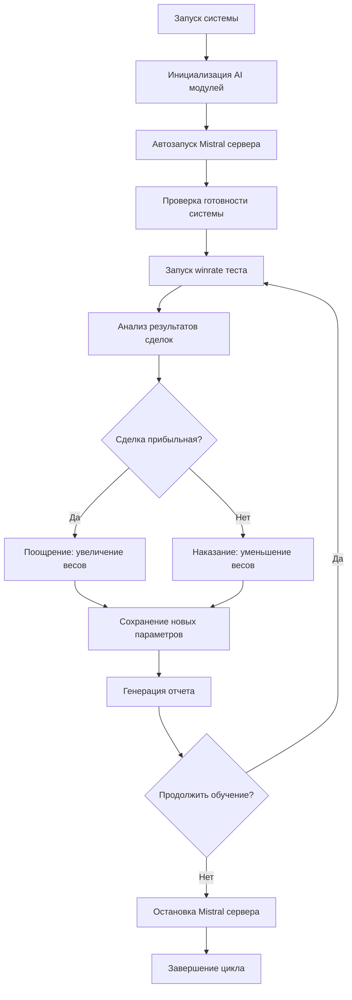

# Система адаптивного обучения с подкреплением для Peper Binance v4

## 1. Обзор продукта

Система адаптивного обучения с подкреплением для торговой платформы "Peper Binance v4" - это интеллектуальная система, которая автоматически улучшает торговые алгоритмы на основе результатов каждой сделки. Система использует принципы машинного обучения с подкреплением для поощрения прибыльных стратегий и наказания убыточных решений.

- Основная цель: создать самообучающуюся торговую систему, которая постоянно адаптируется и улучшает свою производительность
- Целевая аудитория: разработчики торговых алгоритмов и трейдеры, использующие автоматизированные системы
- Ценность продукта: повышение винрейта с текущих 34.4% до целевых 65%+ через адаптивное обучение

## 2. Основные функции

### 2.1 Пользовательские роли

| Роль | Метод регистрации | Основные права |
|------|-------------------|----------------|
| Системный администратор | Прямой доступ к системе | Полный доступ к настройкам обучения, просмотр всех метрик |
| AI-разработчик | Доступ через API | Настройка параметров моделей, анализ результатов обучения |
| Трейдер-аналитик | Веб-интерфейс | Просмотр результатов тестирования, анализ производительности |

### 2.2 Модули функций

Наша система адаптивного обучения состоит из следующих основных модулей:

1. **Модуль поощрения/наказания**: система весов для AI моделей, адаптивная корректировка параметров
2. **Модуль автоматизации тестирования**: автозапуск Mistral сервера, управление тестовыми процессами
3. **Модуль интеграции AI**: координация TradingAI, LavaAI, LGBMAI, MistralAI модулей
4. **Модуль аналитики**: отслеживание метрик, визуализация результатов обучения
5. **Модуль управления конфигурацией**: сохранение настроек, версионирование моделей

### 2.3 Детали страниц

| Название модуля | Название компонента | Описание функции |
|-----------------|-------------------|------------------|
| Модуль поощрения/наказания | Система весов моделей | Динамически изменяет веса AI моделей на основе результатов сделок. Увеличивает веса за прибыльные сделки, уменьшает за убыточные |
| Модуль поощрения/наказания | Адаптивная корректировка | Автоматически настраивает пороги уверенности, размеры позиций и параметры риск-менеджмента |
| Модуль поощрения/наказания | История обучения | Сохраняет все изменения параметров с временными метками для анализа эволюции системы |
| Модуль автоматизации тестирования | Автозапуск Mistral | Автоматически запускает и останавливает Mistral сервер перед/после winrate тестов |
| Модуль автоматизации тестирования | Проверка готовности | Валидирует готовность всех AI модулей перед началом тестирования |
| Модуль автоматизации тестирования | Управление процессами | Координирует последовательность тестовых операций и обработку результатов |
| Модуль интеграции AI | Координатор моделей | Обеспечивает совместимость с существующими TradingAI, LavaAI, LGBMAI, MistralAI модулями |
| Модуль интеграции AI | Адаптер весов | Применяет обновленные веса к ансамблю AI моделей без нарушения архитектуры |
| Модуль интеграции AI | Система обратной связи | Передает результаты сделок обратно в систему обучения для корректировки |
| Модуль аналитики | Трекер производительности | Отслеживает винрейт, ROI, количество сделок для каждой AI модели отдельно |
| Модуль аналитики | Визуализация метрик | Создает графики эволюции производительности, распределения весов моделей |
| Модуль аналитики | Система отчетов | Генерирует детальные отчеты о процессе обучения и рекомендации по оптимизации |
| Модуль управления конфигурацией | Версионирование моделей | Сохраняет снапшоты состояния моделей после каждого цикла обучения |
| Модуль управления конфигурацией | Откат изменений | Позволяет вернуться к предыдущим версиям моделей при ухудшении результатов |
| Модуль управления конфигурацией | Экспорт/импорт настроек | Сохраняет и загружает конфигурации обучения для разных торговых стратегий |

## 3. Основные процессы

### Процесс адаптивного обучения:

1. **Инициализация**: Система загружает текущие веса AI моделей и параметры обучения
2. **Запуск тестирования**: Автоматически запускается Mistral сервер и инициируется winrate тест
3. **Анализ результатов**: Каждая сделка анализируется на прибыльность и качество сигнала
4. **Применение поощрений/наказаний**: Веса моделей корректируются на основе результатов
5. **Сохранение состояния**: Новые параметры сохраняются с версионированием
6. **Повторение цикла**: Процесс повторяется для непрерывного улучшения

### Схема навигации процессов:

## 4. Дизайн пользовательского интерфейса

### 4.1 Стиль дизайна

- **Основные цвета**: Темно-синий (#1a1a2e) для фона, зеленый (#16a085) для прибыльных операций, красный (#e74c3c) для убыточных
- **Вторичные цвета**: Серый (#34495e) для нейтральных элементов, желтый (#f39c12) для предупреждений
- **Стиль кнопок**: Плоские кнопки с закругленными углами (border-radius: 8px)
- **Шрифты**: Roboto Mono для числовых данных (14px), Open Sans для текста (12px)
- **Стиль макета**: Карточный дизайн с тенями, боковая навигация слева
- **Иконки**: Material Design иконки для действий, эмодзи для статусов (🟢 успех, 🔴 ошибка, ⚡ обучение)

### 4.2 Обзор дизайна страниц

| Название модуля | Название компонента | UI элементы |
|-----------------|-------------------|-------------|
| Модуль поощрения/наказания | Панель весов моделей | Интерактивные слайдеры для весов, цветовая индикация изменений (зеленый/красный), анимированные переходы |
| Модуль автоматизации тестирования | Статус сервера | Индикатор состояния Mistral сервера, кнопки запуска/остановки, лог консоль с прокруткой |
| Модуль интеграции AI | Дашборд моделей | Карточки для каждой AI модели, метрики производительности, графики в реальном времени |
| Модуль аналитики | Графики производительности | Интерактивные Chart.js графики, фильтры по времени, экспорт данных в CSV/JSON |
| Модуль управления конфигурацией | Версионирование | Таблица версий с возможностью сравнения, кнопки отката, превью изменений |

### 4.3 Адаптивность

Система разработана как desktop-first приложение с адаптацией для планшетов. Основной фокус на мониторах 1920x1080+ для комфортного анализа множественных графиков и метрик. Мобильная версия предоставляет только базовый мониторинг статуса системы.
