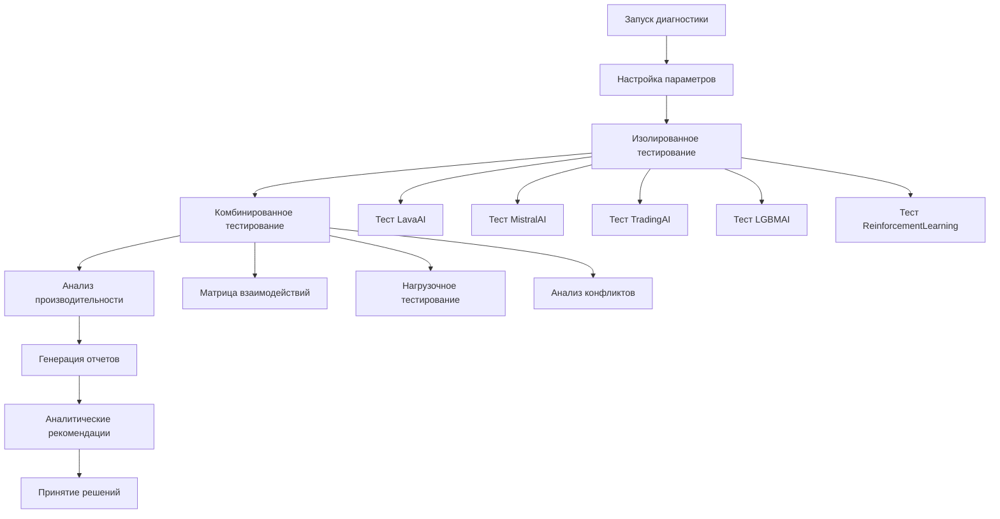

# Система диагностики AI моделей торговой системы - Требования к продукту

## 1. Обзор продукта

Комплексная система диагностики для анализа стабильности и производительности AI моделей в торговой системе WinRT и PPL. Система предназначена для выявления узких мест, оценки производительности отдельных моделей и их взаимодействия, а также предоставления рекомендаций по оптимизации.

Основная цель: обеспечить объективную оценку работы AI моделей (LavaAI, MistralAI, TradingAI, LGBMAI, ReinforcementLearningEngine) для принятия обоснованных решений о переобучении, дообучении или изменении стратегий взаимодействия.

## 2. Основные функции

### 2.1 Роли пользователей

| Роль | Метод доступа | Основные права |
|------|---------------|----------------|
| AI-разработчик | Прямой запуск скрипта | Полный доступ к диагностике, настройка параметров тестирования |
| Системный администратор | CLI интерфейс | Мониторинг производительности, анализ ресурсов |
| Трейдер-аналитик | Веб-отчеты | Просмотр результатов, анализ рекомендаций |

### 2.2 Модули функций

Система диагностики AI моделей состоит из следующих основных страниц:

1. **Главная страница диагностики**: выбор типа тестирования, настройка параметров, запуск диагностики
2. **Страница изолированного тестирования**: индивидуальное тестирование каждой AI модели
3. **Страница комбинированного тестирования**: тестирование взаимодействия моделей в различных конфигурациях
4. **Страница анализа производительности**: мониторинг ресурсов, времени выполнения, точности
5. **Страница отчетов**: детализированные отчеты с графиками и статистикой
6. **Страница рекомендаций**: аналитические выводы и предложения по оптимизации

### 2.3 Детали страниц

| Название страницы | Название модуля | Описание функций |
|-------------------|-----------------|------------------|
| Главная страница диагностики | Панель управления | Выбор AI моделей для тестирования, настройка параметров диагностики, запуск тестовых сценариев |
| Главная страница диагностики | Конфигуратор тестов | Настройка периодов тестирования, выбор торговых пар, установка метрик производительности |
| Страница изолированного тестирования | Тестер LavaAI | Изолированное тестирование технического анализа, измерение точности паттернов, анализ производительности |
| Страница изолированного тестирования | Тестер MistralAI | Тестирование принятия торговых решений, анализ времени отклика, оценка качества решений |
| Страница изолированного тестирования | Тестер TradingAI | Анализ рыночных условий, тестирование торговых сигналов, измерение точности прогнозов |
| Страница изолированного тестирования | Тестер LGBMAI | Тестирование управления рисками, анализ машинного обучения, оценка точности предсказаний |
| Страница изолированного тестирования | Тестер ReinforcementLearning | Анализ системы весов, тестирование адаптации, измерение эффективности обучения |
| Страница комбинированного тестирования | Матрица взаимодействий | Тестирование всех возможных комбинаций моделей, анализ синергии, выявление конфликтов |
| Страница комбинированного тестирования | Нагрузочное тестирование | Тестирование под различными нагрузками, анализ деградации производительности, стресс-тестирование |
| Страница комбинированного тестирования | Анализатор конфликтов | Выявление противоречий между моделями, анализ влияния одной модели на другие |
| Страница анализа производительности | Монитор ресурсов | Отслеживание потребления CPU, RAM, GPU, анализ утечек памяти, мониторинг дискового пространства |
| Страница анализа производительности | Анализатор времени | Измерение времени выполнения каждой модели, анализ задержек, выявление узких мест |
| Страница анализа производительности | Метрики точности | Расчет винрейта, ROI, Sharpe ratio, максимальной просадки для каждой модели |
| Страница отчетов | Генератор графиков | Создание графиков производительности, визуализация метрик, сравнительные диаграммы |
| Страница отчетов | Статистический анализ | Расчет статистических показателей, корреляционный анализ, тренды производительности |
| Страница отчетов | Экспорт данных | Сохранение отчетов в различных форматах (HTML, PDF, CSV, JSON) |
| Страница рекомендаций | Аналитический движок | Анализ результатов тестирования, выявление паттернов, генерация рекомендаций |
| Страница рекомендаций | Система принятия решений | Определение необходимости переобучения, дообучения, изменения стратегий взаимодействия |

## 3. Основные процессы

### Процесс диагностики AI моделей

1. **Инициализация**: Пользователь запускает диагностическую систему и выбирает параметры тестирования
2. **Изолированное тестирование**: Система последовательно тестирует каждую AI модель отдельно, измеряя производительность, точность и потребление ресурсов
3. **Комбинированное тестирование**: Система тестирует различные комбинации моделей, анализируя их взаимодействие и синергию
4. **Анализ производительности**: Система собирает метрики производительности, анализирует узкие места и выявляет проблемы
5. **Генерация отчетов**: Система создает детализированные отчеты с графиками, статистикой и визуализацией результатов
6. **Аналитические рекомендации**: Система передает результаты аналитическому движку для принятия решений о дальнейших действиях

## 4. Дизайн пользовательского интерфейса

### 4.1 Стиль дизайна

- **Основные цвета**: Темная тема с акцентами #00ff88 (зеленый) и #ff4444 (красный) для индикации состояний
- **Вторичные цвета**: #333333 (темно-серый фон), #ffffff (белый текст), #888888 (серый для второстепенной информации)
- **Стиль кнопок**: Плоские кнопки с закругленными углами, hover-эффекты
- **Шрифты**: Monospace для кода и данных, Sans-serif для интерфейса, размеры 12-16px
- **Стиль макета**: Консольный интерфейс с табличным представлением данных, прогресс-бары для длительных операций
- **Иконки**: ASCII-символы и Unicode для совместимости с терминалом

### 4.2 Обзор дизайна страниц

| Название страницы | Название модуля | UI элементы |
|-------------------|-----------------|-------------|
| Главная страница диагностики | Панель управления | Меню выбора моделей (чекбоксы), кнопки запуска тестов, индикаторы статуса, прогресс-бар |
| Страница изолированного тестирования | Тестер моделей | Таблицы результатов, графики производительности в ASCII, цветовые индикаторы статуса |
| Страница комбинированного тестирования | Матрица взаимодействий | Матричное представление результатов, тепловые карты в ASCII, сравнительные таблицы |
| Страница анализа производительности | Монитор ресурсов | Графики потребления ресурсов, таблицы метрик, индикаторы производительности |
| Страница отчетов | Генератор отчетов | Форматированные таблицы, ASCII-графики, экспорт в различные форматы |
| Страница рекомендаций | Система рекомендаций | Структурированный текст с рекомендациями, приоритизированные списки действий |

### 4.3 Адаптивность

Система разработана для работы в терминале и поддерживает различные размеры консоли. Интерфейс автоматически адаптируется к ширине терминала, обеспечивая читаемость на экранах от 80 до 200+ символов в ширину.