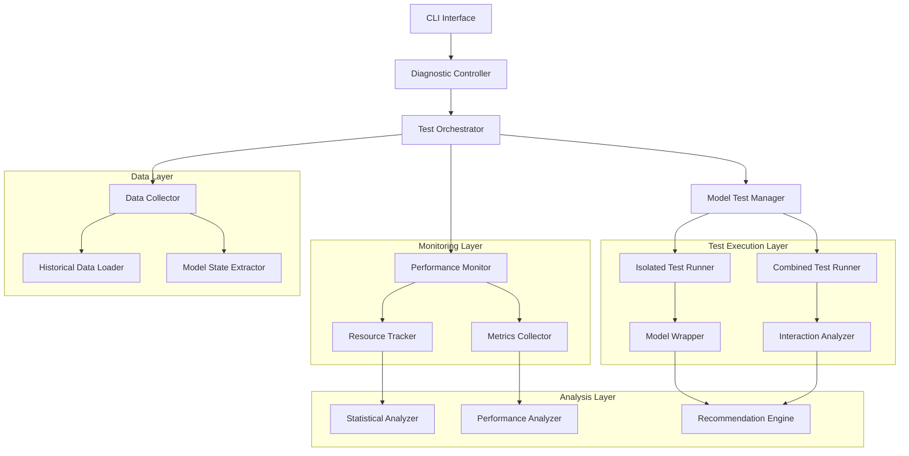
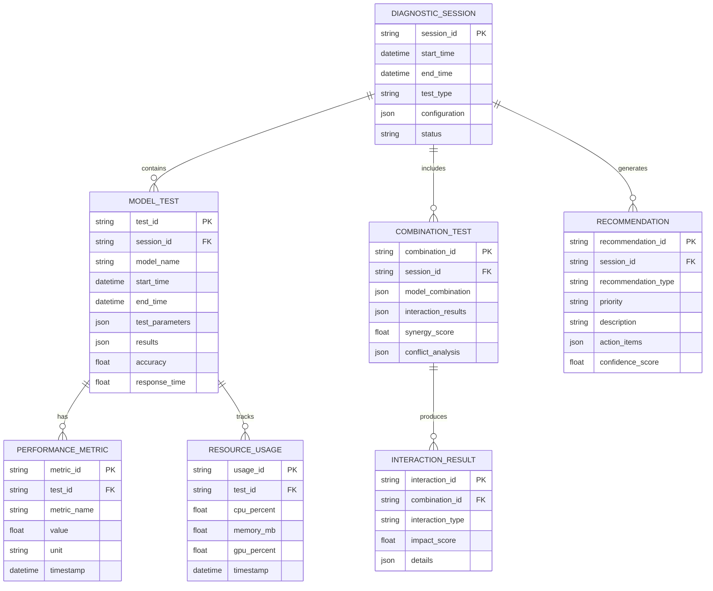

# Техническая архитектура системы диагностики AI моделей

## 1. Архитектурный дизайн

```mermaid
graph TD
    A[AI Diagnostic CLI] --> B[Diagnostic Controller]
    B --> C[Isolated Model Tester]
    B --> D[Combined Model Tester]
    B --> E[Performance Analyzer]
    B --> F[Report Generator]
    B --> G[Recommendation Engine]
    
    C --> H[LavaAI Tester]
    C --> I[MistralAI Tester]
    C --> J[TradingAI Tester]
    C --> K[LGBMAI Tester]
    C --> L[ReinforcementLearning Tester]
    
    D --> M[Interaction Matrix]
    D --> N[Load Tester]
    D --> O[Conflict Analyzer]
    
    E --> P[Resource Monitor]
    E --> Q[Performance Metrics]
    E --> R[Timing Analyzer]
    
    F --> S[Chart Generator]
    F --> T[Statistical Analyzer]
    F --> U[Export Manager]
    
    G --> V[Decision Engine]
    G --> W[Recommendation Formatter]
    
    subgraph "Core Layer"
        B
        C
        D
        E
        F
        G
    end
    
    subgraph "AI Models Layer"
        H
        I
        J
        K
        L
    end
    
    subgraph "Analysis Layer"
        M
        N
        O
        P
        Q
        R
    end
    
    subgraph "Output Layer"
        S
        T
        U
        V
        W
    end
    
    subgraph "Data Sources"
        X[Historical Data]
        Y[Model Weights]
        Z[Performance Cache]
    end
    
    C --> X
    D --> Y
    E --> Z
```



## 2. Описание технологий

- Frontend: Python CLI с rich/colorama для улучшенного вывода
- Backend: Python 3.8+ с asyncio для асинхронного тестирования
- Анализ данных: pandas, numpy, scipy для статистического анализа
- Визуализация: matplotlib, plotly для генерации графиков
- Мониторинг: psutil для отслеживания ресурсов системы
- Экспорт: reportlab для PDF, openpyxl для Excel отчетов

## 3. Определения маршрутов

| Маршрут | Назначение |
|---------|------------|
| /diagnostic | Главная страница диагностики с выбором параметров |
| /isolated | Страница изолированного тестирования моделей |
| /combined | Страница комбинированного тестирования |
| /performance | Страница анализа производительности |
| /reports | Страница генерации и просмотра отчетов |
| /recommendations | Страница аналитических рекомендаций |

## 4. Определения API

### 4.1 Основные API

Диагностика изолированных моделей
```
POST /api/diagnostic/isolated
```

Запрос:
| Название параметра | Тип параметра | Обязательный | Описание |
|-------------------|---------------|--------------|----------|
| model_name | string | true | Название AI модели (lava, mistral, trading, lgbm, reinforcement) |
| test_duration | integer | true | Продолжительность теста в минутах |
| test_pairs | array | true | Список торговых пар для тестирования |
| metrics | array | false | Список метрик для сбора |

Ответ:
| Название параметра | Тип параметра | Описание |
|-------------------|---------------|----------|
| model_name | string | Название протестированной модели |
| test_results | object | Результаты тестирования |
| performance_metrics | object | Метрики производительности |
| resource_usage | object | Использование ресурсов |

Пример запроса:
```json
{
  "model_name": "lava",
  "test_duration": 30,
  "test_pairs": ["BTCUSDT", "ETHUSDT"],
  "metrics": ["accuracy", "response_time", "memory_usage"]
}
```

Комбинированное тестирование моделей
```
POST /api/diagnostic/combined
```

Запрос:
| Название параметра | Тип параметра | Обязательный | Описание |
|-------------------|---------------|--------------|----------|
| model_combinations | array | true | Комбинации моделей для тестирования |
| interaction_tests | array | true | Типы тестов взаимодействия |
| load_levels | array | false | Уровни нагрузки для тестирования |

Ответ:
| Название параметра | Тип параметра | Описание |
|-------------------|---------------|----------|
| combination_results | array | Результаты для каждой комбинации |
| interaction_analysis | object | Анализ взаимодействий |
| conflict_detection | array | Выявленные конфликты |

Генерация рекомендаций
```
POST /api/diagnostic/recommendations
```

Запрос:
| Название параметра | Тип параметра | Обязательный | Описание |
|-------------------|---------------|--------------|----------|
| test_results | object | true | Результаты всех тестов |
| performance_data | object | true | Данные о производительности |
| current_config | object | true | Текущая конфигурация системы |

Ответ:
| Название параметра | Тип параметра | Описание |
|-------------------|---------------|----------|
| recommendations | array | Список рекомендаций |
| priority_actions | array | Приоритетные действия |
| retraining_suggestions | object | Предложения по переобучению |

## 5. Архитектурная диаграмма сервера



## 6. Модель данных

### 6.1 Определение модели данных



### 6.2 Язык определения данных (DDL)

Таблица диагностических сессий (diagnostic_sessions)
```sql
-- создание таблицы
CREATE TABLE diagnostic_sessions (
    session_id TEXT PRIMARY KEY,
    start_time TIMESTAMP WITH TIME ZONE DEFAULT NOW(),
    end_time TIMESTAMP WITH TIME ZONE,
    test_type TEXT NOT NULL CHECK (test_type IN ('isolated', 'combined', 'full')),
    configuration TEXT, -- JSON конфигурация
    status TEXT DEFAULT 'running' CHECK (status IN ('running', 'completed', 'failed', 'cancelled')),
    created_at TIMESTAMP WITH TIME ZONE DEFAULT NOW()
);

-- создание индексов
CREATE INDEX idx_diagnostic_sessions_start_time ON diagnostic_sessions(start_time DESC);
CREATE INDEX idx_diagnostic_sessions_status ON diagnostic_sessions(status);
```

Таблица тестов моделей (model_tests)
```sql
-- создание таблицы
CREATE TABLE model_tests (
    test_id TEXT PRIMARY KEY,
    session_id TEXT NOT NULL REFERENCES diagnostic_sessions(session_id),
    model_name TEXT NOT NULL CHECK (model_name IN ('lava', 'mistral', 'trading', 'lgbm', 'reinforcement')),
    start_time TIMESTAMP WITH TIME ZONE DEFAULT NOW(),
    end_time TIMESTAMP WITH TIME ZONE,
    test_parameters TEXT, -- JSON параметры
    results TEXT, -- JSON результаты
    accuracy REAL,
    response_time REAL,
    created_at TIMESTAMP WITH TIME ZONE DEFAULT NOW()
);

-- создание индексов
CREATE INDEX idx_model_tests_session_id ON model_tests(session_id);
CREATE INDEX idx_model_tests_model_name ON model_tests(model_name);
CREATE INDEX idx_model_tests_accuracy ON model_tests(accuracy DESC);
```

Таблица метрик производительности (performance_metrics)
```sql
-- создание таблицы
CREATE TABLE performance_metrics (
    metric_id TEXT PRIMARY KEY DEFAULT gen_random_uuid(),
    test_id TEXT NOT NULL REFERENCES model_tests(test_id),
    metric_name TEXT NOT NULL,
    value REAL NOT NULL,
    unit TEXT,
    timestamp TIMESTAMP WITH TIME ZONE DEFAULT NOW()
);

-- создание индексов
CREATE INDEX idx_performance_metrics_test_id ON performance_metrics(test_id);
CREATE INDEX idx_performance_metrics_name ON performance_metrics(metric_name);
CREATE INDEX idx_performance_metrics_timestamp ON performance_metrics(timestamp DESC);
```

Таблица использования ресурсов (resource_usage)
```sql
-- создание таблицы
CREATE TABLE resource_usage (
    usage_id TEXT PRIMARY KEY DEFAULT gen_random_uuid(),
    test_id TEXT NOT NULL REFERENCES model_tests(test_id),
    cpu_percent REAL,
    memory_mb REAL,
    gpu_percent REAL,
    timestamp TIMESTAMP WITH TIME ZONE DEFAULT NOW()
);

-- создание индексов
CREATE INDEX idx_resource_usage_test_id ON resource_usage(test_id);
CREATE INDEX idx_resource_usage_timestamp ON resource_usage(timestamp DESC);
```

Таблица комбинированных тестов (combination_tests)
```sql
-- создание таблицы
CREATE TABLE combination_tests (
    combination_id TEXT PRIMARY KEY DEFAULT gen_random_uuid(),
    session_id TEXT NOT NULL REFERENCES diagnostic_sessions(session_id),
    model_combination TEXT NOT NULL, -- JSON массив моделей
    interaction_results TEXT, -- JSON результаты взаимодействия
    synergy_score REAL,
    conflict_analysis TEXT, -- JSON анализ конфликтов
    created_at TIMESTAMP WITH TIME ZONE DEFAULT NOW()
);

-- создание индексов
CREATE INDEX idx_combination_tests_session_id ON combination_tests(session_id);
CREATE INDEX idx_combination_tests_synergy_score ON combination_tests(synergy_score DESC);
```

Таблица рекомендаций (recommendations)
```sql
-- создание таблицы
CREATE TABLE recommendations (
    recommendation_id TEXT PRIMARY KEY DEFAULT gen_random_uuid(),
    session_id TEXT NOT NULL REFERENCES diagnostic_sessions(session_id),
    recommendation_type TEXT NOT NULL CHECK (recommendation_type IN ('retrain', 'fine_tune', 'config_change', 'architecture_change')),
    priority TEXT DEFAULT 'medium' CHECK (priority IN ('low', 'medium', 'high', 'critical')),
    description TEXT NOT NULL,
    action_items TEXT, -- JSON список действий
    confidence_score REAL CHECK (confidence_score >= 0 AND confidence_score <= 1),
    created_at TIMESTAMP WITH TIME ZONE DEFAULT NOW()
);

-- создание индексов
CREATE INDEX idx_recommendations_session_id ON recommendations(session_id);
CREATE INDEX idx_recommendations_priority ON recommendations(priority);
CREATE INDEX idx_recommendations_confidence ON recommendations(confidence_score DESC);

-- начальные данные
INSERT INTO diagnostic_sessions (session_id, test_type, configuration, status)
VALUES ('demo_session_001', 'full', '{"test_duration": 60, "models": ["lava", "mistral", "trading"]}', 'completed');
```