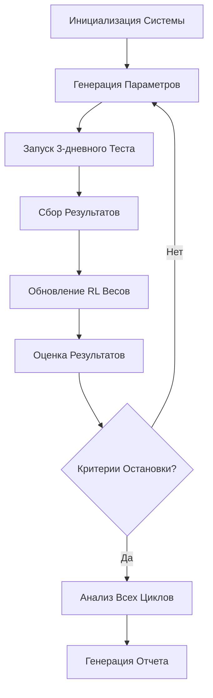

# Автоматизированная Система Множественного Тестирования Винрейта

## 1. Обзор Продукта

Автоматизированная система для запуска множественных циклов тестирования винрейта с адаптивными настройками и интеграцией с Reinforcement Learning Engine. Система автоматически прогоняет серии 3-дневных тестов с различными параметрами для поиска оптимальных торговых настроек и стабилизации AI моделей.

Основная цель: достижение стабильного P&L и винрейта через автоматическое тестирование множественных конфигураций и адаптивное обучение весов AI моделей.

## 2. Основные Функции

### 2.1 Роли Пользователей

| Роль | Метод Регистрации | Основные Права |
|------|-------------------|----------------|
| Трейдер | Доступ к системе через конфигурацию | Запуск тестов, просмотр результатов |
| Администратор | Системный доступ | Настройка параметров, управление циклами |

### 2.2 Модули Функций

Система автоматизированного тестирования состоит из следующих основных страниц:

1. **Панель управления циклами**: конфигурация тестов, запуск/остановка циклов, мониторинг прогресса
2. **Аналитическая панель**: визуализация результатов, сравнение циклов, статистика производительности
3. **Настройки параметров**: управление диапазонами тестирования, стратегии оптимизации
4. **Отчеты и экспорт**: генерация детальных отчетов, экспорт данных

### 2.3 Детали Страниц

| Название Страницы | Название Модуля | Описание Функций |
|-------------------|-----------------|------------------|
| Панель управления | Менеджер циклов | Создание и настройка циклов тестирования, выбор параметров для варьирования, установка критериев остановки |
| Панель управления | Монитор прогресса | Отслеживание текущего цикла, прогресс выполнения, статус AI моделей |
| Аналитическая панель | Визуализатор результатов | Графики P&L по циклам, сравнение винрейтов, анализ drawdown |
| Аналитическая панель | Статистика моделей | Производительность AI моделей, изменение весов, консенсус-анализ |
| Настройки параметров | Конфигуратор диапазонов | Установка минимальных/максимальных значений для позиции, кредитного плеча, take-profit, stop-loss |
| Настройки параметров | Стратегии оптимизации | Выбор алгоритма поиска (grid search, random search, bayesian optimization) |
| Отчеты и экспорт | Генератор отчетов | Создание детальных отчетов по циклам, сравнительный анализ, рекомендации |
| Отчеты и экспорт | Экспорт данных | Сохранение результатов в CSV/JSON, экспорт конфигураций |

## 3. Основной Процесс

Система работает в автоматическом режиме, выполняя следующие этапы:

**Основной Поток Тестирования:**
1. Инициализация системы и загрузка базовой конфигурации
2. Генерация набора параметров для тестирования (позиция, кредитное плечо, take-profit, stop-loss)
3. Запуск 3-дневного цикла тестирования с текущими параметрами
4. Сбор и анализ результатов цикла (P&L, винрейт, drawdown, статистика AI моделей)
5. Обновление весов AI моделей через Reinforcement Learning Engine
6. Оценка результатов и выбор следующих параметров для тестирования
7. Повторение циклов до достижения критериев остановки или завершения всех комбинаций

**Поток Оптимизации:**
1. Анализ всех завершенных циклов
2. Ранжирование результатов по комплексному скору (P&L + винрейт + стабильность)
3. Выбор топ-3 конфигураций для дополнительного тестирования
4. Генерация финального отчета с рекомендациями

## 4. Дизайн Пользовательского Интерфейса

### 4.1 Стиль Дизайна

- **Основные цвета**: Темно-синий (#1a1a2e), зеленый (#00ff88), красный (#ff4757)
- **Стиль кнопок**: Современные плоские кнопки с закругленными углами
- **Шрифт**: Roboto, размеры 14px (основной текст), 18px (заголовки), 24px (главные заголовки)
- **Стиль макета**: Карточный дизайн с боковой навигацией
- **Иконки**: Material Design Icons для индикаторов состояния и действий

### 4.2 Обзор Дизайна Страниц

| Название Страницы | Название Модуля | UI Элементы |
|-------------------|-----------------|-------------|
| Панель управления | Менеджер циклов | Карточки конфигураций с параметрами, кнопки запуска/остановки, прогресс-бары, индикаторы статуса |
| Аналитическая панель | Визуализатор результатов | Интерактивные графики Chart.js, таблицы сравнения, цветовые индикаторы производительности |
| Настройки параметров | Конфигуратор диапазонов | Слайдеры для диапазонов значений, чекбоксы для включения параметров, dropdown для стратегий |
| Отчеты и экспорт | Генератор отчетов | Превью отчетов, кнопки экспорта, фильтры по датам и результатам |

### 4.3 Адаптивность

Система разработана как desktop-first приложение с адаптацией для планшетов. Основной фокус на больших экранах для удобного анализа множественных графиков и таблиц данных.