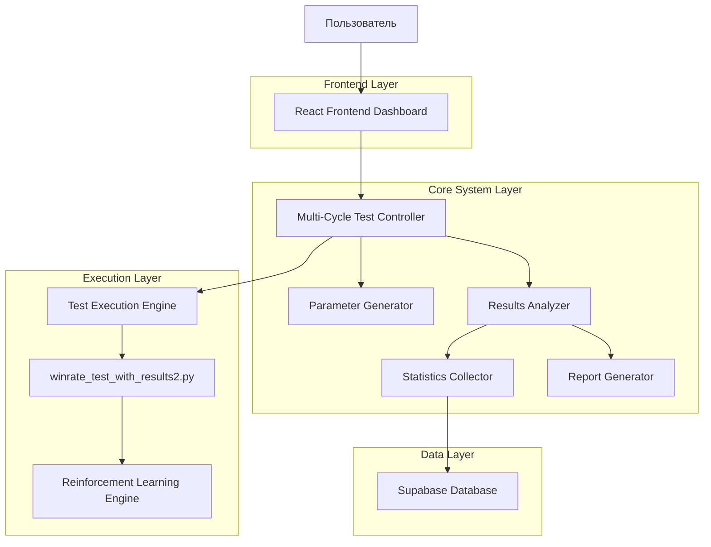
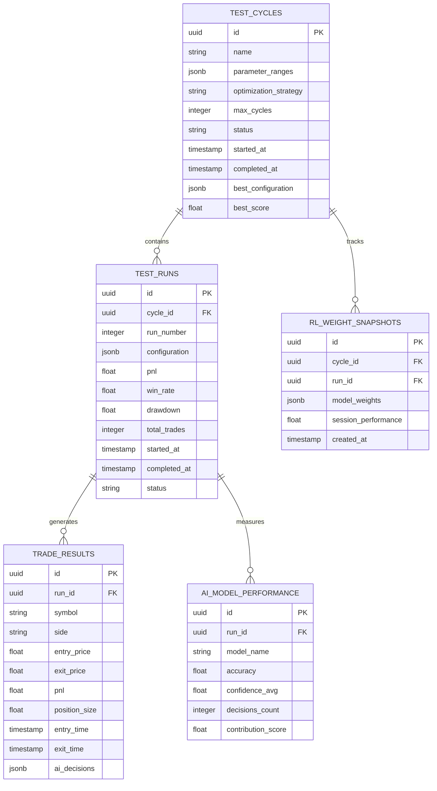

# Техническая Архитектура Автоматизированной Системы Множественного Тестирования

## 1. Архитектурный Дизайн



## 2. Описание Технологий

- Frontend: React@18 + Chart.js@4 + tailwindcss@3 + vite
- Backend: Python@3.9 + FastAPI@0.104 + asyncio
- Database: Supabase (PostgreSQL)
- AI Integration: Существующий Reinforcement Learning Engine
- Планировщик: APScheduler@3.10

## 3. Определения Маршрутов

| Маршрут | Назначение |
|---------|------------|
| /dashboard | Главная панель управления циклами тестирования |
| /analytics | Аналитическая панель с графиками и статистикой |
| /settings | Настройки параметров и конфигурации |
| /reports | Генерация и просмотр отчетов |
| /cycle/:id | Детальный просмотр конкретного цикла |

## 4. API Определения

### 4.1 Core API

**Управление циклами тестирования**
```
POST /api/cycles/start
```

Request:
| Название Параметра | Тип Параметра | Обязательный | Описание |
|-------------------|---------------|--------------|----------|
| test_duration_days | integer | true | Продолжительность каждого теста в днях (по умолчанию 3) |
| parameter_ranges | object | true | Диапазоны параметров для тестирования |
| optimization_strategy | string | true | Стратегия оптимизации (grid_search, random_search, bayesian) |
| max_cycles | integer | false | Максимальное количество циклов |

Response:
| Название Параметра | Тип Параметра | Описание |
|-------------------|---------------|----------|
| cycle_id | string | Уникальный идентификатор цикла |
| status | string | Статус запуска |
| estimated_duration | integer | Ожидаемая продолжительность в часах |

Example:
```json
{
  "test_duration_days": 3,
  "parameter_ranges": {
    "position_percent": [1, 5],
    "leverage": [2, 10],
    "take_profit_percent": [3, 8],
    "stop_loss_percent": [2, 6]
  },
  "optimization_strategy": "bayesian",
  "max_cycles": 50
}
```

**Получение результатов**
```
GET /api/cycles/{cycle_id}/results
```

Response:
| Название Параметра | Тип Параметра | Описание |
|-------------------|---------------|----------|
| cycle_results | array | Массив результатов всех тестов в цикле |
| best_configuration | object | Лучшая найденная конфигурация |
| rl_weights_evolution | array | Эволюция весов AI моделей |
| performance_metrics | object | Агрегированные метрики производительности |

**Управление параметрами**
```
PUT /api/settings/parameters
```

Request:
| Название Параметра | Тип Параметра | Обязательный | Описание |
|-------------------|---------------|--------------|----------|
| symbols | array | true | Список торговых пар для тестирования |
| base_config | object | true | Базовая конфигурация системы |
| stop_criteria | object | true | Критерии остановки циклов |

## 5. Архитектурная Диаграмма Сервера

```mermaid
graph TD
    A[FastAPI Controller] --> B[Cycle Management Service]
    B --> C[Parameter Generation Service]
    B --> D[Test Execution Service]
    B --> E[Results Analysis Service]
    D --> F[Test Runner (winrate_test_with_results2.py)]
    F --> G[Reinforcement Learning Engine]
    E --> H[Statistics Calculator]
    E --> I[Performance Evaluator]
    H --> J[Database Repository]
    I --> J

    subgraph "API Layer"
        A
    end

    subgraph "Business Logic Layer"
        B
        C
        E
        H
        I
    end

    subgraph "Execution Layer"
        D
        F
        G
    end

    subgraph "Data Access Layer"
        J
    end
```

## 6. Модель Данных

### 6.1 Определение Модели Данных



### 6.2 Язык Определения Данных

**Таблица циклов тестирования (test_cycles)**
```sql
-- создание таблицы
CREATE TABLE test_cycles (
    id UUID PRIMARY KEY DEFAULT gen_random_uuid(),
    name VARCHAR(255) NOT NULL,
    parameter_ranges JSONB NOT NULL,
    optimization_strategy VARCHAR(50) NOT NULL CHECK (optimization_strategy IN ('grid_search', 'random_search', 'bayesian')),
    max_cycles INTEGER DEFAULT 50,
    status VARCHAR(20) DEFAULT 'pending' CHECK (status IN ('pending', 'running', 'completed', 'failed', 'stopped')),
    started_at TIMESTAMP WITH TIME ZONE,
    completed_at TIMESTAMP WITH TIME ZONE,
    best_configuration JSONB,
    best_score FLOAT,
    created_at TIMESTAMP WITH TIME ZONE DEFAULT NOW(),
    updated_at TIMESTAMP WITH TIME ZONE DEFAULT NOW()
);

-- создание индексов
CREATE INDEX idx_test_cycles_status ON test_cycles(status);
CREATE INDEX idx_test_cycles_started_at ON test_cycles(started_at DESC);

-- права доступа
GRANT SELECT ON test_cycles TO anon;
GRANT ALL PRIVILEGES ON test_cycles TO authenticated;
```

**Таблица запусков тестов (test_runs)**
```sql
-- создание таблицы
CREATE TABLE test_runs (
    id UUID PRIMARY KEY DEFAULT gen_random_uuid(),
    cycle_id UUID NOT NULL REFERENCES test_cycles(id) ON DELETE CASCADE,
    run_number INTEGER NOT NULL,
    configuration JSONB NOT NULL,
    pnl FLOAT,
    win_rate FLOAT,
    drawdown FLOAT,
    total_trades INTEGER,
    started_at TIMESTAMP WITH TIME ZONE,
    completed_at TIMESTAMP WITH TIME ZONE,
    status VARCHAR(20) DEFAULT 'pending' CHECK (status IN ('pending', 'running', 'completed', 'failed')),
    created_at TIMESTAMP WITH TIME ZONE DEFAULT NOW()
);

-- создание индексов
CREATE INDEX idx_test_runs_cycle_id ON test_runs(cycle_id);
CREATE INDEX idx_test_runs_pnl ON test_runs(pnl DESC);
CREATE INDEX idx_test_runs_win_rate ON test_runs(win_rate DESC);

-- права доступа
GRANT SELECT ON test_runs TO anon;
GRANT ALL PRIVILEGES ON test_runs TO authenticated;
```

**Таблица результатов сделок (trade_results)**
```sql
-- создание таблицы
CREATE TABLE trade_results (
    id UUID PRIMARY KEY DEFAULT gen_random_uuid(),
    run_id UUID NOT NULL REFERENCES test_runs(id) ON DELETE CASCADE,
    symbol VARCHAR(20) NOT NULL,
    side VARCHAR(10) NOT NULL CHECK (side IN ('long', 'short')),
    entry_price DECIMAL(20, 8) NOT NULL,
    exit_price DECIMAL(20, 8),
    pnl FLOAT,
    position_size FLOAT NOT NULL,
    entry_time TIMESTAMP WITH TIME ZONE NOT NULL,
    exit_time TIMESTAMP WITH TIME ZONE,
    ai_decisions JSONB,
    created_at TIMESTAMP WITH TIME ZONE DEFAULT NOW()
);

-- создание индексов
CREATE INDEX idx_trade_results_run_id ON trade_results(run_id);
CREATE INDEX idx_trade_results_symbol ON trade_results(symbol);
CREATE INDEX idx_trade_results_pnl ON trade_results(pnl DESC);

-- права доступа
GRANT SELECT ON trade_results TO anon;
GRANT ALL PRIVILEGES ON trade_results TO authenticated;
```

**Таблица снимков весов RL (rl_weight_snapshots)**
```sql
-- создание таблицы
CREATE TABLE rl_weight_snapshots (
    id UUID PRIMARY KEY DEFAULT gen_random_uuid(),
    cycle_id UUID NOT NULL REFERENCES test_cycles(id) ON DELETE CASCADE,
    run_id UUID REFERENCES test_runs(id) ON DELETE CASCADE,
    model_weights JSONB NOT NULL,
    session_performance FLOAT,
    created_at TIMESTAMP WITH TIME ZONE DEFAULT NOW()
);

-- создание индексов
CREATE INDEX idx_rl_weight_snapshots_cycle_id ON rl_weight_snapshots(cycle_id);
CREATE INDEX idx_rl_weight_snapshots_created_at ON rl_weight_snapshots(created_at DESC);

-- права доступа
GRANT SELECT ON rl_weight_snapshots TO anon;
GRANT ALL PRIVILEGES ON rl_weight_snapshots TO authenticated;
```

**Таблица производительности AI моделей (ai_model_performance)**
```sql
-- создание таблицы
CREATE TABLE ai_model_performance (
    id UUID PRIMARY KEY DEFAULT gen_random_uuid(),
    run_id UUID NOT NULL REFERENCES test_runs(id) ON DELETE CASCADE,
    model_name VARCHAR(100) NOT NULL,
    accuracy FLOAT,
    confidence_avg FLOAT,
    decisions_count INTEGER DEFAULT 0,
    contribution_score FLOAT,
    created_at TIMESTAMP WITH TIME ZONE DEFAULT NOW()
);

-- создание индексов
CREATE INDEX idx_ai_model_performance_run_id ON ai_model_performance(run_id);
CREATE INDEX idx_ai_model_performance_model_name ON ai_model_performance(model_name);
CREATE INDEX idx_ai_model_performance_accuracy ON ai_model_performance(accuracy DESC);

-- права доступа
GRANT SELECT ON ai_model_performance TO anon;
GRANT ALL PRIVILEGES ON ai_model_performance TO authenticated;

-- начальные данные
INSERT INTO test_cycles (name, parameter_ranges, optimization_strategy, max_cycles)
VALUES (
    'Initial Stabilization Cycle',
    '{
        "position_percent": [1, 3],
        "leverage": [2, 5],
        "take_profit_percent": [3, 6],
        "stop_loss_percent": [2, 4]
    }',
    'bayesian',
    30
);
```