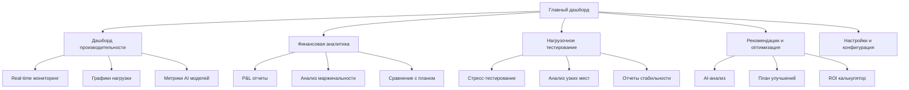

# Техническая документация: Система комплексного системного отчета

## 1. Обзор продукта

Система комплексного системного отчета - это продвинутая платформа мониторинга и анализа производительности торговой системы, которая обеспечивает детальный анализ всех аспектов работы AI-моделей, финансовых показателей и технической производительности.

Система решает критические задачи мониторинга торговых операций, выявления узких мест в производительности и предоставления actionable рекомендаций для оптимизации. Целевая аудитория - трейдеры, аналитики и технические специалисты, работающие с автоматизированными торговыми системами.

Цель системы - обеспечить полную прозрачность работы торговой платформы и максимизировать ROI через data-driven оптимизацию.

## 2. Основные функции

### 2.1 Пользовательские роли

| Роль | Метод регистрации | Основные права |
|------|-------------------|----------------|
| Системный аналитик | Доступ через основную систему | Полный доступ ко всем отчетам и метрикам |
| Трейдер | Интеграция с торговой системой | Просмотр финансовых метрик и торговых отчетов |
| Технический администратор | Административный доступ | Настройка мониторинга, управление алертами |

### 2.2 Модули функций

Система комплексного отчета состоит из следующих основных страниц:

1. **Дашборд производительности**: real-time мониторинг, системные метрики, графики нагрузки
2. **Финансовая аналитика**: P&L отчеты, маржинальность, ROI анализ
3. **Нагрузочное тестирование**: стресс-тесты, анализ узких мест, отчеты стабильности
4. **Рекомендации и оптимизация**: AI-анализ, план улучшений, приоритизация задач
5. **Настройки и конфигурация**: управление алертами, расписание отчетов, пороговые значения

### 2.3 Детали страниц

| Название страницы | Название модуля | Описание функций |
|-------------------|-----------------|------------------|
| Дашборд производительности | Real-time мониторинг | Отображение текущих метрик CPU, RAM, I/O в реальном времени с обновлением каждые 5 секунд |
| Дашборд производительности | Графики нагрузки | Интерактивные графики за 24 часа с возможностью детализации по часам и минутам |
| Дашборд производительности | Метрики AI моделей | Производительность каждой AI модели: время ответа, точность, использование ресурсов |
| Финансовая аналитика | P&L калькулятор | Точный расчет прибыли/убытков по каждой операции с детализацией по валютным парам |
| Финансовая аналитика | Анализ маржинальности | Расчет маржинальности по сегментам: AI модели, валютные пары, временные периоды |
| Финансовая аналитика | Сравнение с планом | Сопоставление фактических показателей с плановыми и бенчмарками |
| Нагрузочное тестирование | Стресс-тестер | Автоматическое тестирование с постепенным увеличением нагрузки от 1 до 50+ пар |
| Нагрузочное тестирование | Анализ узких мест | Выявление компонентов системы, ограничивающих производительность |
| Нагрузочное тестирование | Отчеты стабильности | Тестирование отказоустойчивости и восстановления после сбоев |
| Рекомендации и оптимизация | AI-анализатор | Автоматическое выявление убыточных компонентов и предложения улучшений |
| Рекомендации и оптимизация | План внедрения | Структурированный план улучшений с оценкой эффекта и приоритизацией |
| Рекомендации и оптимизация | ROI калькулятор | Расчет возврата инвестиций для предлагаемых улучшений |
| Настройки и конфигурация | Управление алертами | Настройка уведомлений при критических показателях |
| Настройки и конфигурация | Расписание отчетов | Автоматическая генерация отчетов по заданному расписанию |

## 3. Основные процессы

### Процесс мониторинга производительности:
1. Система непрерывно собирает метрики производительности
2. Данные агрегируются и сохраняются в базе данных
3. Real-time дашборд отображает текущие показатели
4. При превышении пороговых значений отправляются алерты

### Процесс финансового анализа:
1. Сбор данных о торговых операциях из основной системы
2. Расчет P&L по каждой операции и сегменту
3. Сравнение с плановыми показателями
4. Генерация финансовых отчетов

### Процесс нагрузочного тестирования:
1. Планирование тестовых сценариев
2. Постепенное увеличение нагрузки
3. Мониторинг системных метрик во время тестов
4. Анализ результатов и выявление узких мест

## 4. Дизайн пользовательского интерфейса

### 4.1 Стиль дизайна

- **Основные цвета**: Темно-синий (#1a365d) для заголовков, светло-серый (#f7fafc) для фона
- **Вторичные цвета**: Зеленый (#38a169) для прибыли, красный (#e53e3e) для убытков, оранжевый (#dd6b20) для предупреждений
- **Стиль кнопок**: Современные плоские кнопки с закругленными углами (border-radius: 8px)
- **Шрифты**: Inter для заголовков (16-24px), Roboto для основного текста (14px)
- **Стиль макета**: Карточный дизайн с тенями, боковая навигация, адаптивная сетка
- **Иконки**: Feather Icons для единообразия, эмодзи для быстрого визуального восприятия (📊📈📉⚡🎯)

### 4.2 Обзор дизайна страниц

| Название страницы | Название модуля | UI элементы |
|-------------------|-----------------|-------------|
| Дашборд производительности | Real-time мониторинг | Круговые индикаторы для CPU/RAM, линейные графики для I/O, цветовая индикация статуса (зеленый/желтый/красный) |
| Дашборд производительности | Графики нагрузки | Интерактивные Chart.js графики с зумом, временные селекторы, легенда с переключателями |
| Финансовая аналитика | P&L отчеты | Таблицы с сортировкой, фильтрами, цветовое кодирование прибыли/убытков, экспорт в CSV/PDF |
| Нагрузочное тестирование | Стресс-тестер | Прогресс-бары для тестов, real-time логи, кнопки старт/стоп, индикаторы статуса |
| Рекомендации и оптимизация | AI-анализ | Карточки рекомендаций с приоритетами, иконки категорий, кнопки действий |

### 4.3 Адаптивность

Система разработана с desktop-first подходом с полной адаптацией под мобильные устройства. Оптимизирована для сенсорного взаимодействия с увеличенными областями нажатия и свайп-жестами для навигации по графикам.