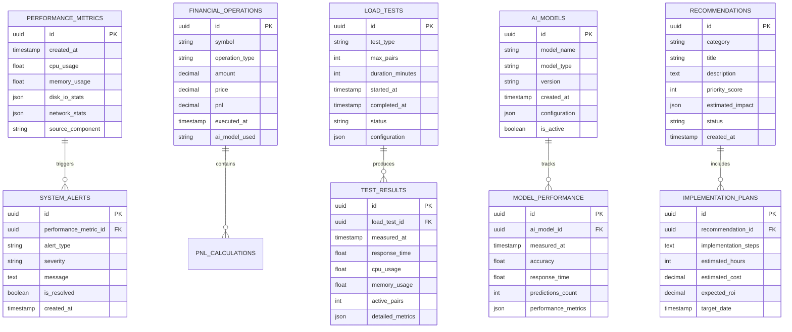

# Техническая архитектура: Система комплексного системного отчета

## 1. Архитектурный дизайн


## 2. Описание технологий

- **Frontend**: React@18 + TypeScript + Tailwind CSS + Chart.js + Vite
- **Backend**: Express.js@4 + TypeScript + Node.js@18
- **Database**: Supabase (PostgreSQL) + Redis для кэширования
- **Мониторинг**: Node.js system metrics + custom performance trackers
- **Интеграция**: AI Diagnostic System API + WinRate Test System

## 3. Определения маршрутов

| Маршрут | Назначение |
|---------|------------|
| /dashboard | Главный дашборд с обзором всех метрик |
| /performance | Страница анализа производительности системы |
| /financial | Финансовая аналитика и P&L отчеты |
| /load-testing | Интерфейс нагрузочного тестирования |
| /recommendations | Страница рекомендаций и оптимизации |
| /settings | Настройки системы и конфигурация алертов |
| /reports | Генерация и просмотр отчетов |

## 4. Определения API

### 4.1 Core API

**Мониторинг производительности**
```
GET /api/performance/metrics
```

Response:
| Параметр | Тип | Описание |
|----------|-----|----------|
| cpu_usage | number | Использование CPU в процентах |
| memory_usage | number | Использование памяти в процентах |
| disk_io | object | Показатели дискового ввода-вывода |
| timestamp | string | Временная метка измерения |

**Финансовые метрики**
```
POST /api/financial/calculate-pnl
```

Request:
| Параметр | Тип | Обязательный | Описание |
|----------|-----|--------------|----------|
| symbol | string | true | Валютная пара |
| start_date | string | true | Дата начала периода |
| end_date | string | true | Дата окончания периода |
| segment | string | false | Сегмент для анализа |

Response:
| Параметр | Тип | Описание |
|----------|-----|----------|
| total_pnl | number | Общая прибыль/убыток |
| trades_count | number | Количество сделок |
| win_rate | number | Процент прибыльных сделок |
| margin_analysis | object | Анализ маржинальности |

**Нагрузочное тестирование**
```
POST /api/load-testing/start
```

Request:
| Параметр | Тип | Обязательный | Описание |
|----------|-----|--------------|----------|
| test_type | string | true | Тип теста (stress, load, spike) |
| max_pairs | number | true | Максимальное количество пар |
| duration | number | true | Длительность теста в минутах |
| ramp_up_time | number | false | Время нарастания нагрузки |

**Рекомендации**
```
GET /api/recommendations/analyze
```

Response:
| Параметр | Тип | Описание |
|----------|-----|----------|
| recommendations | array | Список рекомендаций |
| priority_score | number | Оценка приоритета |
| estimated_impact | object | Оценка влияния на производительность |
| implementation_plan | object | План внедрения |

**Генерация отчетов**
```
POST /api/reports/generate
```

Request:
| Параметр | Тип | Обязательный | Описание |
|----------|-----|--------------|----------|
| report_type | string | true | Тип отчета (performance, financial, full) |
| format | string | true | Формат (html, pdf, json) |
| date_range | object | true | Временной диапазон |
| include_charts | boolean | false | Включать графики |

## 5. Серверная архитектура


## 6. Модель данных

### 6.1 Определение модели данных



### 6.2 Язык определения данных (DDL)

**Таблица метрик производительности**
```sql
-- Создание таблицы
CREATE TABLE performance_metrics (
    id UUID PRIMARY KEY DEFAULT gen_random_uuid(),
    created_at TIMESTAMP WITH TIME ZONE DEFAULT NOW(),
    cpu_usage DECIMAL(5,2) NOT NULL,
    memory_usage DECIMAL(5,2) NOT NULL,
    disk_io_stats JSONB NOT NULL,
    network_stats JSONB,
    source_component VARCHAR(100) NOT NULL,
    updated_at TIMESTAMP WITH TIME ZONE DEFAULT NOW()
);

-- Создание индексов
CREATE INDEX idx_performance_metrics_created_at ON performance_metrics(created_at DESC);
CREATE INDEX idx_performance_metrics_source ON performance_metrics(source_component);
CREATE INDEX idx_performance_metrics_cpu ON performance_metrics(cpu_usage DESC);

-- Права доступа
GRANT SELECT ON performance_metrics TO anon;
GRANT ALL PRIVILEGES ON performance_metrics TO authenticated;
```

**Таблица финансовых операций**
```sql
-- Создание таблицы
CREATE TABLE financial_operations (
    id UUID PRIMARY KEY DEFAULT gen_random_uuid(),
    symbol VARCHAR(20) NOT NULL,
    operation_type VARCHAR(10) CHECK (operation_type IN ('BUY', 'SELL')) NOT NULL,
    amount DECIMAL(18,8) NOT NULL,
    price DECIMAL(18,8) NOT NULL,
    pnl DECIMAL(18,8),
    executed_at TIMESTAMP WITH TIME ZONE NOT NULL,
    ai_model_used VARCHAR(50),
    created_at TIMESTAMP WITH TIME ZONE DEFAULT NOW()
);

-- Создание индексов
CREATE INDEX idx_financial_operations_symbol ON financial_operations(symbol);
CREATE INDEX idx_financial_operations_executed_at ON financial_operations(executed_at DESC);
CREATE INDEX idx_financial_operations_pnl ON financial_operations(pnl DESC);
CREATE INDEX idx_financial_operations_ai_model ON financial_operations(ai_model_used);

-- Права доступа
GRANT SELECT ON financial_operations TO anon;
GRANT ALL PRIVILEGES ON financial_operations TO authenticated;
```

**Таблица нагрузочных тестов**
```sql
-- Создание таблицы
CREATE TABLE load_tests (
    id UUID PRIMARY KEY DEFAULT gen_random_uuid(),
    test_type VARCHAR(20) CHECK (test_type IN ('stress', 'load', 'spike', 'volume')) NOT NULL,
    max_pairs INTEGER NOT NULL,
    duration_minutes INTEGER NOT NULL,
    started_at TIMESTAMP WITH TIME ZONE NOT NULL,
    completed_at TIMESTAMP WITH TIME ZONE,
    status VARCHAR(20) DEFAULT 'pending' CHECK (status IN ('pending', 'running', 'completed', 'failed')),
    configuration JSONB,
    created_at TIMESTAMP WITH TIME ZONE DEFAULT NOW()
);

-- Создание индексов
CREATE INDEX idx_load_tests_started_at ON load_tests(started_at DESC);
CREATE INDEX idx_load_tests_status ON load_tests(status);
CREATE INDEX idx_load_tests_test_type ON load_tests(test_type);

-- Права доступа
GRANT SELECT ON load_tests TO anon;
GRANT ALL PRIVILEGES ON load_tests TO authenticated;
```

**Таблица рекомендаций**
```sql
-- Создание таблицы
CREATE TABLE recommendations (
    id UUID PRIMARY KEY DEFAULT gen_random_uuid(),
    category VARCHAR(50) NOT NULL,
    title VARCHAR(200) NOT NULL,
    description TEXT NOT NULL,
    priority_score INTEGER CHECK (priority_score BETWEEN 1 AND 10) NOT NULL,
    estimated_impact JSONB,
    status VARCHAR(20) DEFAULT 'pending' CHECK (status IN ('pending', 'in_progress', 'completed', 'rejected')),
    created_at TIMESTAMP WITH TIME ZONE DEFAULT NOW(),
    updated_at TIMESTAMP WITH TIME ZONE DEFAULT NOW()
);

-- Создание индексов
CREATE INDEX idx_recommendations_priority ON recommendations(priority_score DESC);
CREATE INDEX idx_recommendations_category ON recommendations(category);
CREATE INDEX idx_recommendations_status ON recommendations(status);
CREATE INDEX idx_recommendations_created_at ON recommendations(created_at DESC);

-- Права доступа
GRANT SELECT ON recommendations TO anon;
GRANT ALL PRIVILEGES ON recommendations TO authenticated;
```

**Инициализация данных**
```sql
-- Начальные данные для тестирования
INSERT INTO performance_metrics (cpu_usage, memory_usage, disk_io_stats, source_component)
VALUES 
    (45.2, 67.8, '{"read_mb": 120, "write_mb": 85}', 'ai_diagnostic_system'),
    (52.1, 71.3, '{"read_mb": 95, "write_mb": 110}', 'trading_engine'),
    (38.7, 59.4, '{"read_mb": 78, "write_mb": 45}', 'data_collector');

INSERT INTO recommendations (category, title, description, priority_score, estimated_impact)
VALUES 
    ('performance', 'Оптимизация кэширования', 'Внедрение Redis кэша для часто запрашиваемых данных', 8, '{"cpu_reduction": 15, "response_time_improvement": 25}'),
    ('financial', 'Улучшение алгоритма расчета P&L', 'Оптимизация вычислений для повышения точности', 7, '{"accuracy_improvement": 12, "processing_speed": 20}'),
    ('architecture', 'Масштабирование AI моделей', 'Распределение нагрузки между несколькими экземплярами', 9, '{"throughput_increase": 40, "latency_reduction": 30}');
```