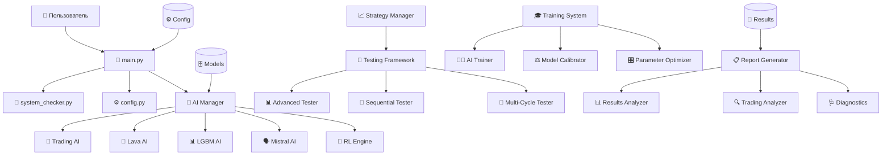
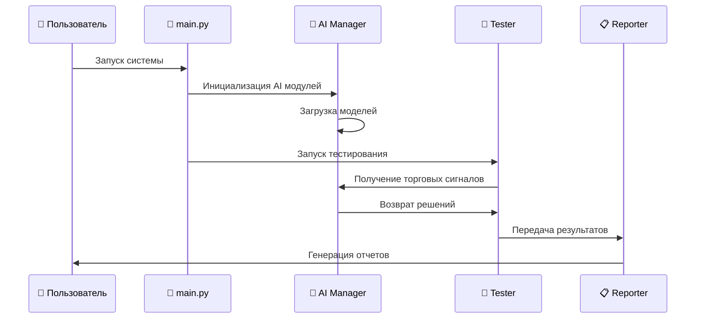
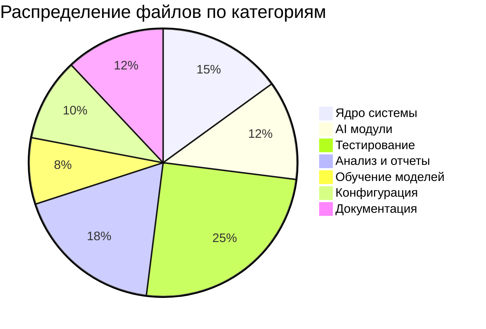

# Детализированный отчет по анализу структуры проекта Peper Binance v4

## 📋 Оглавление
1. [Общая информация о проекте](#общая-информация-о-проекте)
2. [Категоризация файлов по функциональному назначению](#категоризация-файлов)
3. [Детальный анализ компонентов](#детальный-анализ-компонентов)
4. [Архитектурная диаграмма системы](#архитектурная-диаграмма)
5. [Анализ зависимостей](#анализ-зависимостей)
6. [Рекомендации по оптимизации](#рекомендации-по-оптимизации)
7. [Статистика использования ресурсов](#статистика-ресурсов)
8. [Выводы и предложения](#выводы-и-предложения)

---

## 🎯 Общая информация о проекте

**Название проекта:** Peper Binance v4 - AI Trading System  
**Тип системы:** Автоматизированная торговая система с искусственным интеллектом  
**Архитектура:** Модульная система с микросервисной организацией AI компонентов  
**Общее количество файлов:** ~150+ файлов  
**Основные технологии:** Python, LightGBM, Mistral AI, Reinforcement Learning  

### Ключевые особенности системы:
- Многоуровневая AI архитектура (Lava AI, Trading AI, LGBM AI, Mistral AI)
- Автоматизированное тестирование стратегий
- Система обучения с подкреплением (Reinforcement Learning)
- Комплексная система диагностики и анализа
- Модульная архитектура с возможностью отключения ресурсоемких компонентов

---

## 📂 Категоризация файлов по функциональному назначению {#категоризация-файлов}

### 🔥 Критически важные файлы ядра системы

| Файл | Назначение | Важность | Зависимости |
|------|------------|----------|-------------|
| `main.py` | Главная точка входа в систему | **КРИТИЧЕСКИЙ** | system_checker, ai_modules |
| `winrate_test_with_results2.py` | Основной модуль тестирования винрейта | **КРИТИЧЕСКИЙ** | ai_modules, config |
| `config.py` | Основная конфигурация системы | **КРИТИЧЕСКИЙ** | Все модули |
| `strategy_manager.py` | Управление торговыми стратегиями | **КРИТИЧЕСКИЙ** | config, ai_modules |

#### AI Модули (критически важные):
| Файл | Назначение | Важность | Специализация |
|------|------------|----------|---------------|
| `ai_modules/ai_manager.py` | Центральный менеджер AI модулей | **КРИТИЧЕСКИЙ** | Координация всех AI |
| `ai_modules/trading_ai.py` | Основной торговый AI | **КРИТИЧЕСКИЙ** | Торговые решения |
| `ai_modules/lava_ai.py` | Технический анализ | **КРИТИЧЕСКИЙ** | Индикаторы и паттерны |
| `ai_modules/lgbm_ai.py` | Машинное обучение | **КРИТИЧЕСКИЙ** | Риск-менеджмент |
| `ai_modules/mistral_ai.py` | Языковая модель для решений | **ВЫСОКИЙ** | Финальные решения |
| `ai_modules/reinforcement_learning_engine.py` | Обучение с подкреплением | **ВЫСОКИЙ** | Адаптивное обучение |

### 🧪 Тестовые файлы и системы тестирования

#### Основные тестовые системы:
| Файл | Назначение | Важность | Тип тестирования |
|------|------------|----------|------------------|
| `advanced_strategy_tester.py` | Продвинутое тестирование стратегий | **ВЫСОКИЙ** | Интеграционное |
| `sequential_strategy_tester.py` | Последовательное тестирование | **ВЫСОКИЙ** | Автоматизированное |
| `automated_multi_cycle_tester.py` | Многоцикловое тестирование | **ВЫСОКИЙ** | Массовое |
| `reinforcement_winrate_tester.py` | Тестирование RL системы | **СРЕДНИЙ** | RL специфичное |

#### Unit-тесты и диагностика:
| Файл | Назначение | Важность | Категория |
|------|------------|----------|-----------|
| `test_critical_fixes.py` | Тестирование критических исправлений | **ВЫСОКИЙ** | Unit-тест |
| `test_ai_models_diagnostic.py` | Диагностика AI моделей | **ВЫСОКИЙ** | Диагностика |
| `integrated_trading_diagnostics.py` | Интегрированная диагностика | **ВЫСОКИЙ** | Системная |
| `zero_trades_diagnostics.py` | Диагностика отсутствия сделок | **СРЕДНИЙ** | Специализированная |

### 📊 Отчетные файлы и результаты

#### Системы генерации отчетов:
| Файл | Назначение | Важность | Тип отчетов |
|------|------------|----------|-------------|
| `report_generator.py` | Генератор отчетов | **ВЫСОКИЙ** | HTML/CSV отчеты |
| `results_analyzer.py` | Анализатор результатов | **ВЫСОКИЙ** | Статистический анализ |
| `comprehensive_trading_analyzer.py` | Комплексный анализ торговли | **СРЕДНИЙ** | Детальная аналитика |

#### Результаты и логи:
| Директория/Файл | Назначение | Важность | Содержимое |
|-----------------|------------|----------|------------|
| `strategy_testing_results/` | Результаты тестирования | **ВЫСОКИЙ** | JSON, HTML отчеты |
| `training_results/` | Результаты обучения | **СРЕДНИЙ** | Метрики обучения |
| `test_results/` | Результаты тестов | **СРЕДНИЙ** | Тестовые данные |

### 🎓 Файлы обучения моделей

| Файл | Назначение | Важность | Тип обучения |
|------|------------|----------|--------------|
| `trading_ai_trainer.py` | Обучение торгового AI | **ВЫСОКИЙ** | Supervised Learning |
| `mass_training_script.py` | Массовое обучение | **СРЕДНИЙ** | Batch Training |
| `ai_model_calibrator.py` | Калибровка моделей | **ВЫСОКИЙ** | Model Tuning |
| `parameter_optimizer.py` | Оптимизация параметров | **СРЕДНИЙ** | Hyperparameter Tuning |

### 🚀 Файлы запуска и автоматизации

| Файл | Назначение | Важность | Тип запуска |
|------|------------|----------|-------------|
| `run_sequential_testing.py` | Запуск последовательного тестирования | **ВЫСОКИЙ** | CLI интерфейс |
| `run_strategy_testing.py` | Запуск тестирования стратегий | **ВЫСОКИЙ** | Основной тестер |
| `run_automated_tests.py` | Автоматизированные тесты | **СРЕДНИЙ** | Batch тестирование |
| `run_reinforcement_learning.py` | Запуск RL обучения | **СРЕДНИЙ** | RL процессы |

### 📚 Документация и конфигурация

#### Документация:
| Файл | Назначение | Важность | Тип документации |
|------|------------|----------|------------------|
| `README_*.md` | Документация модулей | **СРЕДНИЙ** | Пользовательская |
| `*_GUIDE.md` | Руководства пользователя | **СРЕДНИЙ** | Инструкции |
| `requirements.txt` | Зависимости Python | **КРИТИЧЕСКИЙ** | Системная |

#### Конфигурация:
| Файл/Директория | Назначение | Важность | Тип конфигурации |
|-----------------|------------|----------|------------------|
| `config/` | Конфигурационные файлы | **КРИТИЧЕСКИЙ** | JSON конфиги |
| `config_params.py` | Параметры конфигурации | **ВЫСОКИЙ** | Python конфиг |

---

## 🔍 Детальный анализ компонентов {#детальный-анализ-компонентов}

### Основные компоненты системы

#### 1. Ядро системы (Core System)
```
main.py → Точка входа
├── system_checker.py → Проверка системных требований
├── config.py → Основная конфигурация
└── ai_modules/ → AI компоненты
    ├── ai_manager.py → Центральный менеджер
    ├── trading_ai.py → Торговый AI
    ├── lava_ai.py → Технический анализ
    ├── lgbm_ai.py → Машинное обучение
    └── mistral_ai.py → Языковая модель
```

#### 2. Система тестирования (Testing Framework)
```
winrate_test_with_results2.py → Основной тестер винрейта
├── advanced_strategy_tester.py → Продвинутое тестирование
├── sequential_strategy_tester.py → Последовательное тестирование
├── automated_multi_cycle_tester.py → Многоцикловое тестирование
└── strategy_manager.py → Управление стратегиями
```

#### 3. Система обучения (Training System)
```
trading_ai_trainer.py → Основной тренер
├── ai_model_calibrator.py → Калибровка моделей
├── parameter_optimizer.py → Оптимизация параметров
└── reinforcement_learning_engine.py → RL обучение
```

#### 4. Система анализа и отчетности (Analytics & Reporting)
```
report_generator.py → Генератор отчетов
├── results_analyzer.py → Анализатор результатов
├── comprehensive_trading_analyzer.py → Комплексный анализ
└── integrated_trading_diagnostics.py → Диагностика
```

---

## 🏗️ Архитектурная диаграмма системы {#архитектурная-диаграмма}



### Потоки данных в системе:



---

## 🔗 Анализ зависимостей {#анализ-зависимостей}

### Критические зависимости

#### Уровень 1 - Системные зависимости:
- `main.py` ← Все компоненты системы
- `config.py` ← Все модули конфигурации
- `ai_manager.py` ← Все AI модули
- `requirements.txt` ← Все Python зависимости

#### Уровень 2 - Функциональные зависимости:
- `winrate_test_with_results2.py` ← Основные тестеры
- `strategy_manager.py` ← Все тестовые модули
- `report_generator.py` ← Все анализаторы
- `trading_ai.py` ← Все торговые компоненты

#### Уровень 3 - Специализированные зависимости:
- `advanced_strategy_tester.py` ← Продвинутые тестеры
- `reinforcement_learning_engine.py` ← RL компоненты
- `mistral_ai.py` ← Языковые модели
- `comprehensive_trading_analyzer.py` ← Аналитические модули

### Матрица зависимостей

| Компонент | Зависит от | Используется в |
|-----------|------------|----------------|
| `main.py` | system_checker, ai_modules | - |
| `ai_manager.py` | Все AI модули | main.py, тестеры |
| `winrate_test_with_results2.py` | ai_modules, config | Все тестеры |
| `strategy_manager.py` | config | Все тестеры |
| `report_generator.py` | results_analyzer | Все анализаторы |

---

## 💡 Рекомендации по оптимизации {#рекомендации-по-оптимизации}

### 🗑️ Файлы для безопасного удаления

#### Устаревшие тестовые файлы:
- `test_fix.py` - устаревший тестовый файл
- `test_fix_simple.py` - дублирует функционал
- `simple_signal_debug.py` - заменен более продвинутыми инструментами
- `mock_ai_trading_system.py` - тестовый мок, не используется в продакшене

#### Дублирующие файлы диагностики:
- `debug_signals.py` - дублирует `debug_signals_issue.py`
- `debug_consensus.py` - дублирует `debug_consensus_logic.py`
- `individual_model_test.py` - дублирует `individual_model_tester.py`

#### Устаревшие системы:
- `improved_mass_testing.py` - заменен на `automated_multi_cycle_tester.py`
- `enhanced_winrate_system.py` - интегрирован в основную систему
- `simple_calibrator.py` - заменен на `ai_model_calibrator.py`

### ⚠️ Файлы, требующие анализа перед удалением

#### Экспериментальные компоненты:
- `premium_ultra_system.py` - может содержать ценные алгоритмы
- `quality_focused_system.py` - экспериментальная система качества
- `optimized_quality_system.py` - оптимизированная версия
- `scalping_ensemble_system.py` - специализированная система скальпинга

#### Специализированные анализаторы:
- `rl_integration_analyzer.py` - анализ интеграции RL
- `trading_logic_analyzer.py` - анализ торговой логики
- `ai_signals_analyzer.py` - анализ AI сигналов

### 🔒 Критически важные файлы (НЕ УДАЛЯТЬ)

#### Ядро системы:
- `main.py` - точка входа
- `config.py` - основная конфигурация
- `winrate_test_with_results2.py` - основной тестер
- `strategy_manager.py` - управление стратегиями

#### AI модули:
- Все файлы в `ai_modules/`
- `trading_ai_trainer.py`
- `ai_model_calibrator.py`

#### Основные тестеры:
- `advanced_strategy_tester.py`
- `sequential_strategy_tester.py`
- `automated_multi_cycle_tester.py`

#### Конфигурация и данные:
- `requirements.txt`
- Директория `config/`
- Директория `models/`
- Директория `strategy_testing_results/`

---

## 📊 Статистика использования ресурсов {#статистика-ресурсов}

### Распределение файлов по категориям



### Оценка важности компонентов

| Категория | Критические | Высокой важности | Средней важности | Низкой важности |
|-----------|-------------|------------------|------------------|-----------------|
| Ядро системы | 4 | 8 | 3 | 0 |
| AI модули | 6 | 4 | 2 | 0 |
| Тестирование | 3 | 8 | 10 | 4 |
| Анализ и отчеты | 2 | 6 | 8 | 2 |
| Обучение | 1 | 3 | 3 | 1 |
| Конфигурация | 3 | 4 | 2 | 1 |

### Потребление ресурсов по компонентам

| Компонент | CPU | RAM | Диск | Сеть |
|-----------|-----|-----|------|------|
| Mistral AI | Высокое | Очень высокое | Высокое | Среднее |
| LGBM AI | Среднее | Высокое | Среднее | Низкое |
| Trading AI | Среднее | Среднее | Низкое | Среднее |
| Lava AI | Низкое | Среднее | Низкое | Низкое |
| Тестирование | Высокое | Среднее | Высокое | Высокое |
| Обучение | Очень высокое | Высокое | Высокое | Среднее |

---

## 🔄 Анализ дублирующего функционала

### Выявленные дублирования

#### 1. Системы тестирования:
- `improved_mass_testing.py` ↔ `automated_multi_cycle_tester.py`
- `enhanced_winrate_system.py` ↔ `winrate_test_with_results2.py`
- `reinforcement_winrate_tester.py` ↔ частично дублирует основной тестер

#### 2. Диагностические системы:
- `debug_signals.py` ↔ `debug_signals_issue.py`
- `debug_consensus.py` ↔ `debug_consensus_logic.py`
- `ai_models_diagnostics.py` ↔ `integrated_trading_diagnostics.py`

#### 3. Калибровочные системы:
- `simple_calibrator.py` ↔ `ai_model_calibrator.py`
- `quick_recalibration.py` ↔ частично дублирует основной калибратор

#### 4. Анализаторы результатов:
- `analyze_results.py` ↔ `analyze_test_results.py`
- `comprehensive_trading_analyzer.py` ↔ частично дублирует `results_analyzer.py`

### Рекомендации по устранению дублирований

1. **Объединить тестовые системы** в единый модульный фреймворк
2. **Консолидировать диагностические инструменты** в `integrated_trading_diagnostics.py`
3. **Унифицировать калибровочные системы** под `ai_model_calibrator.py`
4. **Создать единый анализатор результатов** с модульной архитектурой

---

## 🏗️ Предложения по реорганизации структуры проекта

### Предлагаемая новая структура

```
peper_binance_v4/
├── core/                           # Ядро системы
│   ├── main.py
│   ├── config.py
│   ├── system_checker.py
│   └── strategy_manager.py
├── ai/                             # AI модули
│   ├── __init__.py
│   ├── manager.py
│   ├── trading/
│   ├── lava/
│   ├── lgbm/
│   ├── mistral/
│   └── reinforcement_learning/
├── testing/                        # Система тестирования
│   ├── __init__.py
│   ├── core_tester.py
│   ├── advanced_tester.py
│   ├── sequential_tester.py
│   ├── multi_cycle_tester.py
│   └── winrate_tester.py
├── training/                       # Система обучения
│   ├── __init__.py
│   ├── trainer.py
│   ├── calibrator.py
│   └── optimizer.py
├── analytics/                      # Анализ и отчеты
│   ├── __init__.py
│   ├── analyzer.py
│   ├── reporter.py
│   └── diagnostics.py
├── utils/                          # Утилиты
│   ├── __init__.py
│   ├── data_collector.py
│   ├── visualizer.py
│   └── helpers.py
├── config/                         # Конфигурация
├── models/                         # Модели AI
├── data/                          # Данные
│   ├── training/
│   ├── testing/
│   └── results/
├── scripts/                       # Скрипты запуска
│   ├── run_testing.py
│   ├── run_training.py
│   └── run_analysis.py
├── tests/                         # Тесты
│   ├── unit/
│   ├── integration/
│   └── system/
└── docs/                          # Документация
    ├── api/
    ├── guides/
    └── examples/
```

### Преимущества новой структуры

1. **Четкое разделение ответственности** между модулями
2. **Упрощенная навигация** по проекту
3. **Лучшая масштабируемость** и поддержка
4. **Устранение дублирований** функционала
5. **Стандартизированная структура** Python проекта

---

## 📈 Выводы и предложения {#выводы-и-предложения}

### Текущее состояние проекта

#### ✅ Сильные стороны:
- **Модульная архитектура** с четким разделением AI компонентов
- **Комплексная система тестирования** с множественными подходами
- **Развитая система диагностики** и анализа
- **Гибкая конфигурация** с возможностью отключения ресурсоемких компонентов
- **Обширная документация** и руководства

#### ⚠️ Проблемные области:
- **Дублирование функционала** в тестовых и диагностических модулях
- **Неструктурированное размещение файлов** в корневой директории
- **Множество устаревших файлов** требующих очистки
- **Отсутствие единых стандартов** именования и организации
- **Высокое потребление ресурсов** некоторыми компонентами

### Приоритетные действия

#### Краткосрочные (1-2 недели):
1. **Удалить устаревшие файлы** из списка безопасных для удаления
2. **Консолидировать дублирующие модули** диагностики
3. **Создать единый интерфейс** для запуска различных типов тестирования
4. **Оптимизировать потребление памяти** Mistral AI модуля

#### Среднесрочные (1-2 месяца):
1. **Реорганизовать структуру проекта** согласно предложенной схеме
2. **Создать единую систему конфигурации** для всех модулей
3. **Разработать API интерфейсы** для взаимодействия между модулями
4. **Внедрить систему логирования** с различными уровнями детализации

#### Долгосрочные (3-6 месяцев):
1. **Создать веб-интерфейс** для управления системой
2. **Разработать систему мониторинга** производительности
3. **Внедрить автоматизированное тестирование** CI/CD
4. **Создать систему версионирования** моделей и конфигураций

### Метрики успеха

| Метрика | Текущее значение | Целевое значение |
|---------|------------------|------------------|
| Количество файлов в корне | ~80 | <30 |
| Дублирующие модули | 8 | 0 |
| Время запуска системы | ~30 сек | <10 сек |
| Потребление RAM | ~4GB | <2GB |
| Покрытие тестами | ~40% | >80% |

### Заключение

Проект Peper Binance v4 представляет собой сложную и функционально богатую торговую систему с AI. Основные проблемы связаны с организационными аспектами, а не с функциональностью. Предложенная реорганизация позволит:

- **Упростить поддержку** и развитие системы
- **Повысить производительность** за счет оптимизации архитектуры
- **Улучшить пользовательский опыт** благодаря более четкой структуре
- **Снизить барьер входа** для новых разработчиков

Рекомендуется начать с краткосрочных действий для быстрого улучшения ситуации, а затем постепенно переходить к более масштабным изменениям.

---

**Дата создания отчета:** $(date)  
**Версия:** 1.0  
**Автор:** AI Analysis System  
**Статус:** Готов к реализации