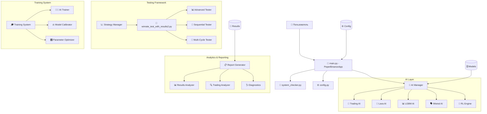
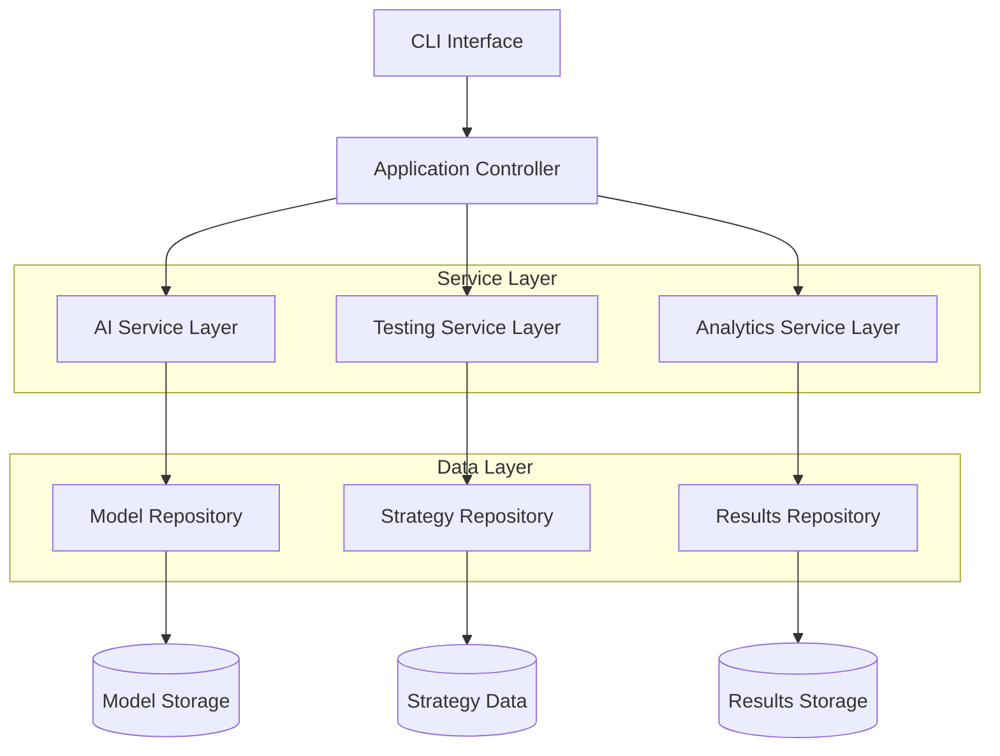
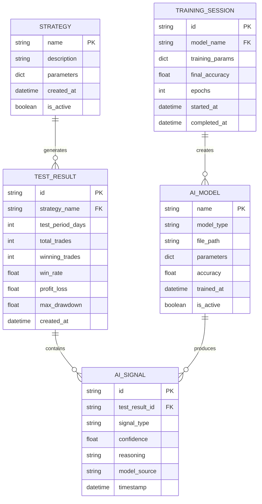

# Техническая архитектура системы Peper Binance v4

## 1. Архитектурная диаграмма



## 2. Описание технологий

### Frontend
- **Интерфейс:** Command Line Interface (CLI)
- **Визуализация:** HTML отчеты с интерактивными графиками
- **Конфигурация:** JSON/Python конфигурационные файлы

### Backend
- **Основа:** Python 3.8+
- **AI Framework:** 
  - LightGBM для машинного обучения
  - Mistral AI для языковых моделей
  - Custom RL Engine для обучения с подкреплением
- **Данные:** JSON файлы, CSV отчеты
- **Тестирование:** Собственный фреймворк тестирования стратегий

### Основные зависимости
- **Python:** 3.8+
- **AI/ML:** lightgbm, scikit-learn, numpy, pandas
- **Визуализация:** matplotlib, plotly
- **Данные:** json, csv, pickle
- **Веб:** requests для API взаимодействия
- **Утилиты:** datetime, logging, threading

## 3. Определения маршрутов

| Маршрут/Команда | Назначение |
|-----------------|------------|
| `python main.py` | Запуск основного приложения с GUI интерфейсом |
| `python run_sequential_testing.py` | Запуск последовательного тестирования стратегий |
| `python run_strategy_testing.py` | Запуск тестирования отдельных стратегий |
| `python winrate_test_with_results2.py` | Прямой запуск тестирования винрейта |
| `python trading_ai_trainer.py` | Запуск обучения торгового AI |
| `python ai_model_calibrator.py` | Калибровка AI моделей |
| `python system_checker.py` | Проверка системных требований |
| `python demo_system.py` | Демонстрационный режим системы |

## 4. API определения

### 4.1 Основные API интерфейсы

#### AI Manager API
```python
class AIManager:
    def initialize_ai_modules() -> bool
    def get_trading_signal(data: dict) -> dict
    def get_consensus_decision(signals: list) -> dict
    def shutdown_ai_modules() -> bool
```

#### Strategy Testing API
```python
class StrategyTester:
    def test_strategy(strategy_name: str, test_days: int) -> dict
    def run_sequential_test(stages: list) -> dict
    def generate_report(results: dict) -> str
```

#### Model Training API
```python
class ModelTrainer:
    def train_model(model_type: str, data: dict) -> bool
    def calibrate_model(model_name: str, params: dict) -> dict
    def save_model(model: object, path: str) -> bool
```

### 4.2 Конфигурационные параметры

| Параметр | Тип | Описание |
|----------|-----|----------|
| `test_period_days` | int | Период тестирования в днях |
| `strategy_test_days` | int | Дни тестирования стратегии |
| `ai_modules_enabled` | dict | Включенные AI модули |
| `risk_management` | dict | Параметры риск-менеджмента |
| `trading_pairs` | list | Торговые пары для тестирования |

### 4.3 Структуры данных

#### TestResult
```python
@dataclass
class TestResult:
    strategy_name: str
    test_period: int
    total_trades: int
    winning_trades: int
    win_rate: float
    profit_loss: float
    max_drawdown: float
    sharpe_ratio: float
    created_at: datetime
```

#### AISignal
```python
@dataclass
class AISignal:
    signal_type: str  # 'BUY', 'SELL', 'HOLD'
    confidence: float
    reasoning: str
    timestamp: datetime
    model_source: str
```

## 5. Архитектура сервера



## 6. Модель данных

### 6.1 Диаграмма сущностей



### 6.2 Определения структур данных

#### Таблица стратегий (strategies)
```python
# Структура данных стратегии
{
    "name": "strategy_name",
    "description": "Strategy description",
    "parameters": {
        "risk_level": 0.02,
        "stop_loss": 0.05,
        "take_profit": 0.10
    },
    "created_at": "2024-01-01T00:00:00Z",
    "is_active": True
}
```

#### Таблица результатов тестирования (test_results)
```python
# Структура результата тестирования
{
    "id": "test_result_uuid",
    "strategy_name": "strategy_name",
    "test_period_days": 30,
    "total_trades": 150,
    "winning_trades": 95,
    "win_rate": 0.633,
    "profit_loss": 0.125,
    "max_drawdown": 0.08,
    "sharpe_ratio": 1.45,
    "created_at": "2024-01-01T00:00:00Z"
}
```

#### Таблица AI сигналов (ai_signals)
```python
# Структура AI сигнала
{
    "id": "signal_uuid",
    "test_result_id": "test_result_uuid",
    "signal_type": "BUY",
    "confidence": 0.85,
    "reasoning": "Strong bullish pattern detected",
    "model_source": "trading_ai",
    "timestamp": "2024-01-01T12:00:00Z"
}
```

#### Таблица AI моделей (ai_models)
```python
# Структура AI модели
{
    "name": "trading_ai_v1",
    "model_type": "lightgbm",
    "file_path": "models/trading_ai_v1.pkl",
    "parameters": {
        "n_estimators": 100,
        "learning_rate": 0.1,
        "max_depth": 6
    },
    "accuracy": 0.78,
    "trained_at": "2024-01-01T00:00:00Z",
    "is_active": True
}
```

#### Таблица сессий обучения (training_sessions)
```python
# Структура сессии обучения
{
    "id": "training_session_uuid",
    "model_name": "trading_ai_v1",
    "training_params": {
        "dataset_size": 10000,
        "validation_split": 0.2,
        "batch_size": 32
    },
    "final_accuracy": 0.78,
    "epochs": 50,
    "started_at": "2024-01-01T00:00:00Z",
    "completed_at": "2024-01-01T02:30:00Z"
}
```

### 6.3 Файловая структура данных

```
data/
├── models/                     # AI модели
│   ├── trading_ai_v1.pkl
│   ├── lava_ai_v2.pkl
│   ├── lgbm_model.pkl
│   └── mistral_config.json
├── strategies/                 # Конфигурации стратегий
│   ├── strategy_1.json
│   ├── strategy_2.json
│   └── custom_strategies/
├── results/                    # Результаты тестирования
│   ├── 2024-01/
│   ├── 2024-02/
│   └── latest/
├── training/                   # Данные обучения
│   ├── datasets/
│   ├── checkpoints/
│   └── logs/
└── config/                     # Конфигурационные файлы
    ├── ai_config.json
    ├── trading_config.json
    └── system_config.json
```

## 7. Интеграционные точки

### 7.1 Внешние API
- **Binance API:** Получение рыночных данных
- **Mistral AI API:** Языковая модель для анализа
- **Custom Data Providers:** Дополнительные источники данных

### 7.2 Внутренние интерфейсы
- **AI Module Interface:** Стандартизированный интерфейс для всех AI модулей
- **Testing Framework Interface:** Единый интерфейс для всех тестеров
- **Reporting Interface:** Стандартизированный интерфейс для генерации отчетов

### 7.3 Конфигурационные интерфейсы
- **JSON Configuration:** Основные настройки системы
- **Python Configuration:** Программные настройки и параметры
- **Environment Variables:** Системные переменные окружения

---

**Версия документа:** 1.0  
**Дата создания:** $(date)  
**Статус:** Актуальный