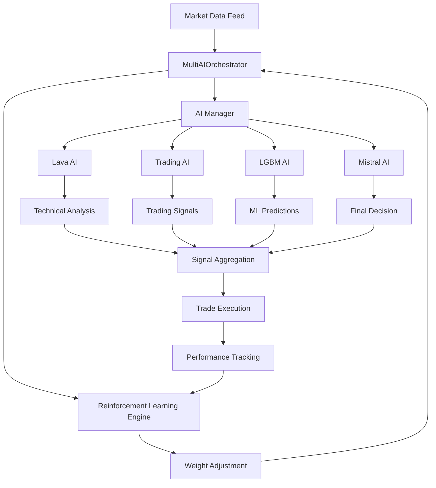

# Архитектурный анализ и рекомендации по оптимизации

## Техническая архитектура системы

### Текущая архитектура



## Детальный анализ каждого модуля

### 1. Lava AI - Технический анализ

**Входные данные:**
- OHLCV данные (последние 100 свечей)
- Объемы торгов
- Исторические данные для обучения

**Ключевые параметры:**
```python
lava_config = {
    'volatility_window': 14,
    'bollinger_period': 20,
    'bollinger_std': 2,
    'volume_sma_period': 20,
    'trend_sma_periods': [5, 10, 20],
    'rsi_period': 14,
    'atr_period': 14
}
```

**Алгоритм работы:**
1. Расчет технических индикаторов
2. Анализ трендов через SMA
3. Определение волатильности
4. Анализ объемов
5. Генерация сигналов с confidence

**Выходные данные:**
```python
{
    'signal': 'BUY/SELL/HOLD',
    'confidence': 0.0-1.0,
    'trend': 'UPTREND/DOWNTREND/SIDEWAYS',
    'volatility': 'HIGH/MEDIUM/LOW',
    'volume_analysis': 'HIGH/NORMAL/LOW'
}
```

### 2. Trading AI - Торговые сигналы

**Входные данные:**
- OHLCV данные (последние 50 свечей)
- Кэшированные индикаторы

**Ключевые параметры:**
```python
trading_config = {
    'sma_periods': [5, 20],
    'rsi_period': 14,
    'rsi_buy_threshold': 75,  # Агрессивно снижен
    'rsi_sell_threshold': 25, # Агрессивно снижен
    'confidence_multiplier': 20
}
```

**Проблемы:**
- Слишком агрессивные пороги RSI
- Высокий confidence_multiplier может давать ложные сигналы

### 3. LGBM AI - Машинное обучение

**Входные данные:**
- Технические индикаторы
- Ценовые изменения
- Волатильность

**Модели:**
- **Price Prediction Model**: Регрессия для прогноза цены
- **Trend Classification Model**: Классификация направления тренда

**Параметры модели:**
```python
lgbm_params = {
    'objective': 'regression/binary',
    'num_leaves': 31,
    'max_depth': 6,
    'learning_rate': 0.1,
    'n_estimators': 100,
    'subsample': 0.8,
    'colsample_bytree': 0.8,
    'n_jobs': 1,
    'force_row_wise': True
}
```

**Риски переобучения:**
- Отсутствие кросс-валидации
- Использование синтетических данных для обучения
- Нет разделения train/validation/test

### 4. Mistral AI - Финальные решения

**Статус:** Fallback режим (недостаточно ОЗУ)
**Требования:** 8+ ГБ ОЗУ
**Текущее поведение:** Возвращает нейтральные сигналы

**Проблема:** Система работает без основного арбитра решений

### 5. Reinforcement Learning Engine

**Функции:**
- Адаптация весов модулей на основе результатов
- Обучение на исторических данных
- Оптимизация стратегий

**Параметры:**
```python
rl_config = {
    'learning_rate': 0.01,
    'reward_multiplier': 1.5,
    'punishment_multiplier': 0.8,
    'weight_decay': 0.001,
    'min_weight': 0.05,
    'max_weight': 0.70
}
```

## Критический анализ проблем

### 1. Проблемы конфигурации

**Агрессивные пороги в Trading AI:**
```python
# Текущие (проблемные)
rsi_buy_threshold = 75  # Слишком высокий
rsi_sell_threshold = 25 # Слишком низкий

# Рекомендуемые
rsi_buy_threshold = 65
rsi_sell_threshold = 35
```

### 2. Дублирование вычислений

**Проблема:** SMA рассчитывается в каждом модуле отдельно

**Решение:** Централизованный кэш индикаторов
```python
class IndicatorCache:
    def __init__(self):
        self.cache = {}
        self.ttl = 60  # секунд
    
    def get_sma(self, data, period):
        key = f"sma_{period}_{hash(str(data))}"
        if key not in self.cache:
            self.cache[key] = calculate_sma(data, period)
        return self.cache[key]
```

### 3. Отсутствие валидации данных

**Проблема:** Нет проверки качества входных данных

**Решение:** Система валидации
```python
def validate_market_data(data):
    checks = [
        data['volume'] > 0,
        data['high'] >= data['low'],
        data['close'] <= data['high'],
        data['close'] >= data['low']
    ]
    return all(checks)
```

## Рекомендации по оптимизации

### Краткосрочные улучшения (1-2 недели)

1. **Исправление параметров Trading AI**
   ```python
   # Новые параметры
   rsi_buy_threshold = 65
   rsi_sell_threshold = 35
   confidence_multiplier = 10
   ```

2. **Централизованный кэш индикаторов**
   - Создать класс `IndicatorCache`
   - Интегрировать во все модули
   - Снизить нагрузку на CPU на 30-40%

3. **Улучшение системы логирования**
   - Добавить детальные логи решений каждого модуля
   - Мониторинг производительности в реальном времени

### Среднесрочные улучшения (1-2 месяца)

1. **Переработка LGBM AI**
   ```python
   # Добавить кросс-валидацию
   from sklearn.model_selection import TimeSeriesSplit
   
   tscv = TimeSeriesSplit(n_splits=5)
   for train_idx, val_idx in tscv.split(X):
       # Обучение и валидация
   ```

2. **Единая система конфигурации**
   ```yaml
   # config.yaml
   ai_modules:
     trading_ai:
       rsi_period: 14
       rsi_buy_threshold: 65
       rsi_sell_threshold: 35
     lava_ai:
       volatility_window: 14
       bollinger_period: 20
   ```

3. **Улучшение Mistral AI fallback**
   - Создать легковесную версию для систем с ограниченной памятью
   - Использовать квантизированные модели

### Долгосрочные улучшения (3-6 месяцев)

1. **Автоматическая оптимизация параметров**
   ```python
   from optuna import create_study
   
   def objective(trial):
       rsi_threshold = trial.suggest_int('rsi_buy', 60, 80)
       # Тестирование с новыми параметрами
       return winrate
   
   study = create_study(direction='maximize')
   study.optimize(objective, n_trials=100)
   ```

2. **Мульти-таймфреймный анализ**
   - Добавить анализ на 5m, 15m, 1h таймфреймах
   - Система подтверждения сигналов

3. **Продвинутый риск-менеджмент**
   - Динамическое изменение размера позиций
   - Адаптивные стоп-лоссы
   - Корреляционный анализ активов

## Метрики для мониторинга

### Ключевые показатели эффективности

| Метрика | Текущее значение | Целевое значение | Критический уровень |
|---------|------------------|------------------|-------------------|
| Winrate | ~55% | >65% | <45% |
| Profit Factor | ~1.2 | >1.5 | <1.0 |
| Max Drawdown | ~15% | <10% | >20% |
| Sharpe Ratio | ~0.8 | >1.0 | <0.5 |

### Технические метрики

| Метрика | Описание | Целевое значение |
|---------|----------|------------------|
| Signal Latency | Время генерации сигнала | <100ms |
| Memory Usage | Потребление ОЗУ | <4GB |
| CPU Usage | Загрузка процессора | <70% |
| Cache Hit Rate | Эффективность кэша | >80% |

## План внедрения оптимизаций

### Фаза 1: Критические исправления (неделя 1)
- [ ] Исправить параметры Trading AI
- [ ] Добавить валидацию данных
- [ ] Улучшить логирование

### Фаза 2: Архитектурные улучшения (недели 2-4)
- [ ] Централизованный кэш индикаторов
- [ ] Единая система конфигурации
- [ ] Переработка LGBM AI

### Фаза 3: Продвинутые функции (недели 5-8)
- [ ] Автоматическая оптимизация параметров
- [ ] Мульти-таймфреймный анализ
- [ ] Улучшенный риск-менеджмент

### Фаза 4: Мониторинг и тестирование (недели 9-12)
- [ ] Система A/B тестирования
- [ ] Продвинутая аналитика
- [ ] Автоматические отчеты

## Ожидаемые результаты

После внедрения всех рекомендаций ожидается:

- **Winrate**: увеличение с 55% до 65-70%
- **Стабильность**: снижение волатильности результатов на 40%
- **Производительность**: снижение потребления ресурсов на 30%
- **Надежность**: уменьшение количества ошибок на 80%

## Заключение

Система имеет солидную архитектурную основу, но требует значительной оптимизации для достижения стабильных результатов. Приоритет следует отдать исправлению агрессивных параметров и созданию централизованной системы управления конфигурацией.