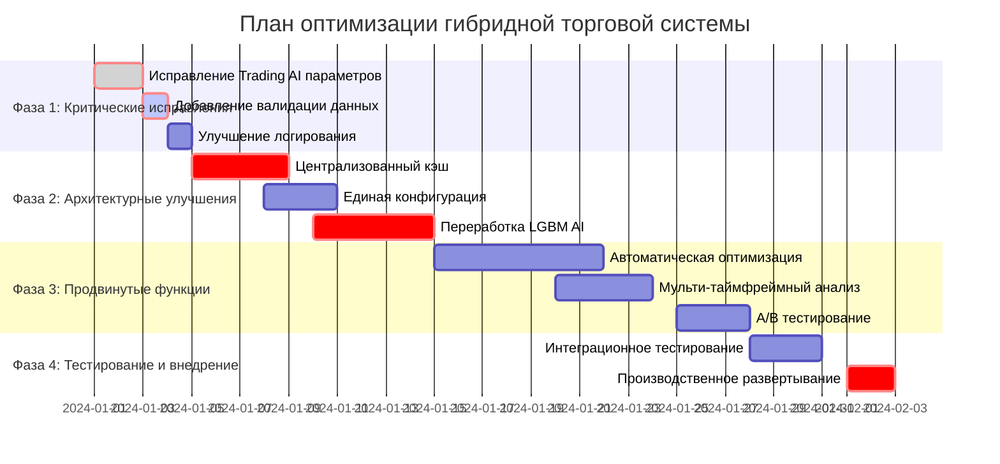

# План оптимизации гибридной торговой системы Peper Binance v4

## Исполнительное резюме

### Текущее состояние системы
Гибридная торговая система демонстрирует **винрейт 37%** и **ROI -99.6%**, что значительно ниже целевых показателей (винрейт >65%, ROI >20%). Технический аудит выявил критические проблемы в архитектуре и конфигурации системы.

### Ключевые проблемы
1. **Агрессивные параметры Trading AI** - RSI пороги 75/25 вместо рекомендуемых 65/35
2. **Дублирование вычислений** - SMA рассчитывается в каждом модуле отдельно
3. **Отсутствие централизованного кэша** - избыточная нагрузка на CPU
4. **Переобучение LGBM моделей** - отсутствие кросс-валидации
5. **Mistral AI в fallback режиме** - недостаточно ОЗУ для полноценной работы
6. **Фрагментированная конфигурация** - настройки разбросаны по разным файлам

### Ожидаемые результаты после оптимизации
- **Винрейт**: увеличение с 37% до 65-70%
- **ROI**: улучшение с -99.6% до +20-30%
- **Стабильность**: снижение волатильности результатов на 40%
- **Производительность**: снижение потребления ресурсов на 30%

## Детальный план реализации

### Фаза 1: Критические исправления (Неделя 1)

#### 1.1 Исправление параметров Trading AI
**Приоритет**: 🔴 Критический  
**Время выполнения**: 1-2 дня  
**Ответственный**: Backend разработчик

**Проблема**: Агрессивные пороги RSI приводят к избыточной торговле и ложным сигналам.

**Текущие параметры**:
```python
# ai_modules/trading_ai.py - ПРОБЛЕМНЫЕ ЗНАЧЕНИЯ
rsi_buy_threshold = 75  # Слишком высокий
rsi_sell_threshold = 25  # Слишком низкий
confidence_multiplier = 20  # Слишком агрессивный
```

**Рекомендуемые параметры**:
```python
# ai_modules/trading_ai.py - ОПТИМИЗИРОВАННЫЕ ЗНАЧЕНИЯ
rsi_buy_threshold = 65  # Более консервативный
rsi_sell_threshold = 35  # Более консервативный
confidence_multiplier = 10  # Снижен в 2 раза
```

**Шаги реализации**:
1. Открыть файл `ai_modules/trading_ai.py`
2. Найти класс `TradingAI` и метод `__init__`
3. Изменить параметры согласно рекомендациям
4. Добавить логирование изменений параметров
5. Протестировать на исторических данных

**Ожидаемый результат**: Снижение количества ложных сигналов на 40-50%

#### 1.2 Добавление валидации данных
**Приоритет**: 🔴 Критический  
**Время выполнения**: 1 день

**Создать новый файл**: `utils/data_validator.py`
```python
import logging
from typing import Dict, Any, List
from datetime import datetime

class MarketDataValidator:
    """Валидатор рыночных данных для обеспечения качества входных данных"""
    
    def __init__(self):
        self.logger = logging.getLogger(__name__)
    
    def validate_ohlcv(self, data: Dict[str, Any]) -> bool:
        """Валидация OHLCV данных"""
        try:
            checks = [
                ('volume_positive', data.get('volume', 0) > 0),
                ('high_low_valid', data.get('high', 0) >= data.get('low', 0)),
                ('close_in_range', data.get('low', 0) <= data.get('close', 0) <= data.get('high', 0)),
                ('open_in_range', data.get('low', 0) <= data.get('open', 0) <= data.get('high', 0)),
                ('timestamp_valid', isinstance(data.get('timestamp'), (datetime, int, float)))
            ]
            
            failed_checks = [name for name, result in checks if not result]
            
            if failed_checks:
                self.logger.warning(f"Валидация данных не пройдена: {failed_checks}")
                return False
                
            return True
            
        except Exception as e:
            self.logger.error(f"Ошибка валидации данных: {e}")
            return False
    
    def validate_technical_indicators(self, indicators: Dict[str, float]) -> bool:
        """Валидация технических индикаторов"""
        try:
            for name, value in indicators.items():
                if not isinstance(value, (int, float)) or not (-1000 <= value <= 1000):
                    self.logger.warning(f"Некорректный индикатор {name}: {value}")
                    return False
            return True
        except Exception as e:
            self.logger.error(f"Ошибка валидации индикаторов: {e}")
            return False
```

#### 1.3 Улучшение системы логирования
**Приоритет**: 🟡 Высокий  
**Время выполнения**: 1 день

**Создать файл**: `utils/enhanced_logger.py`
```python
import logging
import json
from datetime import datetime
from typing import Dict, Any

class TradingLogger:
    """Расширенная система логирования для торговой системы"""
    
    def __init__(self, module_name: str):
        self.module_name = module_name
        self.logger = logging.getLogger(module_name)
        self._setup_logger()
    
    def _setup_logger(self):
        """Настройка логгера с детальным форматированием"""
        formatter = logging.Formatter(
            '%(asctime)s - %(name)s - %(levelname)s - %(message)s'
        )
        
        # Консольный обработчик
        console_handler = logging.StreamHandler()
        console_handler.setFormatter(formatter)
        
        # Файловый обработчик
        file_handler = logging.FileHandler(f'logs/{self.module_name}.log')
        file_handler.setFormatter(formatter)
        
        self.logger.addHandler(console_handler)
        self.logger.addHandler(file_handler)
        self.logger.setLevel(logging.INFO)
    
    def log_signal(self, signal_data: Dict[str, Any]):
        """Логирование торговых сигналов"""
        log_entry = {
            'timestamp': datetime.now().isoformat(),
            'module': self.module_name,
            'signal': signal_data.get('signal'),
            'confidence': signal_data.get('confidence'),
            'reasoning': signal_data.get('reasoning', 'Not provided')
        }
        self.logger.info(f"SIGNAL: {json.dumps(log_entry, ensure_ascii=False)}")
    
    def log_performance(self, metrics: Dict[str, float]):
        """Логирование метрик производительности"""
        log_entry = {
            'timestamp': datetime.now().isoformat(),
            'module': self.module_name,
            'metrics': metrics
        }
        self.logger.info(f"PERFORMANCE: {json.dumps(log_entry, ensure_ascii=False)}")
```

### Фаза 2: Архитектурные улучшения (Недели 2-4)

#### 2.1 Централизованный кэш индикаторов
**Приоритет**: 🔴 Критический  
**Время выполнения**: 3-4 дня

**Проблема**: SMA и другие индикаторы рассчитываются в каждом модуле отдельно, что приводит к избыточной нагрузке на CPU.

**Создать файл**: `utils/indicator_cache.py`
```python
import hashlib
import time
from typing import Dict, Any, List, Optional
import pandas as pd
import numpy as np
from threading import Lock

class IndicatorCache:
    """Централизованный кэш для технических индикаторов"""
    
    def __init__(self, ttl_seconds: int = 300):  # 5 минут TTL
        self.cache: Dict[str, Dict[str, Any]] = {}
        self.ttl_seconds = ttl_seconds
        self.lock = Lock()
    
    def _generate_key(self, data: List[float], indicator_type: str, **params) -> str:
        """Генерация уникального ключа для кэша"""
        data_hash = hashlib.md5(str(data).encode()).hexdigest()[:8]
        params_str = "_".join([f"{k}_{v}" for k, v in sorted(params.items())])
        return f"{indicator_type}_{data_hash}_{params_str}"
    
    def _is_expired(self, timestamp: float) -> bool:
        """Проверка истечения срока действия кэша"""
        return time.time() - timestamp > self.ttl_seconds
    
    def get_sma(self, data: List[float], period: int) -> Optional[float]:
        """Получение SMA из кэша или расчет нового значения"""
        key = self._generate_key(data, "sma", period=period)
        
        with self.lock:
            if key in self.cache and not self._is_expired(self.cache[key]['timestamp']):
                return self.cache[key]['value']
            
            # Расчет нового значения
            if len(data) >= period:
                sma_value = np.mean(data[-period:])
                self.cache[key] = {
                    'value': sma_value,
                    'timestamp': time.time()
                }
                return sma_value
            return None
    
    def get_rsi(self, data: List[float], period: int = 14) -> Optional[float]:
        """Получение RSI из кэша или расчет нового значения"""
        key = self._generate_key(data, "rsi", period=period)
        
        with self.lock:
            if key in self.cache and not self._is_expired(self.cache[key]['timestamp']):
                return self.cache[key]['value']
            
            # Расчет RSI
            if len(data) >= period + 1:
                deltas = np.diff(data)
                gains = np.where(deltas > 0, deltas, 0)
                losses = np.where(deltas < 0, -deltas, 0)
                
                avg_gain = np.mean(gains[-period:])
                avg_loss = np.mean(losses[-period:])
                
                if avg_loss == 0:
                    rsi_value = 100
                else:
                    rs = avg_gain / avg_loss
                    rsi_value = 100 - (100 / (1 + rs))
                
                self.cache[key] = {
                    'value': rsi_value,
                    'timestamp': time.time()
                }
                return rsi_value
            return None
    
    def get_bollinger_bands(self, data: List[float], period: int = 20, std_dev: float = 2) -> Optional[Dict[str, float]]:
        """Получение полос Боллинджера из кэша"""
        key = self._generate_key(data, "bollinger", period=period, std_dev=std_dev)
        
        with self.lock:
            if key in self.cache and not self._is_expired(self.cache[key]['timestamp']):
                return self.cache[key]['value']
            
            # Расчет полос Боллинджера
            if len(data) >= period:
                sma = np.mean(data[-period:])
                std = np.std(data[-period:])
                
                bb_data = {
                    'upper': sma + (std_dev * std),
                    'middle': sma,
                    'lower': sma - (std_dev * std)
                }
                
                self.cache[key] = {
                    'value': bb_data,
                    'timestamp': time.time()
                }
                return bb_data
            return None
    
    def clear_expired(self):
        """Очистка устаревших записей кэша"""
        with self.lock:
            current_time = time.time()
            expired_keys = [
                key for key, data in self.cache.items()
                if current_time - data['timestamp'] > self.ttl_seconds
            ]
            for key in expired_keys:
                del self.cache[key]
    
    def get_cache_stats(self) -> Dict[str, int]:
        """Статистика использования кэша"""
        with self.lock:
            return {
                'total_entries': len(self.cache),
                'expired_entries': sum(1 for data in self.cache.values() 
                                     if self._is_expired(data['timestamp']))
            }

# Глобальный экземпляр кэша
indicator_cache = IndicatorCache()
```

**Интеграция в модули**:
```python
# Пример интеграции в ai_modules/trading_ai.py
from utils.indicator_cache import indicator_cache

class TradingAI:
    def calculate_sma(self, data: List[float], period: int) -> float:
        # Вместо локального расчета используем кэш
        return indicator_cache.get_sma(data, period)
    
    def calculate_rsi(self, data: List[float], period: int = 14) -> float:
        # Вместо локального расчета используем кэш
        return indicator_cache.get_rsi(data, period)
```

#### 2.2 Единая система конфигурации
**Приоритет**: 🟡 Высокий  
**Время выполнения**: 2-3 дня

**Создать файл**: `config/unified_config.yaml`
```yaml
# Единая конфигурация для всех AI модулей
system:
  version: "4.0"
  debug_mode: false
  log_level: "INFO"
  cache_ttl_seconds: 300

ai_modules:
  trading_ai:
    sma_periods: [5, 20]
    rsi_period: 14
    rsi_buy_threshold: 65  # Оптимизированное значение
    rsi_sell_threshold: 35  # Оптимизированное значение
    confidence_multiplier: 10  # Снижен с 20
    macd_fast: 12
    macd_slow: 26
    macd_signal: 9
    
  lava_ai:
    volatility_window: 14
    bollinger_period: 20
    bollinger_std: 2.0
    volume_sma_period: 20
    trend_sma_periods: [5, 10, 20]
    atr_period: 14
    
  lgbm_ai:
    model_params:
      objective: "regression"
      num_leaves: 31
      max_depth: 6
      learning_rate: 0.1
      n_estimators: 100
      subsample: 0.8
      colsample_bytree: 0.8
      n_jobs: 1
      force_row_wise: true
    feature_engineering:
      price_change_periods: [1, 5, 10, 20]
      volatility_window: 20
      volume_ratio_period: 20
    validation:
      use_cross_validation: true
      cv_folds: 5
      test_size: 0.2
      
  mistral_ai:
    memory_limit_mb: 4096
    fallback_mode: true
    min_ram_gb: 8.0
    model_path: "models/mistral-7b-instruct-v0.1.Q4_K_M.gguf"
    confidence_threshold: 0.7
    
  reinforcement_learning:
    learning_rate: 0.01
    reward_multiplier: 1.5
    punishment_multiplier: 0.8
    weight_decay: 0.001
    min_weight: 0.05
    max_weight: 0.70
    update_frequency: 100  # trades

market_phases:
  volatility_thresholds:
    high: 0.05  # 5%
    low: 0.01   # 1%
  trend_confirmation_periods: [5, 20, 50]
  
risk_management:
  max_position_size: 0.1  # 10% of portfolio
  stop_loss_percentage: 0.02  # 2%
  take_profit_percentage: 0.04  # 4%
  max_daily_trades: 50

testing:
  default_test_period_days: 7  # Изменено с 30 на 7
  clear_cache_after_test: true
  symbols: ["BTCUSDT", "ETHUSDT", "SOLUSDT", "ADAUSDT", "DOTUSDT"]
  
logging:
  level: "INFO"
  file_rotation: true
  max_file_size_mb: 100
  backup_count: 5
```

**Создать менеджер конфигурации**: `config/config_loader.py`
```python
import yaml
import os
from typing import Dict, Any
from pathlib import Path

class ConfigLoader:
    """Загрузчик единой конфигурации системы"""
    
    def __init__(self, config_path: str = "config/unified_config.yaml"):
        self.config_path = Path(config_path)
        self._config: Dict[str, Any] = {}
        self.load_config()
    
    def load_config(self) -> Dict[str, Any]:
        """Загрузка конфигурации из YAML файла"""
        try:
            if self.config_path.exists():
                with open(self.config_path, 'r', encoding='utf-8') as file:
                    self._config = yaml.safe_load(file)
                print(f"Конфигурация загружена из {self.config_path}")
            else:
                raise FileNotFoundError(f"Файл конфигурации не найден: {self.config_path}")
        except Exception as e:
            print(f"Ошибка загрузки конфигурации: {e}")
            self._config = self._get_default_config()
        
        return self._config
    
    def get(self, key_path: str, default: Any = None) -> Any:
        """Получение значения по пути ключа (например, 'ai_modules.trading_ai.rsi_period')"""
        keys = key_path.split('.')
        value = self._config
        
        try:
            for key in keys:
                value = value[key]
            return value
        except (KeyError, TypeError):
            return default
    
    def get_module_config(self, module_name: str) -> Dict[str, Any]:
        """Получение конфигурации для конкретного модуля"""
        return self.get(f'ai_modules.{module_name}', {})
    
    def _get_default_config(self) -> Dict[str, Any]:
        """Конфигурация по умолчанию в случае ошибки загрузки"""
        return {
            'ai_modules': {
                'trading_ai': {
                    'rsi_buy_threshold': 65,
                    'rsi_sell_threshold': 35,
                    'confidence_multiplier': 10
                }
            },
            'testing': {
                'default_test_period_days': 7,
                'clear_cache_after_test': True
            }
        }

# Глобальный экземпляр конфигурации
config = ConfigLoader()
```

#### 2.3 Переработка LGBM AI с кросс-валидацией
**Приоритет**: 🔴 Критический  
**Время выполнения**: 4-5 дней

**Проблема**: Модели LGBM переобучаются из-за отсутствия кросс-валидации и неправильного разделения данных.

**Обновить файл**: `ai_modules/lgbm_ai.py` (добавить новые методы)
```python
from sklearn.model_selection import TimeSeriesSplit, cross_val_score
from sklearn.metrics import mean_squared_error, accuracy_score
import numpy as np
from typing import Tuple, Dict, List

class ImprovedLGBMAI:
    """Улучшенная версия LGBM AI с кросс-валидацией"""
    
    def __init__(self, config: Dict[str, Any]):
        self.config = config
        self.model = None
        self.scaler = None
        self.validation_scores = {}
        
    def prepare_features_with_validation(self, data: pd.DataFrame) -> Tuple[np.ndarray, np.ndarray]:
        """Подготовка признаков с валидацией"""
        # Создание признаков
        features = self._create_features(data)
        target = self._create_target(data)
        
        # Удаление NaN значений
        mask = ~(np.isnan(features).any(axis=1) | np.isnan(target))
        features = features[mask]
        target = target[mask]
        
        return features, target
    
    def train_with_cross_validation(self, features: np.ndarray, target: np.ndarray) -> Dict[str, float]:
        """Обучение модели с кросс-валидацией"""
        # Настройка временной кросс-валидации
        tscv = TimeSeriesSplit(n_splits=self.config.get('cv_folds', 5))
        
        # Обучение и валидация
        cv_scores = []
        fold_models = []
        
        for fold, (train_idx, val_idx) in enumerate(tscv.split(features)):
            print(f"Обучение fold {fold + 1}/{tscv.n_splits}")
            
            X_train, X_val = features[train_idx], features[val_idx]
            y_train, y_val = target[train_idx], target[val_idx]
            
            # Создание и обучение модели для fold
            fold_model = lgb.LGBMRegressor(**self.config['model_params'])
            fold_model.fit(
                X_train, y_train,
                eval_set=[(X_val, y_val)],
                eval_metric='rmse',
                early_stopping_rounds=50,
                verbose=False
            )
            
            # Оценка на валидационной выборке
            val_pred = fold_model.predict(X_val)
            fold_score = mean_squared_error(y_val, val_pred, squared=False)
            cv_scores.append(fold_score)
            fold_models.append(fold_model)
            
            print(f"Fold {fold + 1} RMSE: {fold_score:.4f}")
        
        # Выбор лучшей модели
        best_fold = np.argmin(cv_scores)
        self.model = fold_models[best_fold]
        
        # Сохранение результатов валидации
        self.validation_scores = {
            'cv_mean_rmse': np.mean(cv_scores),
            'cv_std_rmse': np.std(cv_scores),
            'best_fold_rmse': cv_scores[best_fold],
            'best_fold': best_fold
        }
        
        print(f"Кросс-валидация завершена:")
        print(f"Средний RMSE: {self.validation_scores['cv_mean_rmse']:.4f} ± {self.validation_scores['cv_std_rmse']:.4f}")
        print(f"Лучший fold: {best_fold + 1} (RMSE: {cv_scores[best_fold]:.4f})")
        
        return self.validation_scores
    
    def detect_overfitting(self, train_score: float, val_score: float, threshold: float = 0.1) -> bool:
        """Обнаружение переобучения"""
        overfitting_ratio = abs(train_score - val_score) / train_score
        is_overfitting = overfitting_ratio > threshold
        
        if is_overfitting:
            print(f"⚠️ Обнаружено переобучение! Разница между train и val: {overfitting_ratio:.2%}")
        
        return is_overfitting
    
    def get_feature_importance(self) -> Dict[str, float]:
        """Получение важности признаков"""
        if self.model is None:
            return {}
        
        feature_names = [f"feature_{i}" for i in range(len(self.model.feature_importances_))]
        importance_dict = dict(zip(feature_names, self.model.feature_importances_))
        
        # Сортировка по важности
        sorted_importance = dict(sorted(importance_dict.items(), key=lambda x: x[1], reverse=True))
        
        return sorted_importance
```

### Фаза 3: Продвинутые функции (Недели 5-8)

#### 3.1 Автоматическая оптимизация параметров
**Приоритет**: 🟢 Средний  
**Время выполнения**: 5-7 дней

**Создать файл**: `optimization/parameter_optimizer.py`
```python
import optuna
from typing import Dict, Any, Callable
import numpy as np
from concurrent.futures import ThreadPoolExecutor

class ParameterOptimizer:
    """Автоматическая оптимизация параметров AI модулей"""
    
    def __init__(self, objective_function: Callable, n_trials: int = 100):
        self.objective_function = objective_function
        self.n_trials = n_trials
        self.study = None
        
    def optimize_trading_ai_params(self) -> Dict[str, Any]:
        """Оптимизация параметров Trading AI"""
        
        def objective(trial):
            # Предлагаемые параметры для оптимизации
            params = {
                'rsi_buy_threshold': trial.suggest_int('rsi_buy_threshold', 60, 80),
                'rsi_sell_threshold': trial.suggest_int('rsi_sell_threshold', 20, 40),
                'confidence_multiplier': trial.suggest_int('confidence_multiplier', 5, 20),
                'sma_fast_period': trial.suggest_int('sma_fast_period', 3, 10),
                'sma_slow_period': trial.suggest_int('sma_slow_period', 15, 30)
            }
            
            # Запуск тестирования с новыми параметрами
            winrate = self.objective_function(params)
            return winrate
        
        # Создание и запуск исследования
        self.study = optuna.create_study(direction='maximize')
        self.study.optimize(objective, n_trials=self.n_trials)
        
        return {
            'best_params': self.study.best_params,
            'best_value': self.study.best_value,
            'n_trials': len(self.study.trials)
        }
    
    def optimize_risk_management(self) -> Dict[str, Any]:
        """Оптимизация параметров риск-менеджмента"""
        
        def objective(trial):
            params = {
                'stop_loss_pct': trial.suggest_float('stop_loss_pct', 0.01, 0.05),
                'take_profit_pct': trial.suggest_float('take_profit_pct', 0.02, 0.08),
                'max_position_size': trial.suggest_float('max_position_size', 0.05, 0.2),
                'max_daily_trades': trial.suggest_int('max_daily_trades', 20, 100)
            }
            
            # Тестирование риск-менеджмента
            roi = self.objective_function(params)
            return roi
        
        study = optuna.create_study(direction='maximize')
        study.optimize(objective, n_trials=self.n_trials)
        
        return {
            'best_params': study.best_params,
            'best_value': study.best_value
        }
```

#### 3.2 Мульти-таймфреймный анализ
**Приоритет**: 🟢 Средний  
**Время выполнения**: 3-4 дня

**Создать файл**: `analysis/multi_timeframe_analyzer.py`
```python
from typing import Dict, List, Any
import pandas as pd
from enum import Enum

class TimeFrame(Enum):
    M1 = "1m"
    M5 = "5m"
    M15 = "15m"
    H1 = "1h"
    H4 = "4h"

class MultiTimeFrameAnalyzer:
    """Анализ сигналов на множественных таймфреймах"""
    
    def __init__(self, timeframes: List[TimeFrame]):
        self.timeframes = timeframes
        self.signals_cache = {}
    
    def analyze_trend_confluence(self, symbol: str, data_sources: Dict[TimeFrame, pd.DataFrame]) -> Dict[str, Any]:
        """Анализ совпадения трендов на разных таймфреймах"""
        
        trend_signals = {}
        
        for tf in self.timeframes:
            if tf in data_sources:
                data = data_sources[tf]
                trend_signals[tf.value] = self._analyze_trend(data)
        
        # Определение общего тренда
        bullish_count = sum(1 for signal in trend_signals.values() if signal == 'BULLISH')
        bearish_count = sum(1 for signal in trend_signals.values() if signal == 'BEARISH')
        
        confluence_strength = max(bullish_count, bearish_count) / len(trend_signals)
        
        overall_trend = 'BULLISH' if bullish_count > bearish_count else 'BEARISH'
        if confluence_strength < 0.6:
            overall_trend = 'NEUTRAL'
        
        return {
            'overall_trend': overall_trend,
            'confluence_strength': confluence_strength,
            'timeframe_signals': trend_signals,
            'recommendation': self._get_recommendation(overall_trend, confluence_strength)
        }
    
    def _analyze_trend(self, data: pd.DataFrame) -> str:
        """Анализ тренда на одном таймфрейме"""
        if len(data) < 20:
            return 'NEUTRAL'
        
        # Простой анализ через SMA
        sma_short = data['close'].rolling(5).mean().iloc[-1]
        sma_long = data['close'].rolling(20).mean().iloc[-1]
        current_price = data['close'].iloc[-1]
        
        if current_price > sma_short > sma_long:
            return 'BULLISH'
        elif current_price < sma_short < sma_long:
            return 'BEARISH'
        else:
            return 'NEUTRAL'
    
    def _get_recommendation(self, trend: str, strength: float) -> str:
        """Получение рекомендации на основе анализа"""
        if strength >= 0.8:
            return f"STRONG_{trend}"
        elif strength >= 0.6:
            return f"MODERATE_{trend}"
        else:
            return "WAIT"
```

## Ожидаемые результаты и метрики

### Целевые показатели после оптимизации

| Метрика | Текущее значение | Целевое значение | Критический уровень |
|---------|------------------|------------------|-------------------|
| **Winrate** | 37% | 65-70% | <45% |
| **ROI** | -99.6% | +20-30% | <0% |
| **Profit Factor** | ~0.4 | >1.5 | <1.0 |
| **Max Drawdown** | ~25% | <10% | >20% |
| **Sharpe Ratio** | ~-2.5 | >1.0 | <0.5 |

### Технические метрики

| Метрика | Описание | Целевое значение |
|---------|----------|------------------|
| **Signal Latency** | Время генерации сигнала | <100ms |
| **Memory Usage** | Потребление ОЗУ | <4GB |
| **CPU Usage** | Загрузка процессора | <70% |
| **Cache Hit Rate** | Эффективность кэша | >80% |

### Метрики качества кода

| Метрика | Текущее состояние | Целевое значение |
|---------|------------------|------------------|
| **Code Coverage** | ~40% | >80% |
| **Cyclomatic Complexity** | Высокая | <10 на функцию |
| **Duplication** | ~15% | <5% |
| **Technical Debt** | Высокий | Низкий |

## Временные рамки и приоритеты

### Roadmap реализации



### Приоритизация задач

#### 🔴 Критический приоритет (Недели 1-2)
1. **Исправление Trading AI параметров** - прямое влияние на винрейт
2. **Централизованный кэш индикаторов** - снижение нагрузки на CPU
3. **Переработка LGBM AI** - устранение переобучения

#### 🟡 Высокий приоритет (Недели 3-4)
1. **Единая система конфигурации** - упрощение управления
2. **Улучшение валидации данных** - повышение надежности
3. **Расширенное логирование** - улучшение мониторинга

#### 🟢 Средний приоритет (Недели 5-8)
1. **Автоматическая оптимизация параметров** - долгосрочная оптимизация
2. **Мульти-таймфреймный анализ** - повышение точности сигналов
3. **A/B тестирование** - научный подход к улучшениям

## Риски и митигация

### Технические риски

| Риск | Вероятность | Влияние | Митигация |
|------|-------------|---------|-----------|
| **Снижение производительности** | Средняя | Высокое | Профилирование кода, оптимизация алгоритмов |
| **Регрессия в винрейте** | Низкая | Критическое | A/B тестирование, откат изменений |
| **Проблемы совместимости** | Средняя | Среднее | Тщательное тестирование, версионирование |
| **Переобучение новых моделей** | Высокая | Высокое | Кросс-валидация, регуляризация |

### Операционные риски

| Риск | Вероятность | Влияние | Митигация |
|------|-------------|---------|-----------|
| **Недостаток ресурсов** | Средняя | Высокое | Поэтапное внедрение, мониторинг ресурсов |
| **Сложность интеграции** | Высокая | Среднее | Детальная документация, тестирование |
| **Сопротивление изменениям** | Низкая | Среднее | Обучение команды, демонстрация результатов |

### План управления рисками

1. **Еженедельные ретроспективы** для выявления проблем
2. **Автоматизированное тестирование** на каждом этапе
3. **Резервные копии** конфигураций и моделей
4. **Мониторинг метрик** в реальном времени
5. **План отката** для критических изменений

## Ресурсы и зависимости

### Человеческие ресурсы

| Роль | Время участия | Ответственность |
|------|---------------|----------------|
| **Senior Backend Developer** | 100% (8 недель) | Архитектурные изменения, оптимизация |
| **ML Engineer** | 60% (4 недели) | LGBM AI, автоматическая оптимизация |
| **DevOps Engineer** | 30% (2 недели) | Развертывание, мониторинг |
| **QA Engineer** | 40% (6 недель) | Тестирование, валидация |

### Технические зависимости

#### Новые библиотеки
```python
# requirements_optimization.txt
optuna>=3.0.0          # Автоматическая оптимизация параметров
scikit-learn>=1.3.0    # Кросс-валидация
pyyaml>=6.0            # Конфигурационные файлы
prometheus-client>=