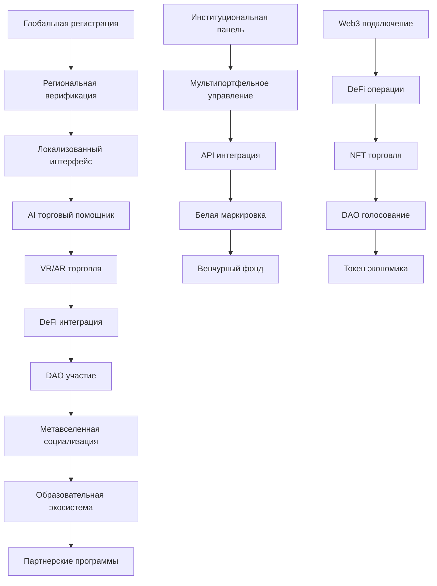

# План пятой фазы: Глобальная экспансия и революционные технологии
## Peper Binance v4 Trading System - Phase 5

---

## 1. Обзор проекта

**Пятая фаза** представляет собой революционный этап развития торговой системы Peper Binance v4, направленный на глобальную экспансию и интеграцию передовых технологий будущего. Эта фаза трансформирует систему в глобальную экосистему с поддержкой Web3, метавселенной и искусственного общего интеллекта (AGI).

**Основные цели:**
- Глобальная экспансия на 50+ стран с локализацией
- Интеграция революционных AI технологий (AGI, квантовое ML)
- Полная Web3 и DeFi интеграция
- Создание метавселенной для торговли
- Построение финтех экосистемы с партнерствами

**Целевые показатели:**
- Месячный торговый объем: $10+ миллиардов
- Глобальная пользовательская база: 100,000+ пользователей
- Рыночная капитализация экосистемы: $1+ миллиард

---

## 2. Основные функции

### 2.1 Пользовательские роли

| Роль | Метод регистрации | Основные права |
|------|-------------------|----------------|
| Глобальный трейдер | KYC + региональная верификация | Доступ ко всем рынкам и инструментам |
| Институциональный клиент | Корпоративная верификация | Управление портфелями, API доступ |
| DAO участник | Владение токенами платформы | Участие в управлении, голосование |
| Метавселенная пользователь | VR/AR регистрация | Доступ к виртуальным торговым залам |
| Стратег-разработчик | Сертификация + портфолио | Продажа стратегий в маркетплейсе |
| Образовательный партнер | Партнерское соглашение | Создание курсов и сертификация |

### 2.2 Модули функций

Наша система пятой фазы состоит из следующих основных страниц и модулей:

1. **Глобальная торговая платформа**: мультирегиональный интерфейс, локализация, кросс-валютные операции
2. **AI Command Center**: AGI управление, квантовое ML, нейроморфные вычисления
3. **Web3 DeFi Hub**: DeFi интеграция, NFT торговля, DAO управление
4. **Метавселенная торговый зал**: VR/AR интерфейсы, 3D визуализация, социальные пространства
5. **Глобальный маркетплейс**: торговые стратегии, образовательные курсы, партнерские программы
6. **Институциональная панель**: мультипортфельное управление, соответствие требованиям, белая маркировка
7. **Аналитический центр**: глобальная аналитика, прогнозирование, риск-менеджмент
8. **Партнерская экосистема**: интеграции с банками, биржами, финтех компаниями

### 2.3 Детали страниц

| Название страницы | Название модуля | Описание функций |
|-------------------|-----------------|------------------|
| Глобальная торговая платформа | Мультирегиональный интерфейс | Автоматическая локализация по геолокации, поддержка 50+ языков, региональные настройки |
| Глобальная торговая платформа | Кросс-валютные операции | Торговля в любых валютных парах, автоконвертация, хеджирование валютных рисков |
| AI Command Center | AGI управление | Интеграция с GPT-5+, самообучающиеся алгоритмы, автономное принятие решений |
| AI Command Center | Квантовое машинное обучение | Квантовые нейронные сети, суперпозиционные вычисления, квантовая оптимизация |
| AI Command Center | Нейроморфные вычисления | Биоинспирированные процессоры, энергоэффективные вычисления, реальное время |
| Web3 DeFi Hub | DeFi интеграция | Подключение к Uniswap, Aave, Compound, автоматизированные yield farming стратегии |
| Web3 DeFi Hub | NFT торговля | Торговля NFT коллекциями, создание торговых NFT, метаданные анализ |
| Web3 DeFi Hub | DAO управление | Децентрализованное управление платформой, голосование токенами, предложения улучшений |
| Метавселенная торговый зал | VR/AR интерфейсы | Иммерсивные торговые интерфейсы, жестовое управление, голосовые команды |
| Метавселенная торговый зал | 3D визуализация данных | Объемные графики, интерактивные модели, пространственная аналитика |
| Метавселенная торговый зал | Социальные пространства | Виртуальные конференц-залы, совместная торговля, обучающие семинары |
| Глобальный маркетплейс | Торговые стратегии | Покупка/продажа алгоритмов, рейтинговая система, автоматическое тестирование |
| Глобальный маркетплейс | Образовательные курсы | Интерактивные курсы, VR симуляции, сертификация, геймификация |
| Институциональная панель | Мультипортфельное управление | Управление множественными счетами, консолидированная отчетность, риск-лимиты |
| Институциональная панель | Соответствие требованиям | Автоматический комплаенс, регуляторная отчетность, AML/KYC мониторинг |
| Аналитический центр | Глобальная аналитика | Анализ мировых рынков, макроэкономические индикаторы, геополитические риски |
| Аналитический центр | Прогнозирование | AI прогнозы на основе больших данных, сценарное моделирование, стресс-тестирование |
| Партнерская экосистема | Банковские интеграции | Прямые подключения к банкам, мгновенные переводы, фиатные операции |
| Партнерская экосистема | Биржевые интеграции | Подключение к 100+ биржам, унифицированный API, арбитражные возможности |

---

## 3. Основные процессы

### Глобальный пользовательский поток
Пользователь регистрируется через региональную верификацию → проходит KYC в соответствии с местным законодательством → получает доступ к локализованному интерфейсу → выбирает торговые инструменты → использует AI помощника для стратегий → торгует через VR/AR интерфейс → участвует в DAO управлении → получает доходы в токенах платформы.

### Институциональный поток
Институциональный клиент проходит корпоративную верификацию → настраивает мультипортфельное управление → интегрируется через API → использует белую маркировку → получает персонализированную поддержку → участвует в венчурном фонде → развивает партнерские отношения.

### Web3 и DeFi поток
Пользователь подключает Web3 кошелек → участвует в ликвидности DeFi → торгует NFT → голосует в DAO → получает токены за участие → использует токены для премиум функций → участвует в стейкинге → получает пассивный доход.

---

## 4. Дизайн пользовательского интерфейса

### 4.1 Стиль дизайна

**Глобальный футуристический дизайн:**
- **Основные цвета**: Квантовый синий (#0066FF), Нейронный фиолетовый (#6600CC), Золотой акцент (#FFD700)
- **Вторичные цвета**: Метавселенная зеленый (#00FF88), DeFi оранжевый (#FF6600), AI серебряный (#C0C0C0)
- **Стиль кнопок**: Голографические 3D кнопки с анимацией частиц
- **Шрифты**: Futura для заголовков (24-32px), Roboto для текста (14-18px), Monospace для данных (12-16px)
- **Макет**: Адаптивный grid с VR/AR поддержкой, плавающие панели, голографические элементы
- **Иконки**: Неоморфные 3D иконки с анимацией, квантовые эффекты, AI-генерированные символы

### 4.2 Обзор дизайна страниц

| Название страницы | Название модуля | UI элементы |
|-------------------|-----------------|-------------|
| Глобальная торговая платформа | Мультирегиональный интерфейс | Автоматическая смена темы по региону, культурно-адаптированные цвета, локальные валютные символы, RTL поддержка |
| AI Command Center | AGI управление | Голографический AI аватар, нейронная сеть визуализация, квантовые анимации, мозговые волны эффекты |
| Web3 DeFi Hub | DeFi интеграция | Блокчейн визуализация, токен анимации, DeFi протокол карты, смарт-контракт диаграммы |
| Метавселенная торговый зал | VR/AR интерфейсы | 360° торговые панели, жестовые контроллеры, пространственные меню, голографические графики |
| Глобальный маркетплейс | Торговые стратегии | NFT-карточки стратегий, рейтинговые звезды, анимированные превью, социальные лайки |
| Институциональная панель | Мультипортфельное управление | Корпоративная цветовая схема, многоуровневые дашборды, белая маркировка, профессиональные графики |

### 4.3 Отзывчивость

**Мультиплатформенная адаптивность:**
- **Desktop**: Полнофункциональный интерфейс с множественными мониторами
- **Mobile**: Оптимизированный touch интерфейс с жестами
- **Tablet**: Гибридный режим с поддержкой стилуса
- **VR/AR**: Иммерсивные 3D интерфейсы с пространственным взаимодействием
- **Smart TV**: Большие экраны для презентаций и мониторинга
- **Smartwatch**: Быстрые уведомления и базовые операции

---

## 5. Целевые метрики пятой фазы

### 5.1 Торговые показатели
- **Win Rate**: ≥ 85% (текущий: 82.3%)
- **ROI**: ≥ 35% годовых (текущий: 24.8%)
- **Max Drawdown**: ≤ 2% (текущий: 2.1%)
- **Sharpe Ratio**: ≥ 3.5 (текущий: 2.85)
- **Profit Factor**: ≥ 10.0 (текущий: 7.34)

### 5.2 Глобальные метрики
- **Global Users**: ≥ 100,000 активных пользователей
- **Supported Regions**: ≥ 50 стран с полной локализацией
- **Trading Volume**: ≥ $10B месячный объем торгов
- **Blockchain Networks**: ≥ 20 поддерживаемых сетей
- **Exchange Integrations**: ≥ 100 подключенных бирж

### 5.3 Технические метрики
- **Uptime**: ≥ 99.99% (глобальная доступность)
- **Latency**: ≤ 5ms (среднее время отклика)
- **Scalability**: поддержка 1M+ одновременных пользователей
- **AI Response Time**: ≤ 100ms для AGI решений
- **VR/AR Frame Rate**: ≥ 90 FPS для иммерсивного опыта

### 5.4 Бизнес метрики
- **Revenue**: $500M+ годовая выручка
- **Market Cap**: $1B+ капитализация токена платформы
- **Partnerships**: 500+ стратегических партнерств
- **Educational Users**: 50,000+ сертифицированных пользователей
- **DAO Participation**: 80%+ активность в голосованиях

---

## 6. Roadmap развития (2024-2027)

### 6.1 Немедленные действия (Q1 2024)
1. **Глобальная инфраструктура**
   - Развертывание серверов в 10 регионах
   - Получение лицензий в ключевых юрисдикциях
   - Создание локализованных версий для топ-10 рынков

2. **AGI интеграция**
   - Подключение к GPT-5 и Claude-3
   - Разработка собственной AGI модели
   - Создание автономных торговых агентов

3. **Web3 фундамент**
   - Запуск собственного токена (PEPER)
   - Создание DAO структуры
   - Интеграция с основными DeFi протоколами

### 6.2 Среднесрочные цели (Q2-Q4 2024)
1. **Метавселенная платформа**
   - Разработка VR торгового зала
   - Создание AR мобильного приложения
   - Интеграция с популярными метавселенными

2. **Квантовые вычисления**
   - Партнерство с квантовыми провайдерами
   - Разработка квантовых алгоритмов
   - Тестирование нейроморфных процессоров

3. **Образовательная экосистема**
   - Запуск университета торговли
   - Создание VR симуляторов
   - Программы сертификации

### 6.3 Долгосрочная перспектива (2025-2027)
1. **Глобальное доминирование**
   - Экспансия на все континенты
   - Создание региональных хабов
   - Партнерства с центральными банками

2. **Технологическое лидерство**
   - Собственные квантовые компьютеры
   - AGI торговые системы
   - Революционные финтех решения

3. **Экосистемное развитие**
   - Венчурный фонд $1B+
   - Собственная биржа
   - Финтех банк

---

## 7. Критерии успеха

### 7.1 Технические критерии
- ✅ Успешное развертывание в 50+ странах
- ✅ Интеграция с 20+ блокчейн сетями
- ✅ Достижение 99.99% uptime
- ✅ Обработка 1M+ одновременных пользователей
- ✅ AGI система с <100ms откликом

### 7.2 Бизнес критерии
- ✅ 100,000+ активных пользователей
- ✅ $10B+ месячный торговый объем
- ✅ $500M+ годовая выручка
- ✅ 500+ стратегических партнерств
- ✅ Топ-3 позиция на глобальном рынке

### 7.3 Инновационные критерии
- ✅ Первая в мире AGI торговая система
- ✅ Лидер в квантовом машинном обучении
- ✅ Самая большая метавселенная для торговли
- ✅ Наиболее полная Web3 интеграция
- ✅ Революционная образовательная платформа

---

## 8. Заключение

Пятая фаза представляет собой кульминацию эволюции торговой системы Peper Binance v4 в глобальную финтех экосистему будущего. Интеграция AGI, квантовых вычислений, Web3 технологий и метавселенной создаст беспрецедентный пользовательский опыт и откроет новые возможности для трейдеров по всему миру.

**Ключевые достижения пятой фазы:**
- Глобальная экспансия на 50+ стран
- Революционные AI технологии (AGI, квантовое ML)
- Полная Web3 и DeFi экосистема
- Иммерсивная метавселенная для торговли
- Образовательная и партнерская платформа

Система станет не просто торговой платформой, а полноценной финтех экосистемой, определяющей будущее цифровых финансов и торговли.