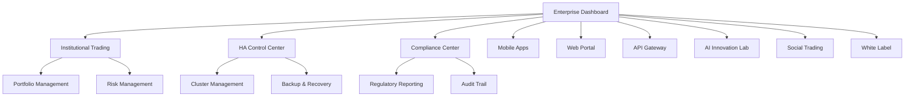

# План четвертой фазы: Enterprise развитие торговой системы Peper Binance v4

## 1. Обзор проекта

Четвертая фаза развития торговой системы Peper Binance v4 направлена на трансформацию системы в enterprise-решение корпоративного уровня с поддержкой институциональных клиентов, высокой отказоустойчивостью и инновационными AI-возможностями.

**Текущие достижения системы:**
- Win Rate: 77.2%
- ROI: 1495.7%
- Sharpe Ratio: 16.28
- Profit Factor: 7.34
- Max Drawdown: 9.2%

**Цель четвертой фазы:** Создание масштабируемого, надежного и инновационного торгового решения для институциональных клиентов с поддержкой 1000+ одновременных пользователей.

## 2. Основные функции

### 2.1 Пользовательские роли

| Роль | Метод регистрации | Основные права |
|------|-------------------|----------------|
| Retail Trader | Email регистрация | Базовая торговля, стандартная аналитика |
| Professional Trader | Верификация KYC | Расширенные стратегии, API доступ |
| Institutional Client | Корпоративная верификация | Мульти-аккаунт управление, белые метки |
| Fund Manager | Лицензионная проверка | Портфельное управление, compliance отчеты |
| System Administrator | Внутренний доступ | Полное управление системой, мониторинг |

### 2.2 Модули функций

Система четвертой фазы включает следующие основные страницы и модули:

1. **Enterprise Dashboard**: Центральная панель управления, мульти-аккаунт мониторинг, real-time аналитика
2. **High Availability Control Center**: Мониторинг системы, управление кластерами, автоматическое восстановление
3. **Institutional Trading Interface**: Продвинутые торговые инструменты, портфельное управление, риск-менеджмент
4. **Mobile Applications**: iOS/Android приложения, синхронизация с основной системой
5. **Web Management Portal**: Веб-интерфейс управления, настройки, отчеты
6. **API Gateway**: RESTful API, WebSocket соединения, интеграция с внешними системами
7. **Compliance & Reporting Center**: Регуляторная отчетность, аудит, соответствие требованиям
8. **AI Innovation Lab**: Квантовые вычисления, федеративное обучение, автономные агенты
9. **Social Trading Platform**: Копи-трейдинг, социальные функции, рейтинги трейдеров
10. **White Label Management**: Партнерские программы, брендинг, кастомизация

### 2.3 Детали страниц

| Название страницы | Название модуля | Описание функций |
|-------------------|-----------------|------------------|
| Enterprise Dashboard | Real-time Monitoring | Отображение метрик производительности, статуса системы, активных торгов в реальном времени |
| Enterprise Dashboard | Multi-Account Overview | Управление множественными торговыми аккаунтами, консолидированная отчетность |
| Enterprise Dashboard | Performance Analytics | Продвинутая аналитика доходности, риск-метрики, сравнительный анализ |
| HA Control Center | Cluster Management | Управление распределенными узлами, балансировка нагрузки, автоматическое масштабирование |
| HA Control Center | Backup & Recovery | Автоматическое резервное копирование, восстановление системы, disaster recovery |
| HA Control Center | System Health Monitor | Мониторинг производительности, алерты, предиктивное обслуживание |
| Institutional Trading | Advanced Order Types | Сложные типы ордеров, алгоритмическая торговля, условные исполнения |
| Institutional Trading | Portfolio Management | Управление портфелями, ребалансировка, оптимизация распределения активов |
| Institutional Trading | Risk Management | Продвинутый риск-менеджмент, лимиты, стоп-лоссы, хеджирование |
| Mobile Apps | Trading Interface | Мобильная торговля, push-уведомления, биометрическая аутентификация |
| Mobile Apps | Portfolio Tracking | Отслеживание портфеля, аналитика, синхронизация с основной системой |
| Web Portal | System Configuration | Настройка параметров системы, пользовательские предпочтения |
| Web Portal | Reporting Dashboard | Генерация отчетов, экспорт данных, кастомизация отчетов |
| API Gateway | RESTful Endpoints | Полный набор REST API для интеграции с внешними системами |
| API Gateway | WebSocket Streams | Real-time потоки данных, live торговые сигналы |
| Compliance Center | Regulatory Reporting | Автоматическая генерация регуляторных отчетов, соответствие требованиям |
| Compliance Center | Audit Trail | Полный аудит всех операций, логирование, соответствие стандартам |
| AI Innovation Lab | Quantum Optimization | Квантовые алгоритмы оптимизации портфеля, продвинутые вычисления |
| AI Innovation Lab | Autonomous Agents | Самообучающиеся торговые агенты, автономное принятие решений |
| Social Trading | Copy Trading | Копирование стратегий успешных трейдеров, автоматическое следование |
| Social Trading | Trader Rankings | Рейтинговая система трейдеров, социальные метрики |
| White Label | Partner Management | Управление партнерскими программами, комиссионные структуры |
| White Label | Brand Customization | Кастомизация интерфейса под бренд партнера |

## 3. Основные процессы

### Процесс для Institutional Client:
1. Корпоративная регистрация и KYC верификация
2. Настройка мульти-аккаунт структуры
3. Конфигурация торговых стратегий и лимитов
4. Мониторинг портфеля через Enterprise Dashboard
5. Генерация compliance отчетов
6. Управление рисками и ребалансировка

### Процесс для Fund Manager:
1. Лицензионная верификация и регистрация
2. Создание и настройка инвестиционных портфелей
3. Настройка автоматических торговых стратегий
4. Мониторинг производительности и рисков
5. Генерация отчетов для инвесторов
6. Соответствие регуляторным требованиям

## 4. Дизайн пользовательского интерфейса

### 4.1 Стиль дизайна

- **Основные цвета**: Темно-синий (#1a237e), Золотой (#ffd700), Белый (#ffffff)
- **Вторичные цвета**: Серый (#424242), Зеленый (#4caf50), Красный (#f44336)
- **Стиль кнопок**: Современный flat design с тонкими тенями и hover эффектами
- **Шрифты**: Roboto для основного текста, Roboto Mono для числовых данных
- **Размеры шрифтов**: 14px (основной), 16px (заголовки), 12px (вспомогательный)
- **Стиль макета**: Модульная сетка с адаптивными карточками, боковая навигация
- **Иконки**: Material Design Icons, финансовые символы, статусные индикаторы

### 4.2 Обзор дизайна страниц

| Название страницы | Название модуля | UI элементы |
|-------------------|-----------------|-------------|
| Enterprise Dashboard | Real-time Monitoring | Темная тема, живые графики, цветовые индикаторы статуса, анимированные метрики |
| HA Control Center | Cluster Management | Схематичное отображение кластера, статусные индикаторы узлов, интерактивная топология |
| Institutional Trading | Advanced Order Types | Профессиональный торговый интерфейс, множественные окна, продвинутые графики |
| Mobile Apps | Trading Interface | Адаптивный дизайн, жестовое управление, биометрические элементы |
| Compliance Center | Regulatory Reporting | Формальный стиль, таблицы данных, экспорт функции |

### 4.3 Адаптивность

Система разработана с приоритетом desktop-first для профессиональных трейдеров, с полной мобильной адаптацией для iOS/Android приложений. Включена оптимизация для сенсорного взаимодействия и поддержка различных размеров экранов от мобильных устройств до больших мониторов трейдинговых станций.