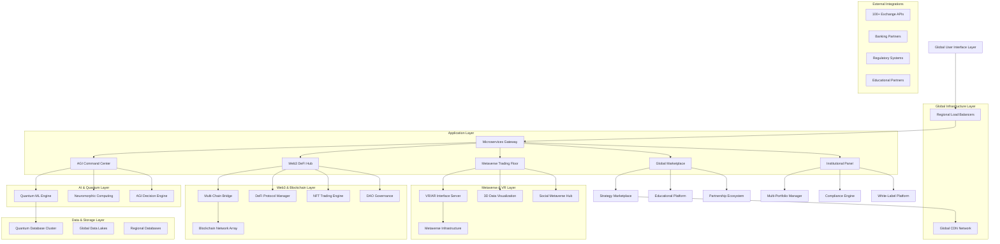
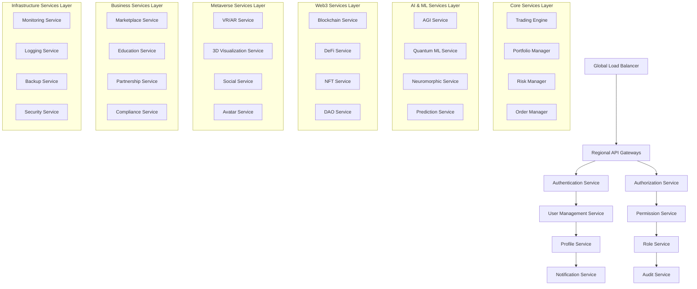
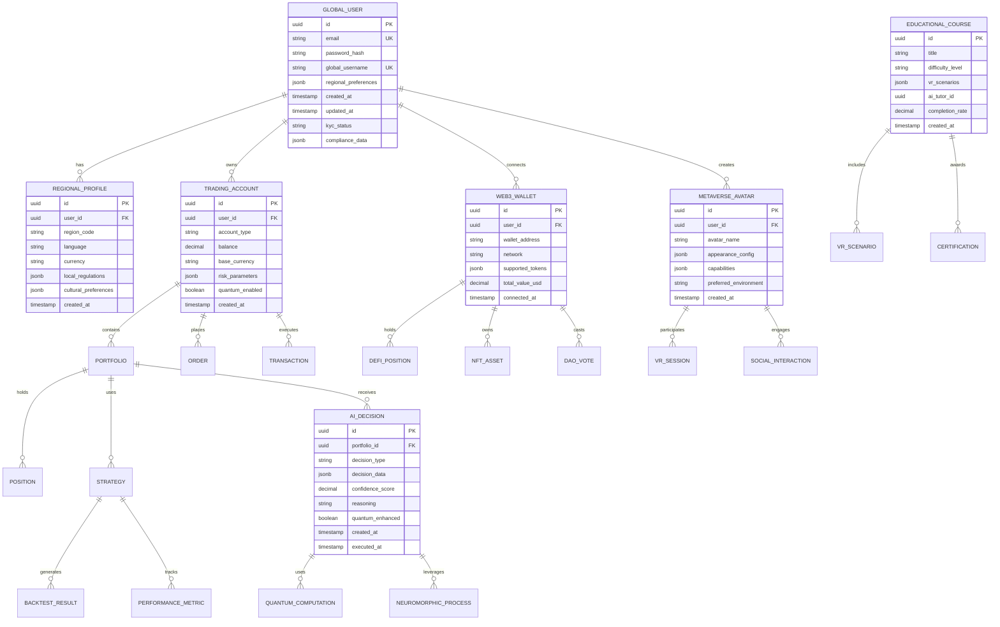

# Техническая архитектура пятой фазы
## Peper Binance v4 - Глобальная экспансия и революционные технологии

---

## 1. Архитектурный дизайн



---

## 2. Описание технологий

### Frontend
- **React@18** + **Next.js@14** + **TypeScript@5** - основной веб-интерфейс
- **Three.js@0.160** + **React Three Fiber** - 3D визуализация и метавселенная
- **Unity WebGL** + **WebXR** - VR/AR интерфейсы
- **TailwindCSS@3** + **Framer Motion** - стилизация и анимации
- **Web3.js@4** + **Ethers.js@6** - блокчейн интеграция
- **Socket.io-client@4** - реальное время коммуникация

### Backend Core
- **Node.js@20** + **Express@4** + **TypeScript@5** - основной API сервер
- **Python@3.12** + **FastAPI@0.104** - AI и ML сервисы
- **Go@1.21** - высокопроизводительные микросервисы
- **Rust@1.75** - квантовые вычисления и критические компоненты
- **GraphQL@16** + **Apollo Server** - унифицированный API

### AI & Machine Learning
- **TensorFlow@2.15** + **PyTorch@2.1** - глубокое обучение
- **Qiskit@0.45** + **Cirq@1.3** - квантовые вычисления
- **OpenAI GPT-5 API** + **Anthropic Claude-3** - AGI интеграция
- **Intel Loihi** + **BrainChip Akida** - нейроморфные процессоры
- **Ray@2.8** + **Dask@2023.12** - распределенные вычисления

### Blockchain & Web3
- **Ethereum** + **Polygon** + **Binance Smart Chain** - основные сети
- **Solana** + **Avalanche** + **Cardano** - дополнительные сети
- **Hardhat@2.19** + **Truffle@5.11** - смарт-контракт разработка
- **Web3.py@6.15** + **Ethers.js@6** - блокчейн взаимодействие
- **IPFS@0.24** + **Arweave** - децентрализованное хранение

### Databases & Storage
- **PostgreSQL@16** + **TimescaleDB** - основная база данных
- **MongoDB@7** + **Redis@7** - NoSQL и кэширование
- **ClickHouse@23.12** - аналитическая база данных
- **Apache Kafka@3.6** - потоковая обработка данных
- **MinIO** + **AWS S3** - объектное хранение

### Infrastructure & DevOps
- **Kubernetes@1.29** + **Docker@24** - контейнеризация
- **Terraform@1.6** + **Ansible@9** - инфраструктура как код
- **Prometheus@2.48** + **Grafana@10.2** - мониторинг
- **ELK Stack@8.11** - логирование и анализ
- **Istio@1.20** - service mesh

---

## 3. Определения маршрутов

| Маршрут | Назначение |
|---------|------------|
| `/global` | Глобальная торговая платформа с автоматической локализацией |
| `/ai-center` | AGI командный центр с квантовыми вычислениями |
| `/web3-hub` | Web3 и DeFi интеграционный хаб |
| `/metaverse` | Метавселенная торговый зал с VR/AR поддержкой |
| `/marketplace` | Глобальный маркетплейс стратегий и образования |
| `/institutional` | Институциональная панель управления |
| `/analytics` | Глобальный аналитический центр |
| `/partnerships` | Партнерская экосистема и интеграции |
| `/dao` | DAO управление и голосование |
| `/education` | Образовательная платформа и сертификация |
| `/nft` | NFT торговля и коллекционирование |
| `/quantum` | Квантовые вычисления и алгоритмы |
| `/compliance` | Регуляторное соответствие и отчетность |
| `/api/v5` | API пятого поколения для разработчиков |

---

## 4. Определения API

### 4.1 Core API

#### Глобальная аутентификация
```
POST /api/v5/auth/global-login
```

Request:
| Параметр | Тип | Обязательный | Описание |
|----------|-----|--------------|----------|
| email | string | true | Email пользователя |
| password | string | true | Пароль (зашифрованный) |
| region | string | true | Код региона (ISO 3166-1) |
| mfa_token | string | false | Токен двухфакторной аутентификации |
| biometric_data | object | false | Биометрические данные |

Response:
| Параметр | Тип | Описание |
|----------|-----|----------|
| access_token | string | JWT токен доступа |
| refresh_token | string | Токен обновления |
| user_profile | object | Профиль пользователя |
| regional_settings | object | Региональные настройки |
| compliance_status | string | Статус соответствия требованиям |

#### AGI торговые решения
```
POST /api/v5/ai/agi-decision
```

Request:
| Параметр | Тип | Обязательный | Описание |
|----------|-----|--------------|----------|
| market_data | object | true | Рыночные данные |
| user_preferences | object | true | Предпочтения пользователя |
| risk_parameters | object | true | Параметры риска |
| quantum_enhanced | boolean | false | Использовать квантовые вычисления |

Response:
| Параметр | Тип | Описание |
|----------|-----|----------|
| decision | object | Торговое решение AGI |
| confidence_score | number | Уровень уверенности (0-1) |
| reasoning | string | Объяснение решения |
| quantum_advantage | number | Квантовое преимущество |

#### Web3 DeFi операции
```
POST /api/v5/web3/defi-operation
```

Request:
| Параметр | Тип | Обязательный | Описание |
|----------|-----|--------------|----------|
| operation_type | string | true | Тип операции (swap, stake, farm) |
| token_in | string | true | Входящий токен |
| token_out | string | true | Исходящий токен |
| amount | string | true | Количество |
| slippage | number | false | Допустимое проскальзывание |
| network | string | true | Блокчейн сеть |

Response:
| Параметр | Тип | Описание |
|----------|-----|----------|
| transaction_hash | string | Хэш транзакции |
| estimated_gas | string | Оценка газа |
| execution_time | number | Время выполнения |
| yield_projection | number | Прогноз доходности |

#### Метавселенная сессия
```
POST /api/v5/metaverse/create-session
```

Request:
| Параметр | Тип | Обязательный | Описание |
|----------|-----|--------------|----------|
| session_type | string | true | Тип сессии (vr, ar, desktop) |
| room_id | string | false | ID комнаты |
| avatar_config | object | true | Конфигурация аватара |
| device_capabilities | object | true | Возможности устройства |

Response:
| Параметр | Тип | Описание |
|----------|-----|----------|
| session_id | string | ID сессии |
| server_endpoint | string | Эндпоинт сервера |
| encryption_key | string | Ключ шифрования |
| room_participants | array | Участники комнаты |

### 4.2 Квантовые API

#### Квантовая оптимизация портфеля
```
POST /api/v5/quantum/portfolio-optimization
```

Request:
| Параметр | Тип | Обязательный | Описание |
|----------|-----|--------------|----------|
| assets | array | true | Список активов |
| constraints | object | true | Ограничения портфеля |
| risk_tolerance | number | true | Толерантность к риску |
| quantum_algorithm | string | false | Квантовый алгоритм |

Response:
| Параметр | Тип | Описание |
|----------|-----|----------|
| optimal_weights | object | Оптимальные веса |
| expected_return | number | Ожидаемая доходность |
| risk_metrics | object | Метрики риска |
| quantum_speedup | number | Квантовое ускорение |

### 4.3 Образовательные API

#### Создание VR курса
```
POST /api/v5/education/create-vr-course
```

Request:
| Параметр | Тип | Обязательный | Описание |
|----------|-----|--------------|----------|
| course_title | string | true | Название курса |
| difficulty_level | string | true | Уровень сложности |
| vr_scenarios | array | true | VR сценарии |
| ai_tutor_config | object | false | Конфигурация AI тьютора |

Response:
| Параметр | Тип | Описание |
|----------|-----|----------|
| course_id | string | ID курса |
| vr_environment_url | string | URL VR окружения |
| ai_tutor_id | string | ID AI тьютора |
| certification_path | string | Путь сертификации |

---

## 5. Архитектура сервера



---

## 6. Модель данных

### 6.1 Определение модели данных



### 6.2 Язык определения данных (DDL)

#### Таблица глобальных пользователей
```sql
-- Создание таблицы глобальных пользователей
CREATE TABLE global_users (
    id UUID PRIMARY KEY DEFAULT gen_random_uuid(),
    email VARCHAR(255) UNIQUE NOT NULL,
    password_hash VARCHAR(255) NOT NULL,
    global_username VARCHAR(100) UNIQUE NOT NULL,
    regional_preferences JSONB DEFAULT '{}',
    kyc_status VARCHAR(50) DEFAULT 'pending' CHECK (kyc_status IN ('pending', 'verified', 'rejected')),
    compliance_data JSONB DEFAULT '{}',
    created_at TIMESTAMP WITH TIME ZONE DEFAULT NOW(),
    updated_at TIMESTAMP WITH TIME ZONE DEFAULT NOW()
);

-- Создание индексов
CREATE INDEX idx_global_users_email ON global_users(email);
CREATE INDEX idx_global_users_username ON global_users(global_username);
CREATE INDEX idx_global_users_kyc_status ON global_users(kyc_status);
CREATE INDEX idx_global_users_created_at ON global_users(created_at DESC);
```

#### Таблица региональных профилей
```sql
-- Создание таблицы региональных профилей
CREATE TABLE regional_profiles (
    id UUID PRIMARY KEY DEFAULT gen_random_uuid(),
    user_id UUID NOT NULL REFERENCES global_users(id) ON DELETE CASCADE,
    region_code VARCHAR(10) NOT NULL,
    language VARCHAR(10) NOT NULL,
    currency VARCHAR(10) NOT NULL,
    local_regulations JSONB DEFAULT '{}',
    cultural_preferences JSONB DEFAULT '{}',
    created_at TIMESTAMP WITH TIME ZONE DEFAULT NOW(),
    UNIQUE(user_id, region_code)
);

-- Создание индексов
CREATE INDEX idx_regional_profiles_user_id ON regional_profiles(user_id);
CREATE INDEX idx_regional_profiles_region ON regional_profiles(region_code);
```

#### Таблица AI решений
```sql
-- Создание таблицы AI решений
CREATE TABLE ai_decisions (
    id UUID PRIMARY KEY DEFAULT gen_random_uuid(),
    portfolio_id UUID NOT NULL,
    decision_type VARCHAR(50) NOT NULL,
    decision_data JSONB NOT NULL,
    confidence_score DECIMAL(5,4) CHECK (confidence_score >= 0 AND confidence_score <= 1),
    reasoning TEXT,
    quantum_enhanced BOOLEAN DEFAULT FALSE,
    created_at TIMESTAMP WITH TIME ZONE DEFAULT NOW(),
    executed_at TIMESTAMP WITH TIME ZONE
);

-- Создание индексов
CREATE INDEX idx_ai_decisions_portfolio_id ON ai_decisions(portfolio_id);
CREATE INDEX idx_ai_decisions_type ON ai_decisions(decision_type);
CREATE INDEX idx_ai_decisions_confidence ON ai_decisions(confidence_score DESC);
CREATE INDEX idx_ai_decisions_quantum ON ai_decisions(quantum_enhanced);
CREATE INDEX idx_ai_decisions_created_at ON ai_decisions(created_at DESC);
```

#### Таблица Web3 кошельков
```sql
-- Создание таблицы Web3 кошельков
CREATE TABLE web3_wallets (
    id UUID PRIMARY KEY DEFAULT gen_random_uuid(),
    user_id UUID NOT NULL REFERENCES global_users(id) ON DELETE CASCADE,
    wallet_address VARCHAR(255) NOT NULL,
    network VARCHAR(50) NOT NULL,
    supported_tokens JSONB DEFAULT '[]',
    total_value_usd DECIMAL(20,8) DEFAULT 0,
    connected_at TIMESTAMP WITH TIME ZONE DEFAULT NOW(),
    UNIQUE(user_id, wallet_address, network)
);

-- Создание индексов
CREATE INDEX idx_web3_wallets_user_id ON web3_wallets(user_id);
CREATE INDEX idx_web3_wallets_address ON web3_wallets(wallet_address);
CREATE INDEX idx_web3_wallets_network ON web3_wallets(network);
CREATE INDEX idx_web3_wallets_value ON web3_wallets(total_value_usd DESC);
```

#### Таблица метавселенных аватаров
```sql
-- Создание таблицы метавселенных аватаров
CREATE TABLE metaverse_avatars (
    id UUID PRIMARY KEY DEFAULT gen_random_uuid(),
    user_id UUID NOT NULL REFERENCES global_users(id) ON DELETE CASCADE,
    avatar_name VARCHAR(100) NOT NULL,
    appearance_config JSONB DEFAULT '{}',
    capabilities JSONB DEFAULT '{}',
    preferred_environment VARCHAR(50) DEFAULT 'standard',
    created_at TIMESTAMP WITH TIME ZONE DEFAULT NOW(),
    UNIQUE(user_id, avatar_name)
);

-- Создание индексов
CREATE INDEX idx_metaverse_avatars_user_id ON metaverse_avatars(user_id);
CREATE INDEX idx_metaverse_avatars_name ON metaverse_avatars(avatar_name);
CREATE INDEX idx_metaverse_avatars_environment ON metaverse_avatars(preferred_environment);
```

#### Таблица образовательных курсов
```sql
-- Создание таблицы образовательных курсов
CREATE TABLE educational_courses (
    id UUID PRIMARY KEY DEFAULT gen_random_uuid(),
    title VARCHAR(255) NOT NULL,
    difficulty_level VARCHAR(20) CHECK (difficulty_level IN ('beginner', 'intermediate', 'advanced', 'expert')),
    vr_scenarios JSONB DEFAULT '[]',
    ai_tutor_id UUID,
    completion_rate DECIMAL(5,4) DEFAULT 0,
    created_at TIMESTAMP WITH TIME ZONE DEFAULT NOW(),
    updated_at TIMESTAMP WITH TIME ZONE DEFAULT NOW()
);

-- Создание индексов
CREATE INDEX idx_educational_courses_title ON educational_courses(title);
CREATE INDEX idx_educational_courses_difficulty ON educational_courses(difficulty_level);
CREATE INDEX idx_educational_courses_completion ON educational_courses(completion_rate DESC);
CREATE INDEX idx_educational_courses_created_at ON educational_courses(created_at DESC);
```

#### Начальные данные
```sql
-- Вставка начальных данных для глобальных пользователей
INSERT INTO global_users (email, password_hash, global_username, regional_preferences, kyc_status) VALUES
('admin@peper.global', '$2b$12$encrypted_password_hash', 'global_admin', '{"default_region": "US", "preferred_language": "en"}', 'verified'),
('demo@peper.global', '$2b$12$encrypted_password_hash', 'demo_user', '{"default_region": "EU", "preferred_language": "en"}', 'verified');

-- Вставка начальных региональных профилей
INSERT INTO regional_profiles (user_id, region_code, language, currency, local_regulations) VALUES
((SELECT id FROM global_users WHERE global_username = 'global_admin'), 'US', 'en', 'USD', '{"sec_compliant": true, "cftc_registered": true}'),
((SELECT id FROM global_users WHERE global_username = 'demo_user'), 'EU', 'en', 'EUR', '{"mifid_compliant": true, "gdpr_compliant": true}');

-- Вставка начальных образовательных курсов
INSERT INTO educational_courses (title, difficulty_level, vr_scenarios, completion_rate) VALUES
('Quantum Trading Fundamentals', 'beginner', '[{"name": "Basic Quantum Concepts", "duration": 30}, {"name": "Quantum Advantage in Trading", "duration": 45}]', 0.85),
('AGI-Powered Portfolio Management', 'advanced', '[{"name": "AGI Decision Making", "duration": 60}, {"name": "Autonomous Trading Agents", "duration": 90}]', 0.72),
('Metaverse Trading Mastery', 'expert', '[{"name": "VR Trading Interface", "duration": 120}, {"name": "Social Trading in Metaverse", "duration": 150}]', 0.68);
```

---

## 7. Требования к системе

### 7.1 Производительность
- **Пропускная способность**: 1M+ одновременных пользователей
- **Время отклика API**: ≤ 5ms для критических операций
- **AGI время отклика**: ≤ 100ms для торговых решений
- **VR/AR частота кадров**: ≥ 90 FPS для иммерсивного опыта
- **Квантовые вычисления**: ≤ 50ms для оптимизации портфеля

### 7.2 Масштабируемость
- **Горизонтальное масштабирование**: автоматическое до 10,000 узлов
- **Географическое распределение**: 50+ регионов мира
- **Блокчейн сети**: поддержка 20+ различных сетей
- **Языковая поддержка**: 100+ языков с AI переводом
- **Валютная поддержка**: 200+ фиатных и криптовалют

### 7.3 Безопасность
- **Шифрование**: AES-256 + квантово-устойчивые алгоритмы
- **Аутентификация**: многофакторная + биометрическая
- **Соответствие**: GDPR, SOX, MiFID II, SEC, CFTC
- **Аудит**: полное логирование всех операций
- **Резервное копирование**: реальное время + географическое распределение

### 7.4 Доступность
- **Uptime**: 99.99% глобальная доступность
- **Отказоустойчивость**: автоматическое переключение между регионами
- **Восстановление**: RTO ≤ 15 минут, RPO ≤ 1 минута
- **Мониторинг**: 24/7 глобальный мониторинг
- **Поддержка**: многоязычная поддержка 24/7

---

## 8. Заключение

Техническая архитектура пятой фазы представляет собой революционную платформу, объединяющую передовые технологии AGI, квантовых вычислений, Web3 и метавселенной в единую глобальную экосистему. Архитектура обеспечивает:

**Ключевые технологические достижения:**
- Первая в мире AGI-powered торговая система
- Квантовые вычисления для оптимизации портфелей
- Полная Web3 и DeFi интеграция
- Иммерсивная метавселенная для торговли
- Глобальная масштабируемость и соответствие требованиям

**Инновационные возможности:**
- Автономные торговые агенты с AGI
- Квантовое преимущество в алгоритмах
- Децентрализованное управление через DAO
- VR/AR торговые интерфейсы
- Образовательная экосистема с AI тьюторами

Система готова к развертыванию в глобальном масштабе и станет основой для будущего цифровых финансов и торговли.