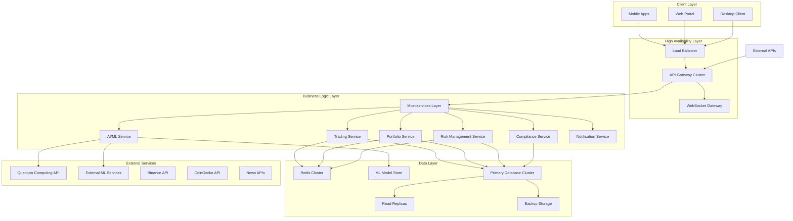
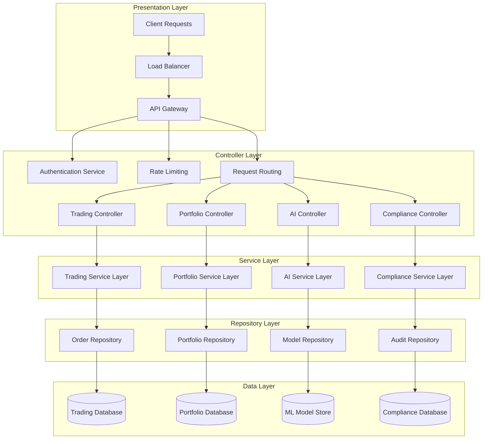
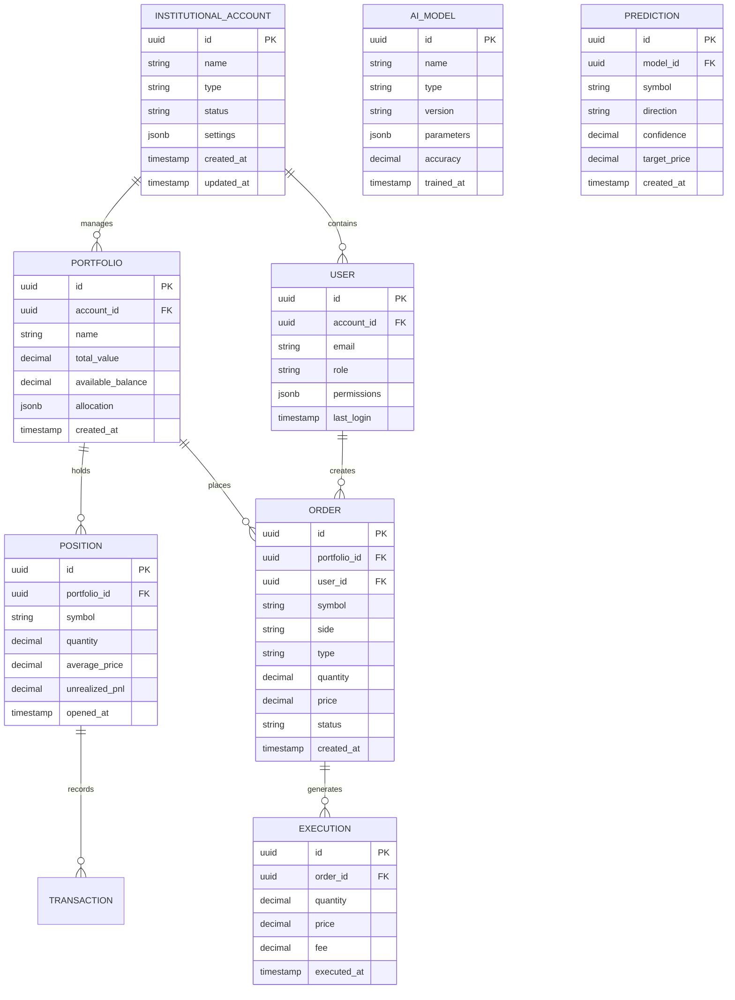

# Техническая архитектура четвертой фазы: Enterprise развитие

## 1. Архитектурный дизайн



## 2. Описание технологий

### Frontend:
- **Web Portal**: React@18 + TypeScript + Material-UI + Redux Toolkit
- **Mobile Apps**: React Native@0.72 + TypeScript + Native Base
- **Desktop Client**: Electron@26 + React + TypeScript

### Backend:
- **API Gateway**: Kong@3.4 + Nginx
- **Microservices**: Node.js@20 + Express@4 + TypeScript
- **Message Queue**: Redis@7 + Bull Queue
- **WebSocket**: Socket.io@4.7
- **Authentication**: JWT + OAuth2 + Passport.js

### Database:
- **Primary**: PostgreSQL@15 (Clustered)
- **Cache**: Redis@7 (Clustered)
- **Time Series**: InfluxDB@2.7
- **Search**: Elasticsearch@8.10

### Infrastructure:
- **Containerization**: Docker@24 + Kubernetes@1.28
- **Monitoring**: Prometheus + Grafana + Jaeger
- **CI/CD**: GitHub Actions + ArgoCD
- **Cloud**: AWS/GCP Multi-region deployment

### AI/ML:
- **ML Framework**: TensorFlow@2.13 + PyTorch@2.0
- **Model Serving**: TensorFlow Serving + MLflow
- **Quantum Computing**: Qiskit + IBM Quantum
- **Federated Learning**: TensorFlow Federated

## 3. Определения маршрутов

| Маршрут | Назначение |
|---------|------------|
| /dashboard | Enterprise панель управления с real-time метриками |
| /trading | Институциональный торговый интерфейс |
| /portfolio | Управление портфелями и активами |
| /risk | Система управления рисками |
| /compliance | Центр соответствия и отчетности |
| /admin | Административная панель системы |
| /api/v1/* | RESTful API endpoints |
| /ws/* | WebSocket соединения |
| /mobile/* | Мобильные API endpoints |
| /partners/* | Партнерские и white-label интерфейсы |

## 4. Определения API

### 4.1 Core Trading API

**Создание институционального ордера**
```
POST /api/v1/institutional/orders
```

Request:
| Параметр | Тип | Обязательный | Описание |
|----------|-----|--------------|----------|
| account_id | string | true | ID институционального аккаунта |
| symbol | string | true | Торговая пара |
| side | string | true | buy/sell |
| type | string | true | market/limit/stop/iceberg |
| quantity | number | true | Количество |
| price | number | false | Цена (для лимитных ордеров) |
| time_in_force | string | false | GTC/IOC/FOK |
| strategy_id | string | false | ID торговой стратегии |

Response:
| Параметр | Тип | Описание |
|----------|-----|----------|
| order_id | string | Уникальный ID ордера |
| status | string | Статус ордера |
| filled_quantity | number | Исполненное количество |
| average_price | number | Средняя цена исполнения |

**Получение портфеля**
```
GET /api/v1/portfolio/{account_id}
```

Response:
```json
{
  "account_id": "inst_001",
  "total_value": 1000000.50,
  "available_balance": 250000.00,
  "positions": [
    {
      "symbol": "BTCUSDT",
      "quantity": 10.5,
      "average_price": 45000.00,
      "unrealized_pnl": 5250.00
    }
  ],
  "performance": {
    "daily_return": 0.025,
    "total_return": 0.15,
    "sharpe_ratio": 2.1,
    "max_drawdown": 0.05
  }
}
```

### 4.2 AI/ML API

**Получение AI предсказаний**
```
POST /api/v1/ai/predictions
```

Request:
| Параметр | Тип | Обязательный | Описание |
|----------|-----|--------------|----------|
| symbols | array | true | Список торговых пар |
| timeframe | string | true | Временной интервал |
| model_type | string | true | ensemble/quantum/rl |
| features | object | false | Дополнительные признаки |

Response:
```json
{
  "predictions": [
    {
      "symbol": "BTCUSDT",
      "direction": "bullish",
      "confidence": 0.85,
      "target_price": 47500.00,
      "time_horizon": "24h",
      "risk_score": 0.3
    }
  ],
  "model_performance": {
    "accuracy": 0.78,
    "precision": 0.82,
    "recall": 0.75
  }
}
```

## 5. Серверная архитектура



## 6. Модель данных

### 6.1 Определение модели данных



### 6.2 Язык определения данных

**Таблица институциональных аккаунтов**
```sql
-- Создание таблицы
CREATE TABLE institutional_accounts (
    id UUID PRIMARY KEY DEFAULT gen_random_uuid(),
    name VARCHAR(255) NOT NULL,
    type VARCHAR(50) NOT NULL CHECK (type IN ('hedge_fund', 'asset_manager', 'bank', 'family_office')),
    status VARCHAR(20) DEFAULT 'active' CHECK (status IN ('active', 'suspended', 'closed')),
    settings JSONB DEFAULT '{}',
    aum DECIMAL(20,2) DEFAULT 0,
    created_at TIMESTAMP WITH TIME ZONE DEFAULT NOW(),
    updated_at TIMESTAMP WITH TIME ZONE DEFAULT NOW()
);

-- Создание индексов
CREATE INDEX idx_institutional_accounts_type ON institutional_accounts(type);
CREATE INDEX idx_institutional_accounts_status ON institutional_accounts(status);
CREATE INDEX idx_institutional_accounts_created_at ON institutional_accounts(created_at DESC);
```

**Таблица портфелей**
```sql
-- Создание таблицы
CREATE TABLE portfolios (
    id UUID PRIMARY KEY DEFAULT gen_random_uuid(),
    account_id UUID NOT NULL REFERENCES institutional_accounts(id),
    name VARCHAR(255) NOT NULL,
    strategy VARCHAR(100),
    total_value DECIMAL(20,8) DEFAULT 0,
    available_balance DECIMAL(20,8) DEFAULT 0,
    allocation JSONB DEFAULT '{}',
    risk_profile VARCHAR(20) DEFAULT 'moderate',
    created_at TIMESTAMP WITH TIME ZONE DEFAULT NOW(),
    updated_at TIMESTAMP WITH TIME ZONE DEFAULT NOW()
);

-- Создание индексов
CREATE INDEX idx_portfolios_account_id ON portfolios(account_id);
CREATE INDEX idx_portfolios_strategy ON portfolios(strategy);
CREATE INDEX idx_portfolios_total_value ON portfolios(total_value DESC);
```

**Таблица AI моделей**
```sql
-- Создание таблицы
CREATE TABLE ai_models (
    id UUID PRIMARY KEY DEFAULT gen_random_uuid(),
    name VARCHAR(255) NOT NULL,
    type VARCHAR(50) NOT NULL CHECK (type IN ('ensemble', 'quantum', 'reinforcement_learning', 'deep_learning')),
    version VARCHAR(20) NOT NULL,
    parameters JSONB DEFAULT '{}',
    accuracy DECIMAL(5,4),
    precision_score DECIMAL(5,4),
    recall_score DECIMAL(5,4),
    f1_score DECIMAL(5,4),
    training_data_size INTEGER,
    trained_at TIMESTAMP WITH TIME ZONE,
    status VARCHAR(20) DEFAULT 'active',
    created_at TIMESTAMP WITH TIME ZONE DEFAULT NOW()
);

-- Создание индексов
CREATE INDEX idx_ai_models_type ON ai_models(type);
CREATE INDEX idx_ai_models_accuracy ON ai_models(accuracy DESC);
CREATE INDEX idx_ai_models_status ON ai_models(status);
```

**Таблица предсказаний**
```sql
-- Создание таблицы
CREATE TABLE predictions (
    id UUID PRIMARY KEY DEFAULT gen_random_uuid(),
    model_id UUID NOT NULL REFERENCES ai_models(id),
    symbol VARCHAR(20) NOT NULL,
    direction VARCHAR(10) NOT NULL CHECK (direction IN ('bullish', 'bearish', 'neutral')),
    confidence DECIMAL(5,4) NOT NULL,
    target_price DECIMAL(20,8),
    current_price DECIMAL(20,8),
    time_horizon VARCHAR(10),
    risk_score DECIMAL(5,4),
    features JSONB DEFAULT '{}',
    actual_outcome VARCHAR(10),
    accuracy_score DECIMAL(5,4),
    created_at TIMESTAMP WITH TIME ZONE DEFAULT NOW(),
    expires_at TIMESTAMP WITH TIME ZONE
);

-- Создание индексов
CREATE INDEX idx_predictions_model_id ON predictions(model_id);
CREATE INDEX idx_predictions_symbol ON predictions(symbol);
CREATE INDEX idx_predictions_confidence ON predictions(confidence DESC);
CREATE INDEX idx_predictions_created_at ON predictions(created_at DESC);
```

**Начальные данные**
```sql
-- Вставка тестовых институциональных аккаунтов
INSERT INTO institutional_accounts (name, type, aum) VALUES
('Quantum Capital Management', 'hedge_fund', 500000000.00),
('Global Asset Partners', 'asset_manager', 1200000000.00),
('Digital Investment Bank', 'bank', 2500000000.00);

-- Вставка AI моделей
INSERT INTO ai_models (name, type, version, accuracy, precision_score, recall_score, f1_score, trained_at, status) VALUES
('Quantum Ensemble Model v3.0', 'quantum', '3.0.1', 0.8520, 0.8340, 0.8710, 0.8520, NOW(), 'active'),
('Deep RL Trading Agent', 'reinforcement_learning', '2.1.0', 0.7890, 0.8120, 0.7650, 0.7880, NOW(), 'active'),
('Multi-Modal Ensemble', 'ensemble', '4.2.0', 0.8750, 0.8890, 0.8610, 0.8750, NOW(), 'active');
```