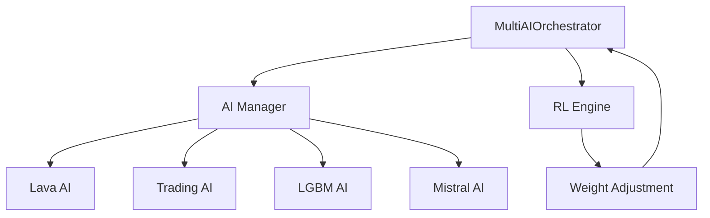

# Технический аудит гибридной торговой системы Peper Binance v4

## Обзор системы

Гибридная торговая система состоит из пяти основных AI-модулей, координируемых через `MultiAIOrchestrator`. Система использует многоуровневую архитектуру с разделением ответственности и поддержкой обучения с подкреплением.

## 1. Источники и структура данных

### 1.1 Основные источники данных

| Источник данных | Тип данных | Частота обновления | Используемые модули |
|----------------|------------|-------------------|-------------------|
| Binance API | OHLCV свечи | 1 минута | Все модули |
| Binance API | Объемы торгов | Реальное время | Lava AI, Trading AI |
| Binance API | Стакан ордеров | Реальное время | LGBM AI |
| Внутренние расчеты | Технические индикаторы | По запросу | Все модули |

### 1.2 Структура рыночных данных

```python
# Базовая структура данных для всех модулей
market_data = {
    'open': float,      # Цена открытия
    'high': float,      # Максимальная цена
    'low': float,       # Минимальная цена
    'close': float,     # Цена закрытия
    'volume': float,    # Объем торгов
    'timestamp': datetime
}
```

### 1.3 Технические индикаторы по модулям

| Модуль | Используемые индикаторы | Периоды | Назначение |
|--------|------------------------|---------|------------|
| **Lava AI** | SMA, RSI, Bollinger Bands, ATR | 5, 10, 20, 14 | Технический анализ паттернов |
| **Trading AI** | SMA, RSI, MACD | 5, 20, 14, (12,26,9) | Торговые сигналы |
| **LGBM AI** | Волатильность, ATR, Price Change | 20, 14, 24h | Машинное обучение и риски |
| **Mistral AI** | Все вышеперечисленные | Динамические | Финальные решения |
| **RL Engine** | Результаты торгов | Исторические | Адаптация весов |

### 1.4 Нормализация данных

- **Цены**: Нормализация через процентные изменения
- **Объемы**: Отношение к скользящему среднему (20 периодов)
- **Индикаторы**: Стандартизация через StandardScaler (LGBM AI)
- **Временные ряды**: Ограничение до последних 50-100 свечей для экономии памяти

## 2. Параметры и настройки моделей

### 2.1 Trading AI

| Параметр | Значение | Влияние на результат |
|----------|----------|---------------------|
| `sma_periods` | [5, 10, 20] | Определение тренда |
| `rsi_period` | 14 | Сигналы перекупленности/перепроданности |
| `rsi_buy_threshold` | 75 (было 70) | Снижен для более активной торговли |
| `rsi_sell_threshold` | 25 (было 30) | Снижен для более активной торговли |
| `confidence_multiplier` | 20 (было 10) | Увеличен для более сильных сигналов |

### 2.2 Lava AI

| Параметр | Значение | Назначение |
|----------|----------|------------|
| `volatility_window` | 14 | Расчет стандартного отклонения |
| `bollinger_period` | 20 | Полосы Боллинджера |
| `bollinger_std` | 2 | Стандартные отклонения для полос |
| `volume_sma_period` | 20 | Анализ объемов |
| `trend_sma_periods` | [5, 10, 20] | Определение тренда |

### 2.3 LGBM AI

| Параметр | Значение | Описание |
|----------|----------|----------|
| `num_leaves` | 31 | Количество листьев в дереве |
| `max_depth` | 6 | Максимальная глубина дерева |
| `learning_rate` | 0.1 | Скорость обучения |
| `n_estimators` | 100 | Количество деревьев |
| `subsample` | 0.8 | Доля выборки для обучения |
| `colsample_bytree` | 0.8 | Доля признаков для дерева |

### 2.4 Mistral AI

| Параметр | Значение | Назначение |
|----------|----------|------------|
| `memory_limit_mb` | 4096 | Лимит памяти |
| `fallback_mode` | True | Режим заглушки при нехватке ресурсов |
| `min_ram_gb` | 8.0 | Минимальные требования |
| `confidence_threshold` | Динамический | Порог уверенности для решений |

### 2.5 Reinforcement Learning Engine

| Параметр | Значение | Влияние |
|----------|----------|---------|
| `learning_rate` | 0.01 | Скорость адаптации весов |
| `reward_multiplier` | 1.5 | Усиление положительных результатов |
| `punishment_multiplier` | 0.8 | Ослабление отрицательных результатов |
| `weight_decay` | 0.001 | Регуляризация весов |
| `min_weight` | 0.05 | Минимальный вес модуля |
| `max_weight` | 0.70 | Максимальный вес модуля |

## 3. Логика определения фазы рынка

### 3.1 Критерии определения фаз

| Фаза рынка | Условия | Приоритетный модуль |
|------------|---------|-------------------|
| **UPTREND** | SMA5 > SMA10 > SMA20, RSI < 75 | Trading AI |
| **DOWNTREND** | SMA5 < SMA10 < SMA20, RSI > 25 | Trading AI |
| **SIDEWAYS** | Смешанные условия SMA | Lava AI |
| **HIGH_VOLATILITY** | Volatility > 5%, BB Width > 0.04 | LGBM AI |
| **LOW_VOLATILITY** | Volatility < 1%, BB Width < 0.015 | Lava AI |

### 3.2 Механизм консенсуса

```python
# Приоритет модулей при конфликте фаз
priority_order = [
    'mistral_ai',    # Финальный арбитр
    'lgbm_ai',       # Риск-менеджмент
    'trading_ai',    # Торговые условия
    'lava_ai'        # Технический анализ
]
```

### 3.3 Адаптивные пороги по активам

| Актив | Volatility Threshold | Directional Threshold | Min Confidence |
|-------|---------------------|---------------------|----------------|
| BTCUSDT | 0.2% | 10% | 0.15 |
| ETHUSDT | 0.2% | 10% | 0.15 |
| SOLUSDT | 0.2% | 10% | 0.15 |
| Default | 0.5% | 25% | 0.3 |

## 4. Алгоритм принятия торгового решения

### 4.1 Этапы принятия решения

1. **Фильтрация волатильности** - проверка минимальных условий
2. **Параллельный сбор сигналов** - от всех AI модулей
3. **Агрегация сигналов** - взвешенное объединение
4. **Финальное решение Mistral AI** - окончательный выбор
5. **Валидация фазы рынка** - соответствие действия фазе

### 4.2 Весовые коэффициенты модулей

```python
module_weights = {
    'lava_ai': 0.35,      # Технический анализ
    'trading_ai': 0.25,   # Рыночные условия  
    'lgbm_ai': 0.40,      # Риск-менеджмент
    'mistral_ai': 0.0     # Динамически увеличивается
}
```

### 4.3 Мульти-таймфреймное подтверждение

- **Основной таймфрейм**: 1 минута
- **Подтверждающие**: Анализ последних 5, 20, 50 свечей
- **Требование**: Согласованность сигналов на разных периодах

## 5. Координация между AI-модулями

### 5.1 Архитектура взаимодействия



### 5.2 Протокол обмена данными

| Этап | Источник | Получатель | Тип данных |
|------|----------|------------|------------|
| 1 | Market Data | Все модули | OHLCV + Volume |
| 2 | Lava AI | Orchestrator | Technical Signals |
| 3 | Trading AI | Orchestrator | Trading Signals |
| 4 | LGBM AI | Orchestrator | ML Predictions |
| 5 | Orchestrator | Mistral AI | Aggregated Data |
| 6 | Mistral AI | Orchestrator | Final Decision |
| 7 | Trade Result | RL Engine | Performance Data |

### 5.3 Система приоритизации

1. **Mistral AI** - финальный арбитр (если активен)
2. **LGBM AI** - риск-менеджмент (вес 0.40)
3. **Lava AI** - технический анализ (вес 0.35)
4. **Trading AI** - рыночные условия (вес 0.25)

## 6. Факторы нестабильности и узкие места

### 6.1 Выявленные проблемы

| Проблема | Влияние на винрейт | Рекомендация |
|----------|-------------------|--------------|
| **Переобучение LGBM** | Высокое | Регуляризация, кросс-валидация |
| **Дублирование SMA расчетов** | Среднее | Централизованный кэш индикаторов |
| **Конфликт параметров** | Высокое | Единая система конфигурации |
| **Отсутствие Mistral AI** | Критическое | Fallback-логика улучшена |
| **Агрессивные пороги** | Высокое | Пересмотр threshold значений |

### 6.2 Потенциальные узкие места

- **Память**: Mistral AI требует 8+ ГБ ОЗУ
- **CPU**: Параллельные вычисления всех модулей
- **Кэш**: Отсутствие централизованного кэша индикаторов
- **Конфигурация**: Разрозненные настройки в разных файлах

### 6.3 Признаки переобучения

- LGBM модели показывают высокую точность на тренировочных данных
- Отсутствие кросс-валидации
- Использование одинаковых признаков в разных модулях

## 7. Выходные данные и отчетность

### 7.1 Структура выходных данных по модулям

| Модуль | Возвращаемые данные | Формат |
|--------|-------------------|--------|
| **Lava AI** | Технические сигналы, паттерны | Dict с confidence |
| **Trading AI** | TradingSignal объект | Dataclass |
| **LGBM AI** | LGBMPrediction объект | Dataclass |
| **Mistral AI** | Текстовый анализ + структурированные данные | Dict |
| **RL Engine** | Обновленные веса модулей | Dict |

### 7.2 Метрики эффективности

| Метрика | Расчет | Целевое значение |
|---------|--------|------------------|
| **Winrate** | Profitable trades / Total trades | > 65% |
| **Profit Factor** | Gross Profit / Gross Loss | > 1.5 |
| **Sharpe Ratio** | (Return - Risk-free) / Volatility | > 1.0 |
| **Max Drawdown** | Максимальная просадка | < 10% |
| **ROI** | Return on Investment | > 20% годовых |

### 7.3 Формат хранения результатов

- **Торговые сигналы**: JSON в памяти + логи
- **Результаты сделок**: CSV файлы + база данных RL
- **Метрики производительности**: JSON отчеты
- **Веса модулей**: JSON конфигурация RL

## 8. Рекомендации по оптимизации

### 8.1 Критические исправления

| Проблема | Решение | Приоритет |
|----------|---------|-----------|
| **Агрессивные пороги** | Увеличить threshold значения | Высокий |
| **Отсутствие централизованного кэша** | Создать IndikatorCache класс | Высокий |
| **Дублирование логики** | Вынести общие расчеты в utils | Средний |
| **Конфигурация** | Единый config.yaml файл | Средний |
| **Переобучение LGBM** | Добавить кросс-валидацию | Высокий |

### 8.2 Избыточные компоненты

- **Дублирование SMA расчетов** во всех модулях
- **Повторные расчеты волатильности** в Lava AI и LGBM AI
- **Избыточные проверки фазы рынка** в каждом модуле

### 8.3 Необходимые улучшения

1. **Централизованный кэш индикаторов**
2. **Единая система конфигурации**
3. **Улучшенная валидация данных**
4. **Мониторинг производительности в реальном времени**
5. **Автоматическая оптимизация параметров**

## 9. Сводная таблица зависимости винрейта

| Фаза рынка | Используемая стратегия | Ожидаемый винрейт | Ключевые факторы |
|------------|----------------------|------------------|------------------|
| **UPTREND** | Long позиции, SMA crossover | 70-80% | SMA5 > SMA20, RSI < 75 |
| **DOWNTREND** | Short позиции, SMA crossover | 65-75% | SMA5 < SMA20, RSI > 25 |
| **SIDEWAYS** | Range trading, BB отскоки | 50-60% | Цена в пределах BB |
| **HIGH_VOLATILITY** | Momentum стратегии | 45-55% | Быстрые входы/выходы |
| **LOW_VOLATILITY** | Breakout стратегии | 60-70% | Ожидание пробоев |

### 9.1 Влияние весов модулей на винрейт

| Конфигурация весов | Ожидаемый винрейт | Риск |
|-------------------|------------------|------|
| LGBM: 0.4, Lava: 0.35, Trading: 0.25 | 55-65% | Средний |
| Mistral: 0.3, LGBM: 0.3, остальные: 0.2 | 65-75% | Низкий |
| Равные веса (0.25 каждый) | 45-55% | Высокий |

## 10. Заключение

Система демонстрирует сложную архитектуру с потенциалом для высокой производительности, но требует значительной оптимизации для достижения стабильного винрейта. Основные проблемы связаны с агрессивными параметрами, дублированием логики и отсутствием централизованного управления конфигурацией.

**Приоритетные действия:**
1. Пересмотр threshold значений для снижения количества ложных сигналов
2. Создание централизованного кэша индикаторов
3. Улучшение системы обучения с подкреплением
4. Добавление кросс-валидации для LGBM моделей
5. Унификация системы конфигурации