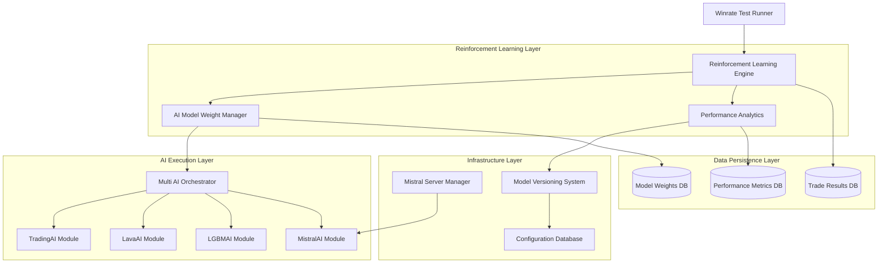
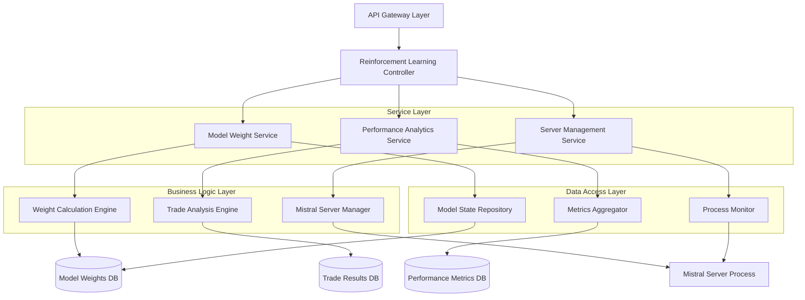
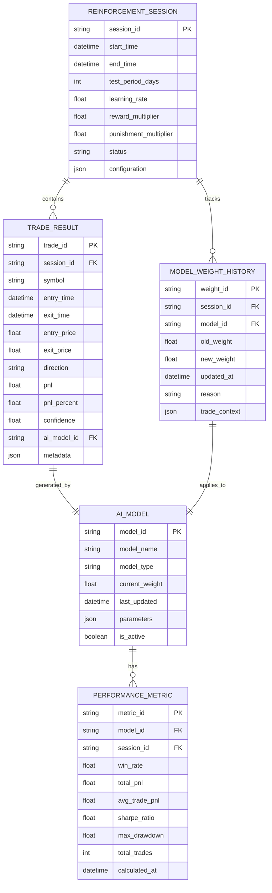

# Техническая архитектура системы адаптивного обучения с подкреплением

## 1. Архитектурный дизайн



## 2. Описание технологий

- Frontend: Python CLI интерфейс + Jupyter Notebook для аналитики
- Backend: Python 3.11+ с asyncio для асинхронной обработки
- AI Framework: scikit-learn, lightgbm, pandas, numpy
- Database: SQLite для локального хранения + JSON файлы для конфигураций
- Server Management: subprocess для управления Mistral сервером
- Logging: Python logging с ротацией файлов

## 3. Определения маршрутов

| Маршрут | Назначение |
|---------|------------|
| `/api/reinforcement/start` | Запуск цикла адаптивного обучения |
| `/api/reinforcement/status` | Получение статуса процесса обучения |
| `/api/models/weights` | Получение/обновление весов AI моделей |
| `/api/models/performance` | Метрики производительности моделей |
| `/api/server/mistral/start` | Запуск Mistral сервера |
| `/api/server/mistral/stop` | Остановка Mistral сервера |
| `/api/server/mistral/status` | Статус Mistral сервера |
| `/api/analytics/trades` | Анализ результатов сделок |
| `/api/config/export` | Экспорт конфигурации системы |
| `/api/config/import` | Импорт конфигурации системы |

## 4. Определения API

### 4.1 Core API

Управление системой обучения с подкреплением

```
POST /api/reinforcement/start
```

Request:
| Название параметра | Тип параметра | Обязательный | Описание |
|-------------------|---------------|--------------|----------|
| test_period_days | integer | true | Период тестирования в днях |
| learning_rate | float | false | Скорость обучения (по умолчанию 0.01) |
| reward_multiplier | float | false | Множитель поощрения (по умолчанию 1.5) |
| punishment_multiplier | float | false | Множитель наказания (по умолчанию 0.8) |

Response:
| Название параметра | Тип параметра | Описание |
|-------------------|---------------|----------|
| status | boolean | Статус запуска процесса |
| session_id | string | Идентификатор сессии обучения |
| estimated_duration | integer | Ожидаемая продолжительность в минутах |

Example:
```json
{
  "test_period_days": 30,
  "learning_rate": 0.01,
  "reward_multiplier": 1.5,
  "punishment_multiplier": 0.8
}
```

Управление весами AI моделей

```
GET /api/models/weights
```

Response:
| Название параметра | Тип параметра | Описание |
|-------------------|---------------|----------|
| trading_ai_weight | float | Текущий вес TradingAI модели |
| lava_ai_weight | float | Текущий вес LavaAI модели |
| lgbm_ai_weight | float | Текущий вес LGBMAI модели |
| mistral_ai_weight | float | Текущий вес MistralAI модели |
| last_updated | string | Время последнего обновления |

```
PUT /api/models/weights
```

Request:
| Название параметра | Тип параметра | Обязательный | Описание |
|-------------------|---------------|--------------|----------|
| trading_ai_weight | float | true | Новый вес TradingAI модели |
| lava_ai_weight | float | true | Новый вес LavaAI модели |
| lgbm_ai_weight | float | true | Новый вес LGBMAI модели |
| mistral_ai_weight | float | true | Новый вес MistralAI модели |

Управление Mistral сервером

```
POST /api/server/mistral/start
```

Request:
| Название параметра | Тип параметра | Обязательный | Описание |
|-------------------|---------------|--------------|----------|
| model_path | string | false | Путь к модели (по умолчанию из конфига) |
| port | integer | false | Порт сервера (по умолчанию 8080) |
| timeout | integer | false | Таймаут запуска в секундах |

Response:
| Название параметра | Тип параметра | Описание |
|-------------------|---------------|----------|
| status | boolean | Статус запуска сервера |
| pid | integer | Process ID сервера |
| port | integer | Порт на котором запущен сервер |

## 5. Серверная архитектура



## 6. Модель данных

### 6.1 Определение модели данных



### 6.2 Язык определения данных (DDL)

Таблица сессий обучения с подкреплением (reinforcement_sessions)
```sql
-- создание таблицы
CREATE TABLE reinforcement_sessions (
    session_id TEXT PRIMARY KEY,
    start_time TIMESTAMP DEFAULT CURRENT_TIMESTAMP,
    end_time TIMESTAMP,
    test_period_days INTEGER NOT NULL,
    learning_rate REAL DEFAULT 0.01,
    reward_multiplier REAL DEFAULT 1.5,
    punishment_multiplier REAL DEFAULT 0.8,
    status TEXT DEFAULT 'running' CHECK (status IN ('running', 'completed', 'failed', 'stopped')),
    configuration TEXT -- JSON конфигурация
);

-- создание индексов
CREATE INDEX idx_reinforcement_sessions_start_time ON reinforcement_sessions(start_time DESC);
CREATE INDEX idx_reinforcement_sessions_status ON reinforcement_sessions(status);
```

Таблица результатов сделок (trade_results)
```sql
-- создание таблицы
CREATE TABLE trade_results (
    trade_id TEXT PRIMARY KEY,
    session_id TEXT NOT NULL,
    symbol TEXT NOT NULL,
    entry_time TIMESTAMP NOT NULL,
    exit_time TIMESTAMP NOT NULL,
    entry_price REAL NOT NULL,
    exit_price REAL NOT NULL,
    direction TEXT NOT NULL CHECK (direction IN ('LONG', 'SHORT')),
    pnl REAL NOT NULL,
    pnl_percent REAL NOT NULL,
    confidence REAL NOT NULL,
    ai_model_id TEXT NOT NULL,
    metadata TEXT, -- JSON метаданные
    FOREIGN KEY (session_id) REFERENCES reinforcement_sessions(session_id),
    FOREIGN KEY (ai_model_id) REFERENCES ai_models(model_id)
);

-- создание индексов
CREATE INDEX idx_trade_results_session_id ON trade_results(session_id);
CREATE INDEX idx_trade_results_symbol ON trade_results(symbol);
CREATE INDEX idx_trade_results_pnl ON trade_results(pnl DESC);
CREATE INDEX idx_trade_results_entry_time ON trade_results(entry_time DESC);
```

Таблица AI моделей (ai_models)
```sql
-- создание таблицы
CREATE TABLE ai_models (
    model_id TEXT PRIMARY KEY,
    model_name TEXT NOT NULL,
    model_type TEXT NOT NULL CHECK (model_type IN ('trading', 'lava', 'lgbm', 'mistral')),
    current_weight REAL NOT NULL DEFAULT 0.25,
    last_updated TIMESTAMP DEFAULT CURRENT_TIMESTAMP,
    parameters TEXT, -- JSON параметры
    is_active BOOLEAN DEFAULT TRUE
);

-- создание индексов
CREATE INDEX idx_ai_models_type ON ai_models(model_type);
CREATE INDEX idx_ai_models_active ON ai_models(is_active);

-- начальные данные
INSERT INTO ai_models (model_id, model_name, model_type, current_weight) VALUES
('trading_ai', 'TradingAI', 'trading', 0.25),
('lava_ai', 'LavaAI', 'lava', 0.35),
('lgbm_ai', 'LGBMAI', 'lgbm', 0.40),
('mistral_ai', 'MistralAI', 'mistral', 0.0);
```

Таблица истории весов моделей (model_weight_history)
```sql
-- создание таблицы
CREATE TABLE model_weight_history (
    weight_id TEXT PRIMARY KEY,
    session_id TEXT NOT NULL,
    model_id TEXT NOT NULL,
    old_weight REAL NOT NULL,
    new_weight REAL NOT NULL,
    updated_at TIMESTAMP DEFAULT CURRENT_TIMESTAMP,
    reason TEXT NOT NULL,
    trade_context TEXT, -- JSON контекст сделки
    FOREIGN KEY (session_id) REFERENCES reinforcement_sessions(session_id),
    FOREIGN KEY (model_id) REFERENCES ai_models(model_id)
);

-- создание индексов
CREATE INDEX idx_model_weight_history_session_id ON model_weight_history(session_id);
CREATE INDEX idx_model_weight_history_model_id ON model_weight_history(model_id);
CREATE INDEX idx_model_weight_history_updated_at ON model_weight_history(updated_at DESC);
```

Таблица метрик производительности (performance_metrics)
```sql
-- создание таблицы
CREATE TABLE performance_metrics (
    metric_id TEXT PRIMARY KEY,
    model_id TEXT NOT NULL,
    session_id TEXT NOT NULL,
    win_rate REAL NOT NULL,
    total_pnl REAL NOT NULL,
    avg_trade_pnl REAL NOT NULL,
    sharpe_ratio REAL,
    max_drawdown REAL,
    total_trades INTEGER NOT NULL,
    calculated_at TIMESTAMP DEFAULT CURRENT_TIMESTAMP,
    FOREIGN KEY (model_id) REFERENCES ai_models(model_id),
    FOREIGN KEY (session_id) REFERENCES reinforcement_sessions(session_id)
);

-- создание индексов
CREATE INDEX idx_performance_metrics_model_id ON performance_metrics(model_id);
CREATE INDEX idx_performance_metrics_session_id ON performance_metrics(session_id);
CREATE INDEX idx_performance_metrics_win_rate ON performance_metrics(win_rate DESC);
CREATE INDEX idx_performance_metrics_calculated_at ON performance_metrics(calculated_at DESC);
```